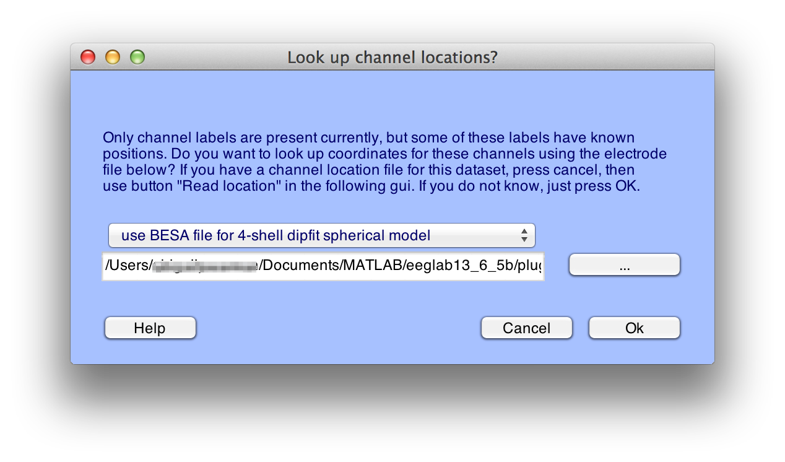
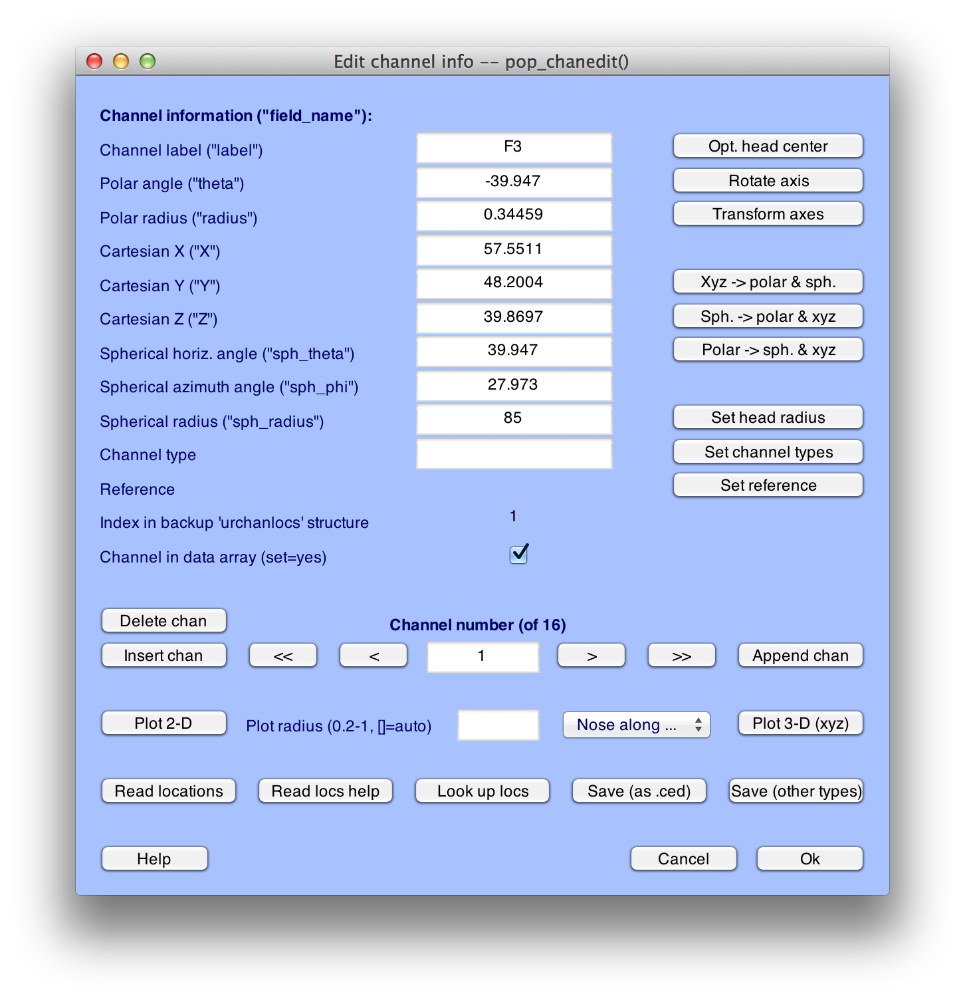
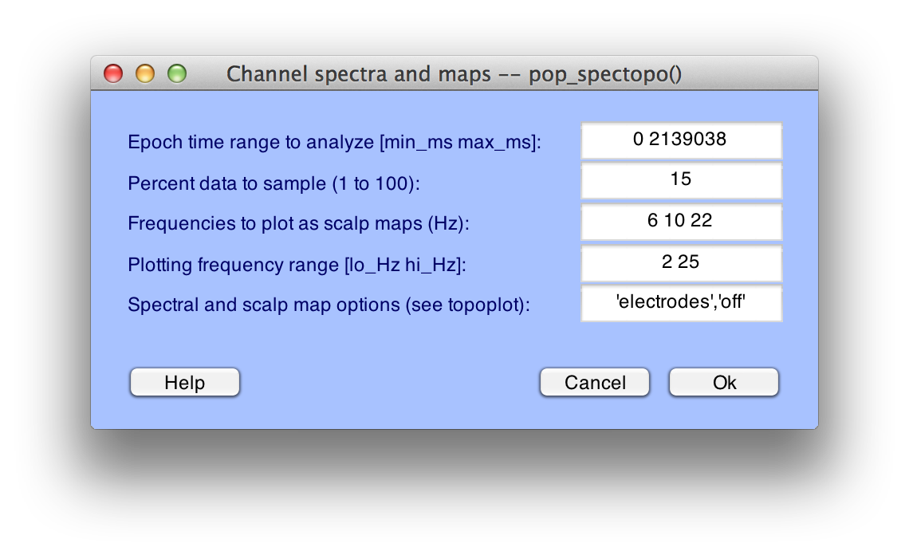
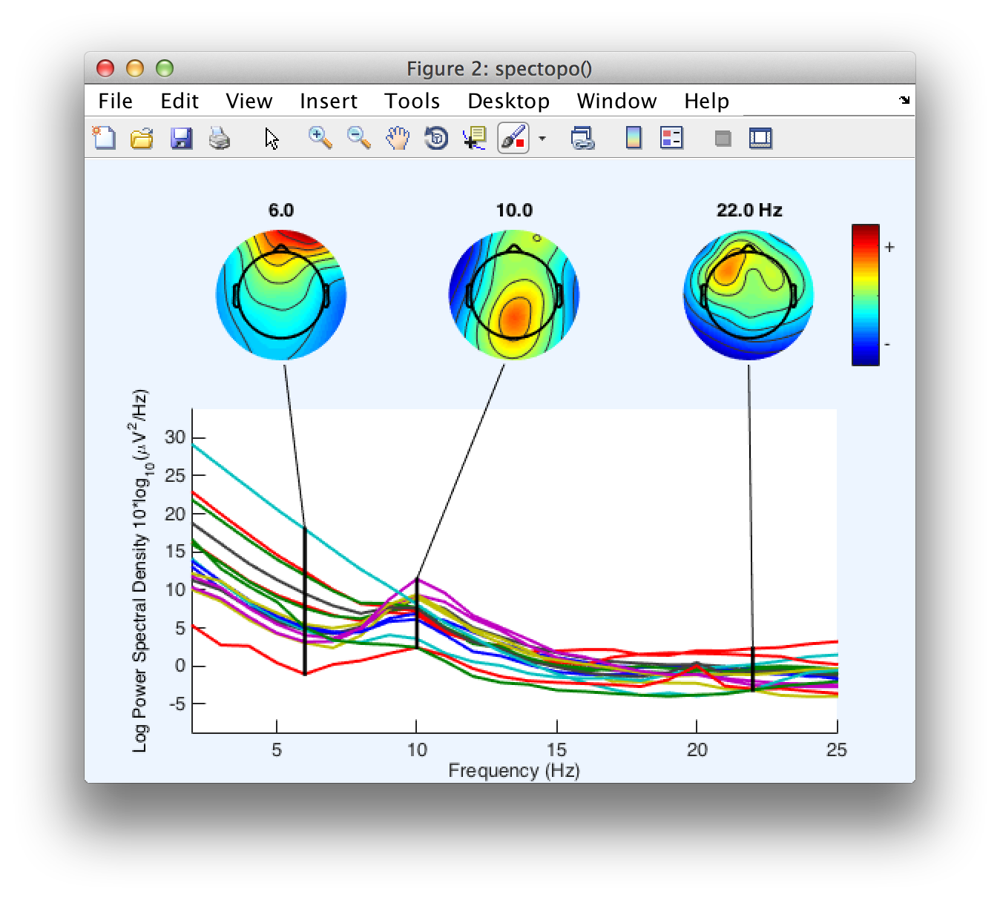
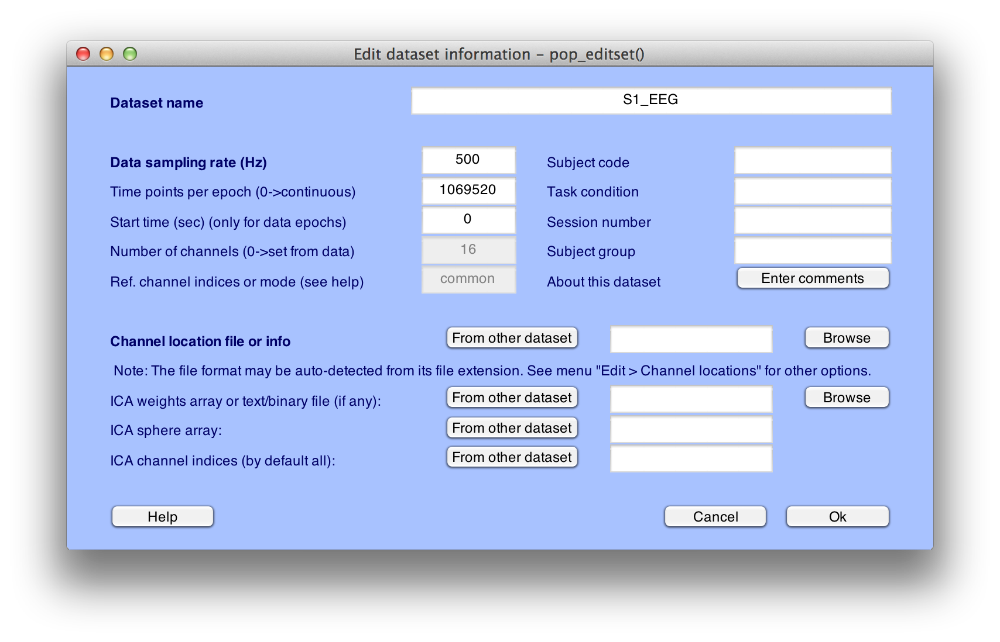

## Adding Channel Locations
Before we start using ERPLAB's functions, we'll use one of EEGLAB's functions that will prove useful at a later stage.  Specifically, we will add location coordinates for each electrode site  (see the [EEGLAB documentation](.) for more information).  Our original data file contained electrode labels conforming to the International 10/20 System, and EEGLAB can automatically determine standard coordinates on the basis of these labels.  These coordinates are not guaranteed to be exact, but they are a reasonable approximation for simple procedures such as plotting scalp maps.  If you want exact electrode locations, you will need to use a 3-D digitizer and measure the locations for each subject.

To add coordinates based on the electrode labels, select **Edit > Channel locations**, which will bring up the window shown here:

Click **Ok**, and you will see the window shown here:

    Equivalent Script Command:

    %Adding Channel Locations to Dataset

    %Make sure that you change the path to indicate the location of eeglab within your file system

    EEG=pop_chanedit(EEG,'lookup',
    '/Users/etfoo/Documents/MATLAB/eeglab9_0_2_3b/plugins/dipfit2.2/standard_BESA/standard-10-5-cap385.elp');

For simple data files such as the one used in this tutorial, you can accept all of the default values and simply click **OK**.  This will add the coordinates to the current dataset.

EEGLAB and ERPLAB require electrode coordinates for plotting topographic maps; you will get an error message if you try to plot a topographic map before you've added the coordinates.  You can verify that the coordinates have been added by running a routine that plots topographic maps.  For example, if you select **Plot > Channel spectra and maps** and select the default parameters in the window that appears, as shown in the screenshot below:

Click **OK** and you will see the following plot:

    Equivalent Script Command:

    %Plot Channel Spectra and maps

    figure; pop_spectopo(EEG, 1, [0  2139038], 'EEG' , 'percent', 15, 'freq', [6 10 22], 'freqrange',[2
    25],'electrodes','off');

Later parts of this tutorial will make use of this dataset, so you should save it to disk.  First, however, you should change the name of the dataset to **S1_Chan** so that you can differentiate between this version and the original version.  To do this, select **Edit > Dataset info**.  This will bring up the window shown below, and you should enter **S1_Chan** in the **Dataset name** field.  Click **OK**, and then look in the **Datasets** menu.  You should now see that it is named **S1_Chan**.

You can now save the modified dataset by selecting **File > Save current dataset as**.  We recommend that you give the file the same name as the dataset, but with a **.set** extension (**S1_Chan.set**).

    Equivalent Script Command:

    %Setname is S1_Chan

    %Filename is S1_Chan.set

    %Path is /Users/etfoo/Desktop/tutorial_script/

    %Note that you will need to replace the path with the actual location in your file system

    EEG.setname='S1_Chan';

    EEG=pop_saveset(EEG, 'filename', 'S1_Chan.set', 'filepath', '/Users/etfoo/Desktop/tutorial_script/');

    %Alternatively, the following version will put the file in Matlab's Current Folder

    EEG.setname='S1_Chan';

    EEG=pop_saveset(EEG, 'filename', 'S1_Chan.set');

----
<table style="width:100%">
  <tr>
    <td><a href="./Brief-Description-of-the-Example-Experiment"> << Brief Description of the Example Experiment </a></td>
    <td><a href="./Tutorial"> Tutorial</a></td>
    <td><a href="./Background-Concepts:-Datasets,-ERPsets,-and-bins">  Background-Concepts: Datasets, ERPsets, and bins >>  </a></td>
  </tr>
</table>
