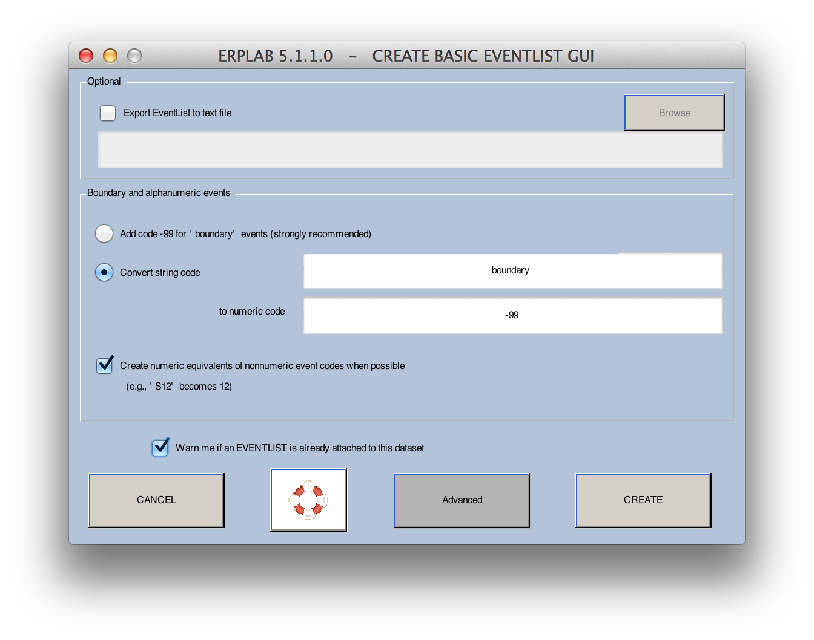
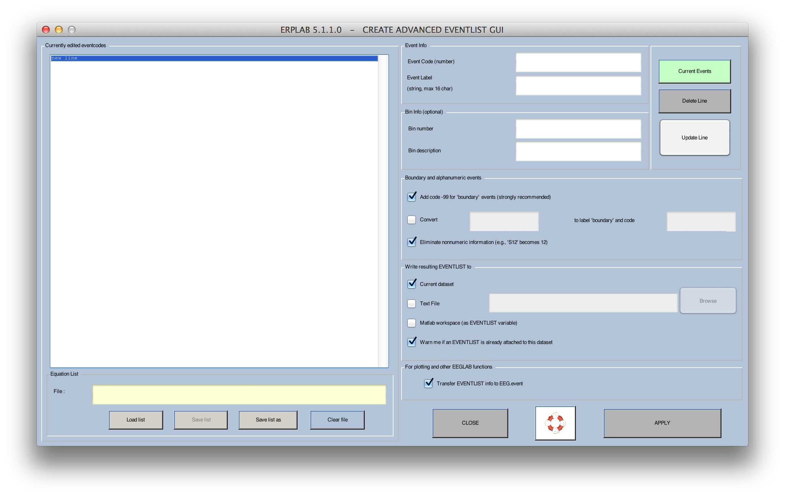
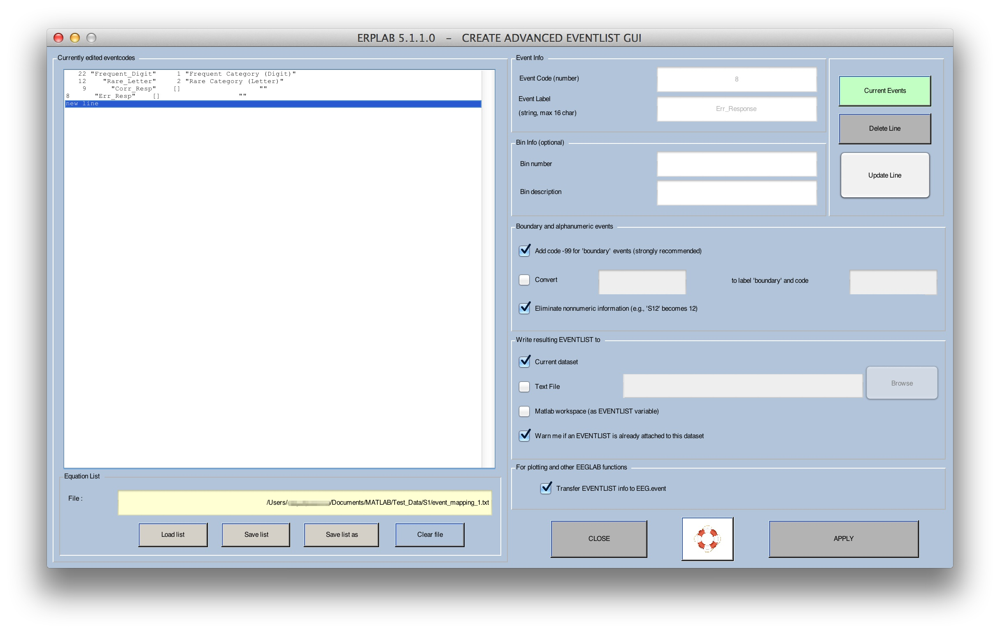
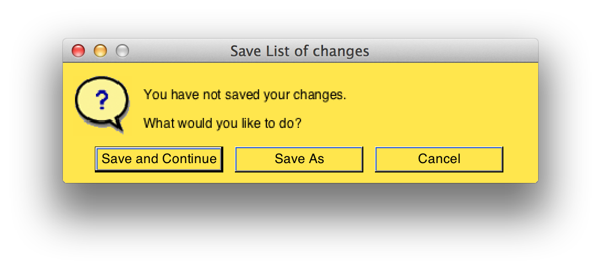
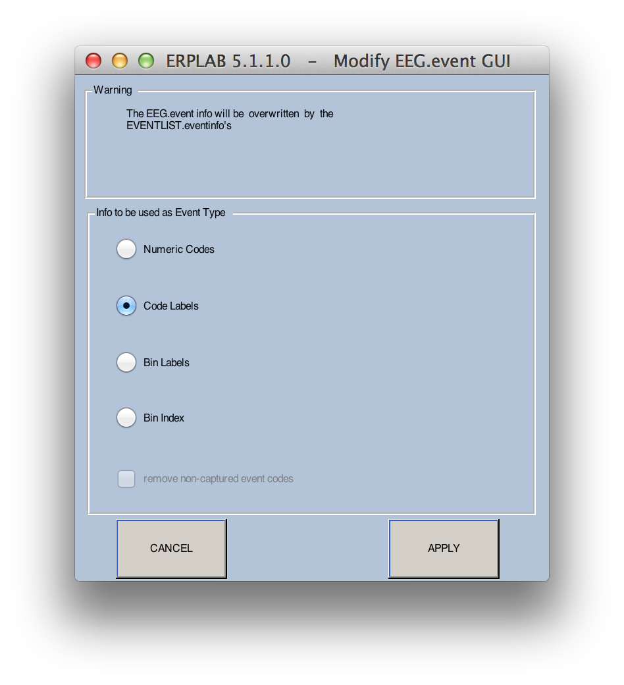
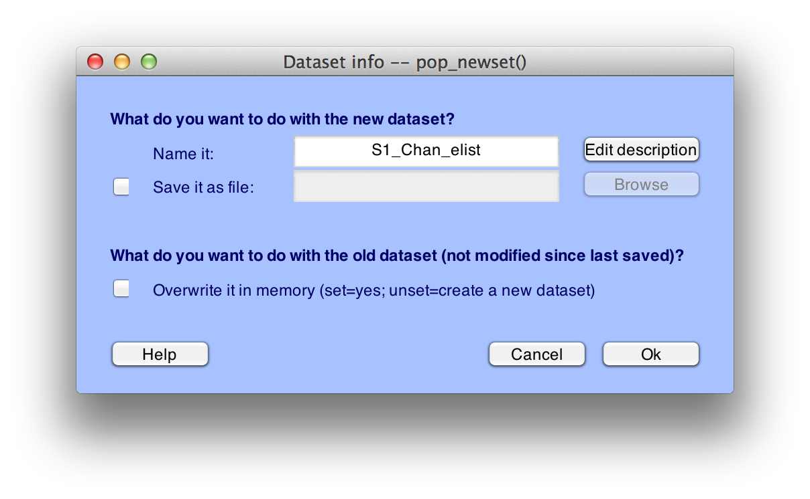
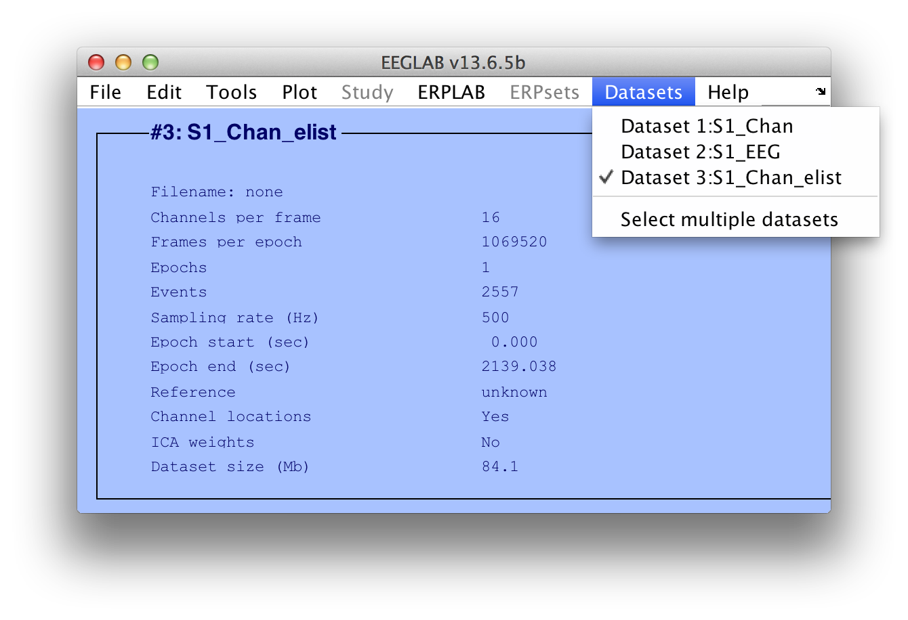
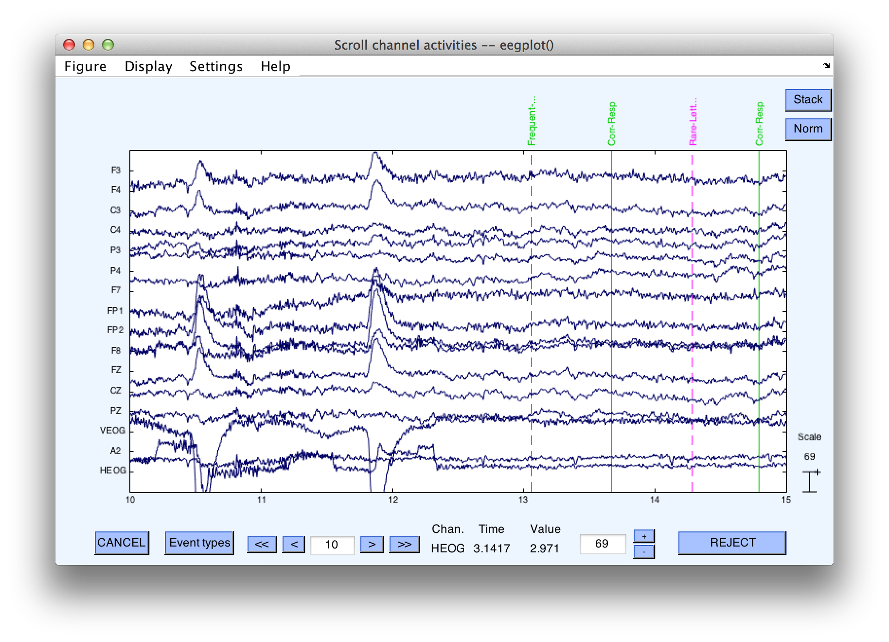
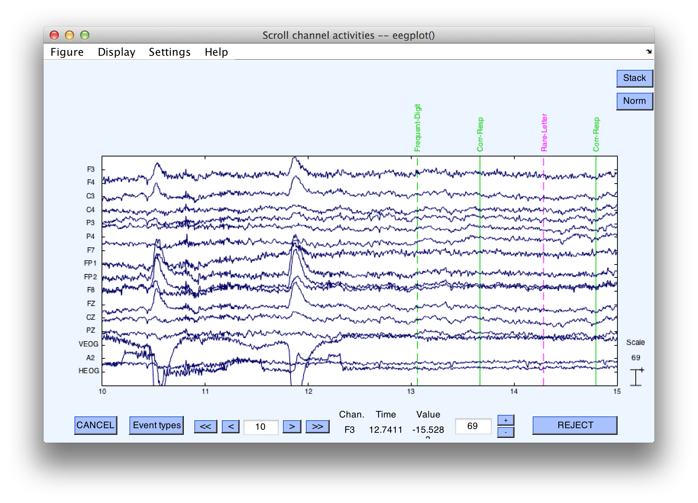

## Advanced EventList Options
When you create an EventList, you can add some additional information using the **ADVANCED** button in the Create EventList window (see screenshot below). The **ADVANCED** tools are important if you have complex text-based event labels (or want to create them) or if you have a very simple scheme that links event codes to bins.  Most people won't use the **ADVANCED** button, but it is important for the present tutorial.

<TABLE>
   <TR>
     <TH>Requirements</TH>
     <TH>Completed?</TH>
   </TR>
   <TR>
      <TD>Loaded Data</TD>
      <TD align="center"> &#10003 </TD>
   </TR>
   <TR>
      <TD> <a href="./Creating-an-EventList:-ERPLAB-Functions:-Tutorial"> Creating an EventList </a> </TD>
      <TD align="center"> </TD>
   </TR>
   <TR>
      <TD><a href="./Creating-Bin--Based-EEG-Epochs:-Tutorial">  Creating Bin-Based EEG Epochs </a></TD>
      <TD align="center"> </TD>
   </TR>
<TR>
      <TD><a href="./Artifact-Detection:-Tutorial"> Artifact Detection </a></TD>
      <TD align="center"> </TD>
   </TR>
<TR>
      <TD><a href="./Creating-Averaged-ERPs:-Tutorial"> Creating Averaged ERPs </a></TD>
      <TD align="center"> </TD>
   </TR>
</TABLE>

The **ADVANCED** button allows you to define a text label for each numeric event code (or vice versa), which helps to avoid the errors that often occur in experiments with many different event codes. It also allows you to define the bins that you will use to sort your EEG epochs for averaging. In most cases, you will define your bins in a later step (using something called BINLISTER), but it can be done at this step if your bins are very simple. You will use the **ADVANCED** button if you want to create event labels from numeric event codes or if you want to assign the events to bins, but you don't need it if you don't want event labels and you will be using BINLISTER to assign events to bins.

1. First, make sure that **S1_Chan** is selected as the active dataset in the Datasets menu (because we are going to re-create the eventless). Then select **EventList > Create EEG EventList**  

2. Open the Create Advanced EventList GUI (shown below)Click the **Advanced** button to open the **Create Advanced EventList** window  

    The **Create Advanced EventList** panel allows you to define a set of events for the experiment. Each event contains a numeric event code and text-based event label, as well as an optional bin number and bin label.  

    **Note: ERPLAB requires that each event have a numeric event code**. If your data acquisition system uses text-based labels instead of numeric codes, you must define a numeric event code for each text-based event label. If your data acquisition system uses numeric codes, you are not required to create text-based labels for each code, but it's a good idea. You can also define a bin for all (or some) of your event codes, along with a label for that bin. We will do that in this example, but it is not necessary if you will be using BINLISTER in a later step to define your bins.  

3. Define this information for a single trial block from our example experiment.Enter the following information into the **Event Info** area (upper left corner) of the **Create Advanced EventList** window:  

    Event Code:	**22**  
    Event Label:	**Frequent_Digit**  
    Bin number:	**1**  
    Bin description:  **Frequent Category (digit)**   

    Then click the **Update Line** button to add the event information to the **Currently edited eventcodes list** (left pane)  
    For each event, the **Event Info** area defines the event codes, event labels, bin numbers, and bin descriptions for each eventthe In our experiment, letters were rare (event code 12) and numbers were frequent (event code 22).  
4. Next, define the _rare letter event_. Click on the **new line** entry in the **Currently edited eventcodes** pane Enter the following information for the _rare letter event_  
    Event Code:	**12**  
    Event Label:	**Rare_Letter**  
    Bin number:	**2**  
    Bin description:	**Rare Category (letters)**  

    Don't forget to click **Update Line** after entering the information for each type of event or the information will not be added to the table.   

    Note: Your bin numbers must start at 1 and be consecutive with no breaks (the event codes need not be consecutive, and they can be any integer number that Matlab can represent).  
    It will still be useful to define labels for the response codes so that we will not have to remember that code 9 denotes a correct response and code 8 denotes an incorrect response. The table below shows how to define these events.  
    Event Code:       **9**                       Event Code:	**8**  
    Event Label:      **Corr_Resp**               Event Label:	**Err_Resp**  
    Bin number:       (blank)                     Bin number:	(blank)  
    Bin description:  (blank)                     Bin description:(blank)  

5. Save the event code **equation list** in the **Equation List** pane (bottom-left), click on the **Save list** button  
    Navigate to your save directory and type in the filename: **elist_equations.txt**  
    Click the **Save** button. The save file name and path should now appear in the **Equation List** pane.  

    Because you will need to do this step for every subject, the saved file **elist_equations.txt** can now be loaded in again for the next subject (by clicking **open list**). If you want, you can load the file **event_mapping_1.txt**, which contains the table of events for this example. You can edit this file with the Matlab text editor, which is more convenient than using the ERPLAB GUI for large tables of event information. To see the format, open the **event_mapping_1.txt** file with Matlab's text editor.  

    

6. Save the EventList in a text file (to look at it later) Locate the **Write resulting EVENTLIST to** pane in the bottom-right corner  
    Check the box labeled **Text File**  
    Click the **Browse** button to save the file as **elist.txt**. (The .txt extension is not required, but it's a good idea)  
    Check the box labeled **Transfer EVENTLIST info to EEG.event**  
7. Transfer EventList to the EEG.event variableCheck the box labelled **Transfer EVENTLIST info to EEG.event**  

    EEGLAB keeps track of event information in the **EEG.event** structure, but EEGLAB doesn't automatically "know" anything about ERPLAB's EventList. Moreover, the **EEG.event** structure can store either a numeric event code or a text-based event label for a given event, but not both. By checking this box, you will have the opportunity to transfer your newly created labels into **EEG.event** so that they will be available for use by EEGLAB functions (such as the function for plotting the EEG data).  
8. Apply the EventListClick the **APPLY** button to create the EventList and add it to the current ERP dataset.  

    The information about event mapping must be stored in a file. Therefore, if you have made any changes in this information, the following window will appear:

    

    Click on the **Save and Continue** button to create the EventList.
Because we have checked the **Transfer EVENTLIST info to EEG.event** box), the following window will appear:  

    This window allows you to choose whether to store the events as event codes, event labels, or bin numbers in the **EEG.event** structure). The default is **Code Labels**, and selecting this will allow you to see the labels for each event code when you look at the EEG using EEGLAB's **Plot > Channel data (scroll)** routine.
    Keep the default **Code Labels** setting and click the **APPLY** button.

    ERPLAB will then attach the **EVENTLIST** structure that you just created to the current dataset to produce a new dataset. Any operation that creates a new dataset will put up the save dataset window shown in the next screenshot.

    Equivalent Script Command:

    % The first step is to create a file named elist_equations.txt with the following contents:
    %   22 "Frequent_Digit"     1     "Frequent Category (Digit)"
    %   12 "Rare_Letter"        2     "Rare Category (Letter)"  
    %    9 "Corr_Resp"          []    ""      
    %    8 "Err_Resp"           []    ""
    %
    % The following command creates the event list using these equations, using a fully specified path
    % A text file with the event list saved in elist.txt in the same path
    EEG = pop_editeventlist(EEG,'/Users/etfoo/Desktop/tutorial_script/elist_equations.txt', 'elist.txt', {'boundary'}, {-99});
    % The following command uses Matlab's Current Folder
    EEG = pop_editeventlist(EEG,'elist_equations.txt', 'elist.txt', {'boundary'}, {-99});
    % Copy event labels into the EEG structure
    EEG = pop_overwritevent( EEG, 'codelabel');

9. Specify a name and save your new datasetCheck the **Save it as file** box  
    Click the **Browse** button and select a save directory  
    Specify the filename **S1_Chan_elist** and click the **Save** button  

    This name will be stored inside the dataset, and it will be shown in the **Datasets** menu.  
    Note: The dataset name is not necessarily the same as the file in which the dataset is stored on disk, but we recommend that you use the same name for the file (if you save it as a file on disk). ERPLAB will automatically suggest a name for the dataset, appending a string onto the end of the name of the dataset from which the new dataset was created. When an EventList is generated, it suggests adding "_elist" onto the dataset name (going from "S1_Chan" to "S1_Chan_elist"). This is not required, but it is recommended (otherwise you will have a hard time remembering what is in a given dataset.  

    The dataset will then be saved to disk. You can also choose to either keep the previous dataset in the **Datasets** menu (this is the default) or overwrite the previous dataset in this menu.  

    
    You should save the new dataset to a file, named **S1_Chan_elist.set**, but don't overwrite the old dataset. Click **OK**, and the new dataset will be created (this may take a few seconds). Once the new dataset has been created (you will see "Done" printed in the Matlab command window), you will be able to see it in the **Datasets** menu, as shown in the next screenshot.  

    

    Equivalent Script Command:

    % Saving after Eventlist
    % Setname is S1_Chan_elist
    % Filename is S1_Chan_elist.set
    % Path is /Users/etfoo/Desktop/tutorial_script/
    % Note that you will need to replace the path with the actual location in your file system
    EEG.setname='S1_Chan_elist';
    EEG=pop_saveset(EEG, 'filename', 'S1_Chan_elist.set', 'filepath', '/Users/etfoo/Desktop/tutorial_script/');

    % The following command uses Matlab's Current Folder
    EEG.setname='S1_Chan_elist';
    EEG=pop_saveset(EEG, 'filename', 'S1_Chan_elist.set');  

### Verify your event codes  

1. You will now be able to see that the previous event code numbers have now been replaced by their event labelsIn EEGLAB, select **Plot > Channel data (scroll)** and scroll ahead to the period starting at 10 seconds (hit the >> button twice)  

  The standard EEGLAB routine only provides room for about 10 characters, so some of the labels are truncated.    
2. Optional: You can modify the number of characters shown in the plotting functionWithin the plotting window, select **Settings > Events > Events' String Length** (Note: Do this within the plotting window and **not from the main EEGLAB window**)  

  Enter a width of 20 characters to make the plot will look like this:
  
3. View the dataScroll through the data for a while (and play with the plotting routine if you haven't used it before). You might want to change **Settings > Time range to display** to 30 seconds (within the plotting window). Eventually (around 120 seconds) you will see a period with no event codes and lots of artifacts. This is a short rest break about ¼ of the way through the trial block. You'll see another period like this at 255 seconds and 390 seconds. The trial block ended at approximately 525 seconds and the file ended at 535 seconds. You will see a **boundary** event label at this point, which is where the second trial block was appended after the first trial block.  

  If you keep going past the **boundary** event, you will start to see some numeric event codes. In this simplified example of creating an EventList, we assigned labels only to the event codes for the stimuli that were used in the first block of trials (along with the responses for the entire session). You don't need to assign labels for all of your event codes (or even any of them). However, having the labels makes it much easier to link the signals that you see in the EEG to specific types of events (especially in experiments with dozens of different event codes).  

  If you're interested, you can take a look at the text version of the EventList that you created. Simply open this file with the Matlab text editor. For details on the contents and format of this file, see the ERPLAB User's Manual. Later on we will show how you can edit this file and import it back into your EEG data.

----
<table style="width:100%">
  <tr>
    <td><a href="./Creating-an-EventList:-ERPLAB-Functions:-Tutorial">   <b> Creating an EventList </a></td>
    <td><a href="./Tutorial">   <b> Tutorial</a></td>
    <td><a href="./Creating-Bin--Based-EEG-Epochs:-Tutorial">   <b> Creating Bin-Based EEG Epochs </a></td>
  </tr>
</table>