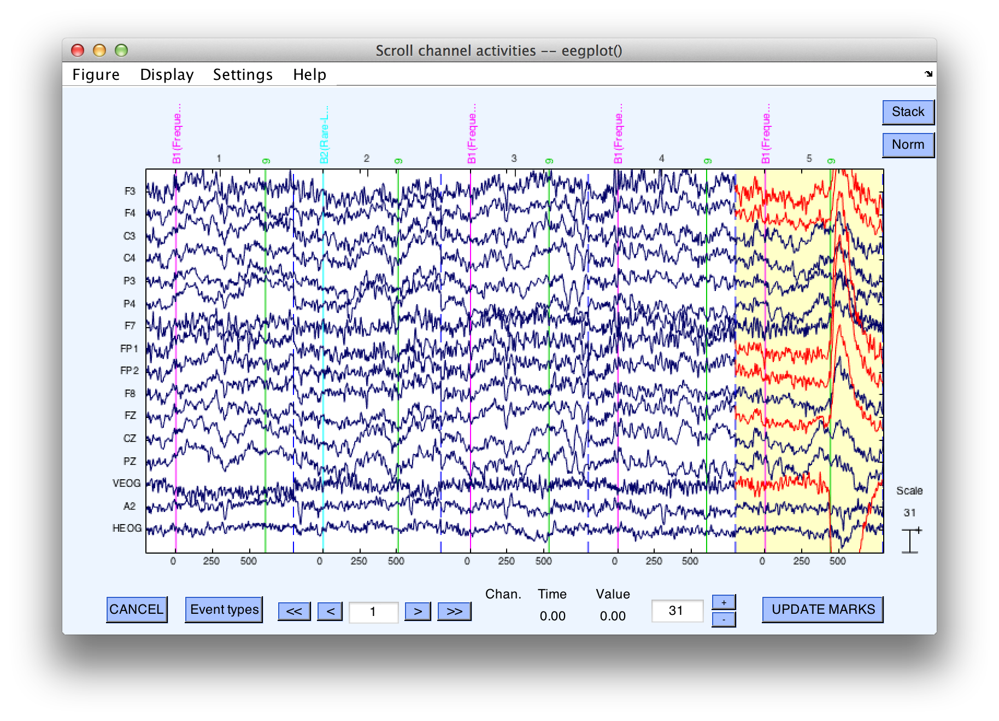
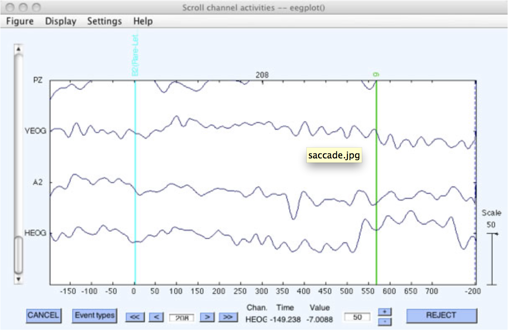
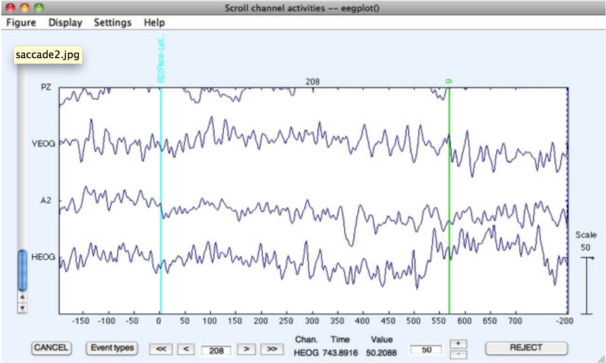
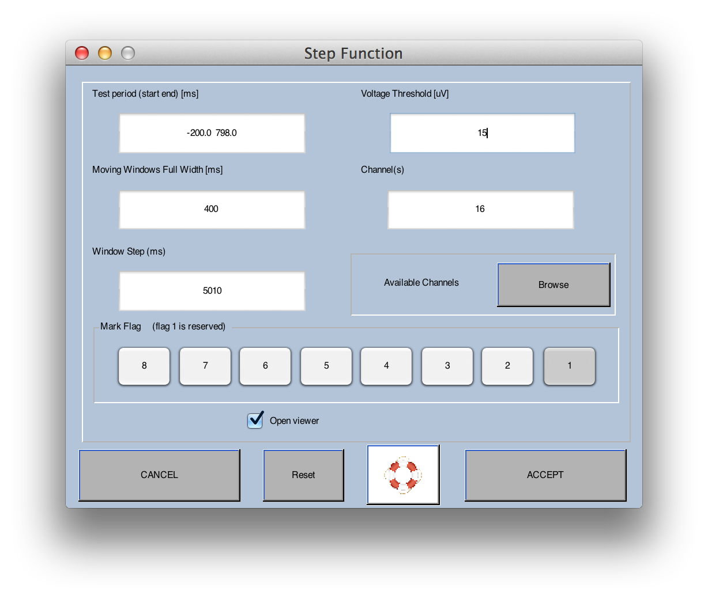

## Artifact Detection
The next step after epoching is usually artifact detection. ERPLAB makes a distinction between _artifact detection_ and _artifact rejection_. **Artifact detection** is the process of marking epochs that contain artifacts. **Artifact rejection** is the process of excluding trials containing artifacts. The ERPLAB artifact detection routines do not throw out any data; epochs with artifacts are merely marked. Artifact rejection occurs during averaging; marked epochs are simply excluded from the averaging process.

EEGLAB provides a method for manually rejecting (deleting) sections of the EEG data, and ERPLAB contains a method for automatically finding sections of "crazy" data and rejecting (deleting) them.  However, we strongly recommend that you use these only when it is absolutely necessary to delete the sections of EEG (e.g., deleting "crazy" data periods prior to ICA), and that you use artifact detection (marking of artifacts) for dealing with artifacts in all other cases.  Also, note that the deletion of sections of the EEG also leads to deletion of the event codes within those sections.  Consequently, if you are going to delete sections of EEG (with any method), **you must do so before the EVENTLIST has been created**.  In contrast, artifact detection should typically be conducted as the final step before averaging.

### Example 1: Moving window peak-to-peak threshold
We will start with moving window peak-to-peak threshold. Make sure that your epoched dataset is active ("S1_EEG_elist_be") and select **ERPLAB > Artifact detection in epoched data > Moving window peak-to-peak threshold**. You will see the window shown in the screenshot below.


This routine finds the maximum peak-to-peak voltage within a moving window that slides across the epoch (see the ERPLAB User's Manual for details). You select the **Test period**, which is by default the entire epoch (note that the time values you selected in the epoching process have been rounded to actual sample times). However, sometimes you will want to search for artifacts only during a portion of the epoch. You cannot, of course, look for artifacts outside of the epoch period, because only the data from within the epoch period are present after the data have been epoched.

You must also choose a **Voltage threshold**. An epoch will be rejected if the peak-to-peak voltage (the difference between the largest and smallest values) exceeds this value. The appropriate value will depend on the nature of the artifact you are trying to reject and how large it is in a given subject (see Chapter 4 in _An Introduction to the Event-Related Potential Technique_ for an overview of artifact detection).

You will then choose the length of the **Moving window** and the **Window step**. This routine finds the peak-to-peak voltage within a window of the length specified in the **Moving window** field. It then shifts the window by the amount specified in the **Window step** field and finds the peak-to-peak voltage within this new window. This is repeated until the end of the **Test period**, and the largest of these peak-to-peak amplitudes is compared with the **Voltage threshold**. This is an excellent way to find artifacts in which the voltage changes rapidly within a relatively short period of time (e.g., blinks, which usually peak and then subside within 200-300 ms) and not be fooled by relatively slow voltage changes.

By default, artifacts will be detected in all channels. However, you can specify a subset of channels to be tested in the **Channel(s)** field.

_Hint: Most windows that ask you to specify a range of values allow you to use the standard Matlab rules for numeric lists. You can simply type the values separated by spaces (e.g., "1 2 3"), or you can use a colon to specify a range (e.g., "1:3") or some combination (e.g., "1:3 5:7" to indicate 1-3 and 5-7). To specify a regular set of values, you can specify the first value, the step size, and the last value (e.g., "1:3:7" to start with 1 and go by steps of 3 to a final value of 7 [1 4 7])._

Finally, you can specify a set of flags in the **Flag** field that will be set in the EventList whenever an epoch has been marked for rejection. This allows you to do things like perform behavioral analyses on the information in the EventList while excluding events that contain artifacts. Flag 1 is always set for events with artifacts, and you can keep track of which events had which types of artifacts by setting additional flags for each artifact rejection test you perform. For details, see the ERPLAB User's Manual.

Set all of the fields as shown in the screenshot above (including ensuring the **Open viewer** box is checked) and click **Accept**.

ERPLAB will then scan the active dataset for artifacts (which may take some time). The total percentage of trials with artifacts detected (i.e. the total percentage marked for rejection, including epochs that had been marked previously) will be shown in the Matlab command window:  

    pop_artmwppth() rejected a 29.7 % of total trials.  

At this point, the ERPLAB artifact rejection routines automatically bring up the scrolling EEG data viewer window, as shown in the screenshot below.  

Scroll through the data to make sure that the parameters you entered have actually caused epochs containing artifacts to be detected without accidentally marking a large number of epochs without true artifacts. For example, you may need to increase the threshold if epochs without real artifacts are being marked for rejection, and you may need to decrease the threshold if epochs with clear artifacts are not being marked. Each epoch that has been marked is shown with a yellow background, and the channels within the epoch that exceeded the rejection threshold are drawn in red (see screenshot below). At present, artifact rejection is all-or-none; the entire epoch is discarded if an artifact is detected in one or more channels in that epoch.




The window for saving the newly created dataset is also brought up at this point. The idea is that you will scan through the dataset, and either save it (if everything looks OK) or click on **CANCEL** (if you want to change the parameters and try again). Once you have finished looking at the data, click **OK** in the window for saving the dataset if you are satisfied with the artifacts that were detected (it will be named "S1_EEG_elist_be_ar").  

```Matlab
    Equivalent Script Command:

    % Artifact Detection with Moving window peak to peak threshold
    % Test period [-200 798]. Voltage threshold 100uV
    % Moving window width: 200 ms. Window step: 50. Channels 1:16
    % Mark flags 1 and 4 (you must always mark flag 1
     EEG = pop_artmwppth( EEG, 'Channel' , 1:16, 'Flag' , [1 2]. 'Threshold', 100 ...
                   , 'Twindow', [-200798], 'Windowsize' , 200, ' Windowstep' , 50);
    % The script-based routine does not show you the data. To see the data, do this:
    pop_eegplot(EEG);

    % Now we will save the dataset
    % Setname is S1_EEG_elist_be_ar
    % Filename is S1_EEG_elist_be_ar.set
    % Path is /Users/etfoo/Desktop/tutorial_script/
    % Note that you will need to replace the path with the actual location in your file system
    EEG.setname='S1_EEG_elist_be_ar';
    EEG=pop_saveset(EEG, 'filename', 'S1_EEG_elist_be_ar.set', 'filepath', '/Users/etfoo/Desktop/tutorial_script/');

    %The following command uses Matlab's Current Folder
    EEG.setname='S1_EEG_elist_be_ar';
    EEG=pop_saveset(EEG, 'filename', 'S1_EEG_elist_be_ar.set');  
```

Note that the scrolling EEG display window ordinarily allows you to click on an epoch that has not been marked to manually mark it or to click on an epoch that has already been marked to unmark it. However, this ability is disabled when you are looking at the initial results of an artifact detection procedure, because the goal at this moment is to determine whether the automated procedure worked correctly. Once you are satisfied and have saved the dataset, you can open it again in the scrolling EEG display window, and then you can manually reject and unreject epochs.

### Seeing a summary of the number of artifacts detected

If, at some later time, you want to see how many trials have been marked for rejection in a given dataset, you can select **ERPLAB > Artifact Detection in epoched data> Summarize EEG Artifact Detection > Table**. This will print a table of the number of trials marked for rejection in each bin, along with the number of occurrences of each flag (which ordinarily corresponds to different types of artifacts). In our example, it should look like this if you print the table in the command window:


You can also get this information after averaging with **ERPLAB > Artifact Detection in epoched data > ERP Artifact Detection Summary Table**.

### Rejecting multiple times and clearing flags

Imagine that you want to do artifact rejection twice, once on the VEOG channel with a relatively low threshold (e.g., 75 µV) and short moving window length (e.g., 200 ms) to detect blinks, and once on all the other channels with a relatively high threshold (e.g., 200 µV) and long moving window length (e.g., 1000 ms) to detect other kinds of artifacts (e.g., EMG bursts, skin potentials, etc.). You can simply run the artifact detection routine once with one set of parameters, save the dataset, and then run the artifact detection routine on this new dataset with a new set of parameters. Any artifacts marked in the dataset prior to artifact detection will remain marked when artifact rejection is performed on that dataset, and any additional artifacts will be marked in the new dataset. If you wish to unmark everything and start over, you can either clear the datasets and go back to an unmarked dataset or select **ERPLAB > Artifact Detection > Clear Artifact Detection Marks on EEG** which then displays the following figure.


To reset the artifact detection marks, make sure **Reset Artifact Rejection Marks, Reset Flags**, and **All flags** are selected, then click **OK**. After you click **OK**, a window pops up prompting you to name the new dataset.  

```Matlab
    Equivalent Script Command:

    % Artifact Detection, Clear Artifact Detection Marks on EEG
    EEG = pop_resetrej(EEG, 1, 65535);  
```

### Combining EEGLAB and ERPLAB Artifact Detection
EEGLAB allows you to manually delete sections of the continuous EEG with artifacts from within the **Plot > Channel data (scroll)** window. This deletion is permanent (although you can always go back to a previous version of the data in which the data have not been deleted). Manual deletion also causes the insertion of a **boundary** event. This type of artifact rejection is performed on the continuous EEG, so it is prior to (and independent of) ERPLAB's artifact detection.

EEGLAB also has routines for marking epochs for deletion (and you can optionally delete the rejected epochs from the EEG in addition to marking them). The most useful of these routines allows you to visually inspect the data and click on epochs that you would like to mark for deletion (**Tools > Reject data epochs > Reject by inspection**). If you use any of EEGLAB's routines for marking epochs for rejection, the marks will not automatically be propagated to the artifact flags in the EVENTLIST (because EEGLAB doesn't "know" anything about the EVENTLIST structure). Similarly, any manual rejection that you do by simply changing the EVENTLIST flags won't be propagated to EEGLAB's rejection marks (EEG.reject). When you average the ERPs, ERPLAB's averaging routine automatically rejects trials marked in either place, and the EVENTLIST in the ERP will contain marks for both types of rejections.

In addition, you can force the synchronization of these two sets of marks with **ERPLAB > Artifact Detection > Synchronize Artifact Info in EEG and EVENTLIST**. This can also be achieved from scripts or from the command line with the pop_syncroartifacts() routine. Note: If you unreject epochs using **Reject by inspection** in EEGLAB, you must transfer the marks from EEG.reject to the EVENTLIST, but not vice versa.

### Example 2: Step-like artifacts
To see how this works, let's take the dataset that you've already marked with rejections using the **Moving window peak-to-peak threshold test** and apply another test, the **Step-like artifacts test**. In this example, we will attempt to detect horizontal eye movements in the HEOG channel (channel 16). Saccadic eye movements have a distinctive shape, because the eyes are steady at one location for a period of time, then jump to another location, stay steady for a period of time, and then jump to yet another location, so the HEOG signal is relatively flat, suddenly jumps to a new level, stays flat for a period of time, and then jumps to a new level. In many cases, the eyes are on the fixation point, jump away for a few hundred milliseconds, and then jump back to fixation. When this happens, the HEOG signal has a boxcar shape, as in the screenshot shown below.




The current data file has quite a bit of high-frequency noise that makes it difficult to see this small artifact (which was at epoch #208). Thus, the data shown in the screenshot above were first filtered with a 30-Hz low-pass filter (see the [section on filtering](./Filtering-EEG-and-ERPs) for more details). To get a close-up view of the artifact, the time window to display was set to 1 epoch and the number of channels to display was set to 3 (within the **Settings** menu within the plotting window).

Without the filter, the plot will look like the following screenshot:




The **Step-like artifacts** function is well suited to detecting this type of artifact (see the User's Manual for more details about this function). To use it, make sure that the dataset you created with the first artifact test is selected, and then select **ERPLAB > Artifact detection in epoched data > Step-like artifacts**. Enter the parameters as shown in the screenshot below, making sure that Flag 3 is selected (you should have selected Flag 4 when you did the peak-to-peak detection) and that you are detecting artifacts only in Channel 16. Note that the full width of the step function is set to 400 ms. This means that we are looking for a period of one voltage for >=200 ms immediately followed by a period of a different voltage for >=200 ms. This width was chosen because fixation periods almost always last for at least 200 ms.



After you click **Accept**, you will see in the command window that this routine found artifacts on 12.8% of trials. If you look at the scrolling data window that pops up, you will see that some of the epochs with these artifacts also had blink artifacts that were detected with the peak-to-peak amplitude routine that was previously run with these data (e.g., epoch 44 indicates a rejection of the HEOG channel by drawing this channel in red, and the data from several other channels are also drawn in red from the peak-to-peak artifact detection). However, other epochs were rejected solely because of the step function in the HEOG channel (e.g., epochs 208 and 209).  

```Matlab
    Equivalent Script Command:

    % Artifact Detection, Step-like artifacts
    % Test period [-200 798], Voltage Threshold 15
    % Moving Window Width 400, Window step 10
    % Channel 16 only, Mark flags 1 and 3 (you must always mark flag 1
    EEG = pop_artstep( EEG,>'Channel' , 16, 'Flag', 1, 'Threshold'  15 ...
                 , 'Twindow' , [-200 798], 'Windowsize' , 400, 'Windowstep' , 10);  
```

### Looking at artifact information in the EventList

Information about the artifacts can also be found in the EventList. To see this, save the EventList from the current dataset in a text file by selecting **ERPLAB > EventList > Export EEG EventList to Text File**. Now open the text file in Matab's text editor. You will see something like the following.


If you look at the column of artifact rejection flags (a_flags), you will see that every rejected trial has flag 1 set (the rightmost flag). Some of the events have flag 4 set from the peak-to-peak routine (e.g., item 157). Other events have flag 3 set from the step function routine (e.g., item 159), and other events have both flags 3 and 4 set (e.g., item 167), indicating that both types of artifacts were detected. This information can be useful if you want to perform behavioral analyses excluding trials with specific types of artifacts.  

```Matlab
    Equivalent Script Command:

    % Export EEG Eventlist to Text file
    % Filename is Export_EEG_EL.txt
    % Path is /Users/etfoo/Desktop/tutorial_script
    % Note that you will need to replace the path with the actual location in your file system
    EEG = pop_exporteegeventlist(EEG, '/Users/etfoo/Desktop/tutorial_script/Export_EEG_EL.txt');

    % The following command uses Matlab's Current Folder
    EEG = pop_exporteegeventlist(EEG, 'Export_EEG_EL.txt');  
```

Note that the left column in this text file shows the original item number of the event, from the original continuous dataset. The second column shows the bin epoch (bepoch) number, which is the item number after epoching. These numbers will be different when some event codes are not used as time-locking events when the data are epoched (e.g., the response event codes in the current example). If you are trying to find an event in the continuous data with **Plot > Channel data (scroll)**, you should use the item number (first column). If you are trying to find an event in the epoched data, you should use the bepoch number (second column).

_Note for programmers:_ The flags are shown in a binary format in the text file (to make it easier to see the individual flag values). However, they are stored in a single variable, and Matlab ordinarily uses decimal numbers to enter and print the value of a variable. For example: If you set flags 1 and 5 in an artifact detection tool, and you print out the value of the flag variable, you will see a value of 17.

----
<table style="width:100%">
  <tr>
    <td><a href="./Creating-Bin--Based-EEG-Epochs"> <br> <b> Creating Bin-Based EEG Epochs </a></td>
    <td><a href="./Tutorial"> <br> <b> Tutorial</a></td>
    <td><a href="./Creating-Averaged-ERPs"> <br> <b> Creating Averaged ERPs  </a></td>
  </tr>
</table>