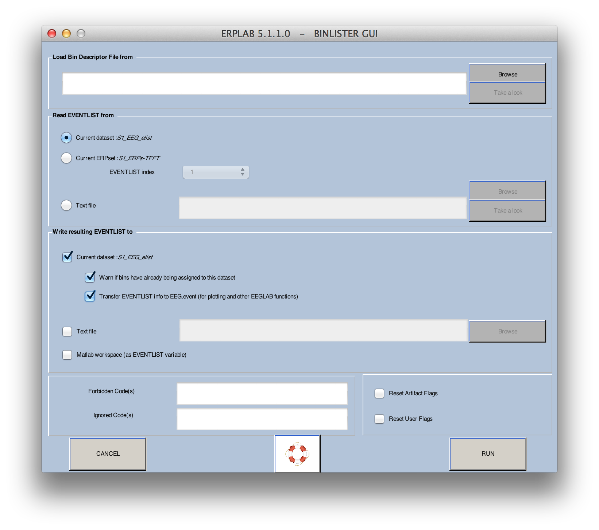

## Assigning Events to Bins with BINLISTER
## Overview of BINLISTER
BINLISTER is a powerful and flexible routine for assigning events to bins.  For simple experiments with a 1:1 relationship between event codes and bins, the bin assignment can be accomplished when you [create the EventList](./Creating-An-EVENTLIST) (using the **Advanced** button). For most experiments, however, you will use BINLISTER to assign events to bins.

Each event in an **EVENTLIST** structure contains a list of bins to which that event has been assigned.  This typically starts out as an empty list (unless you performed simple bin assignment when the **EVENTLIST** structure was first created).  When you run the BINLISTER routine, the list of bins for each event is updated (except that the list remains empty for any events that are not assigned to a bin).  At a subsequent step, you will extract EEG epochs surrounding each of the events that has been assigned to a bin, and the averaging routine will then be used to average together all of the epochs that have been assigned to a given bin.  This is a somewhat complicated process, which is a reflection of the variety of ways in which one might want to sort the data for averaging.

The general approach used by BINLISTER is as follows.  Using the Matlab text editor, the user creates a text file that provides an abstract description of the kinds of event sequences that should be assigned to each bin (e.g., event code 20 preceded by event code 51 or 52 and followed 200-1500 ms later by event code 101).  The abstract description for a given bin is called a _bin descriptor_, and the file containing the bin descriptors is called a _bin descriptor file_.  BINLISTER reads this file, and then scans the **EVENTLIST** structure.  Each event is compared with each of the bin descriptors.  If it matches one or more of the bin descriptors, the list of bins for that event is updated (in the **EVENTLIST.eventinfo.bini** field [_bini_ stands for _bin indexes_]).

_Note: BINLISTER is reasonably powerful and flexible, but it was designed with certain types of experiments in mind and it may not be very good for other types of experiments.  When this happens, we encourage ERPLAB users to write their own programs for assigning events to bins.  This should be relatively easy, because all of the relevant information is easily available in the **EVENTLIST** structure.  If you write a program of this nature that you think will be useful to others, please send it to us and we will incorporate it into future ERPLAB releases._

## Bin Descriptor 'Cheat Sheet' and Examples
https://github.com/lucklab/erplab/wiki/BDF-Library

## Creating a Bin Descriptor File (BDF)
A bin descriptor file (BDF) can be created in any text editor, but we strongly recommend that you use Matlab's built-in text editor; other text editors may insert hidden characters that will cause problems. We recommend using a **.txt** file extension.

To explain the bin descriptor file syntax, we will begin with the relatively simple example shown below.  In this example, there are green targets (event code 100), red standards (event code 101), and blue standards (event code 102).  Subjects are asked to make a left-hand response (event code 201) for either standard and to make a right-hand response (event code 202) for the target. Here are several bins that one might want to define for this experiment:

```
bin 1
Target preceded by standard (correct response)
{101;102}.{100}{t<200-1000>202}


bin 2
Target preceded by standard (incorrect response)
{101;102}.{100}{t<200-1000>201}


bin 3
Target with no response
.{100}{t<200-1000>~201;202}


bin 4
Red standard preceded by either standard (correct response)
{101;102}.{101}{t<200-1000>201}


bin 5
Blue standard preceded by either standard (correct response)
{101;102}.{102}{t<200-1000>201}
```


Each bin descriptor contains three lines.  The first line gives the bin number; the bins must be listed in ascending order starting with bin 1 (not with bin 0, as in ERPSS).  The second line gives a written description of the bin, which will be used for things like labeling waveforms when the data are plotted.  The third line provides the criteria for determining whether a given event should be assigned to that bin.  It is conventional, but not necessary, to place a blank line between the end of one bin descriptors and the beginning of the next. Note that comments can be included if preceded by a # character.

_Sequences of events._  Let's begin by considering the criteria for the first bin, "{101;102}.{100}{t<200-1000>202}".  Each set of curly brackets ("{}") defines an event.  The event following the dot is the time-locking event, and the preceding and following sets of curly brackets define the events that must precede and follow the time-locking event.  In this example, the string ".{100}" indicates that the time-locking event for this bin must have an event code of 100.  Multiple event codes can be listed by separating individual event code values with semicolons.  Thus, the string "{101;102}.{100}" indicates that the time-locking event code 100 must be immediately preceded by either a 101 or a 102.

Note: We will eventually allow you to use event labels rather than event codes in bin descriptor files, but the labels cannot currently be used.

_Time-conditioned event lists._  It is also possible to provide a time range for a set of event codes using the syntax "t<start–end>ecode", where **start** is the starting time of the time range, **end** is the ending time, and **ecode** is the event code (or list of event codes).  This is called a _time-conditioned event list_. In the present example, the string ".{100}{t<200-1000>202}" means that the time-locking event code of 100 must be followed 200-1000 ms later by an event code of 202.  Times are listed in milliseconds, and they are always relative to the time-locking event. Thus, ".{100}{t<200-1000>202}{t<200-1000>203}" would mean "find a 100 followed by a 202 that is between 200 and 1000 ms after the 100 and is also followed by a 203 that is between 200 and 1000 ms after the 100."

However, when a time range is used, other event codes can be present without disrupting the assignment of an event to a bin.  Imagine, for example, an experiment in which a stimulus (event code 100) was supposed to be followed by two responses (event codes 201 and 202) on each trial, in any order.  If you wanted bins in which they made the 202 response after the stimulus, irrespective of whether and when a 201 response was made, you could specify the sequence ".{100}{t<200-1000>202}". This will work whether the sequence on a given trials was 100-201-202, 100-202-201, or even 100-202 (as long as the 202 was 200-1000 ms after the 100).  When a time range is not specified, however, the exact sequence must be matched.  Thus, ".{100}{202}" would lead to a match if, following the 100 code for the stimulus, the subject made the 202 response and then made the 201 response.  However, it would not lead to a match if the subject made the 201 response and then made the 202 response.

Imagine another situation in which an event code 255 occurs whenever a heartbeat was detected by some device.  These heartbeat codes would occur at unpredictable times.  Thus, if you were looking for a stimulus of 100 followed by a response of 202, and you specified an event descriptor of ".{100}{202}", this would fail whenever a hearbeat code (255) occurred between the 100 and the 202.  There are several ways to deal with unpredictable sequences such as this.  First, you could specify time ranges instead of absolute sequences (e.g., ".{100}{t<10-2000>202}").  Second, you could set the **enable** value to 0 for all occurrences of event code 255 (remember that BINLISTER completely ignores events in which **enable** is set to 0).  Third, you could use the BINLISTER GUI to tell BINLISTER to ignore any occurrences of event code 255 (this is described in the next section).  Finally, you could create two separate bins, one for when the 255 was present and one for when it was absent (e.g., Bin 1 could be defined as ".{100}{202}" and Bin 2 could be defined as ".{100}{255}{202}").  The two bins could then be merged into a single bin after averaging using **ERPLAB > ERP Operations > ERP Bin Operations**.

If a time-conditioned event list appears prior to the time-locking event, time flows backward from the time-locking event.  That is, if you specify "{t<200-800>15}.{100}", BINLISTER will search for an event code of 100 preceded by an event code of 15 that occurred 200-800 ms prior to the 100.

If two time-conditioned event lists are used on one side of the time-locking point, both time and sequence are implied.  That is, ".{100}{t<200-1000>201}{t<400-1200>202}" means that a 201 must occur 200-1000 ms after the 100, that a 202 must occur 400-1200 ms after the 100, _and that the 202 must occur after the 201_. This is the one situation in which sequence matters with time-conditioned event lists.

_The not (~) operation_. The tilde (~) character is used to mean _not_.  That is, "{~101;102}.{100}" would mean that the time-locking event of 100 must not be preceded by 101 or 102 (the _not_ operation applies to all of the listed event codes; it wouldn't make sense to say that it must not be 101 and must be 102, because that is the same as saying that it must be 102).  The _not_ operation can also be applied when a time range has been specified.  For example, Bin 3 of the example above defines a target that is followed by neither of the two responses, which is specified as ".{100}{t<200-1000>~201;202}".

_Flags_. BINLISTER can set and test the flag values from the **EVENTLIST**, using a syntax of "fa<#>" or "wa<#>"to test and write artifact flags, respectively, and a syntax of "fb<#>" or "wb<#>" to test and write user flags, respectively.  For example, the rightmost artifact flag will be set for trials containing artifacts, and you could include only trials with artifacts by specifying "{100:fa<1>}".  That is, the event code (or list of event codes) is followed by a colon and then the list of flag values inside "<" and ">" symbols.  To exclude flagged trials, you could use the tilde to specify a not operation, as in "{100:~fa<1>}" to exclude trials in which artifact flag 1 was set.  Equivalently, you could specify that the flag must be a zero, as in "{100:fa<0>}".

You do not need to specify all 8 flag values.  As with decimal numbers, you can leave out the zeroes at the left of the number (i.e., just as the decimal number "0027" can be written as simply "27", the binary number "000010" can be written simply as "10").  In addition, you can use an "x" instead of a "0" or "1" if a given flag should be ignored.  For example, you would specify "<10x>" to include the event if the third-to-right value is a 1, the second-to-right value is a 0, and it doesn't matter whether the rightmost value is a 0 or a 1.

_Note for experts: The artifact and user flags are actually stored together in a single 16-bit value, with the artifact flags as the least significant byte and the user flags as the most significant byte.  You can test and write the value of the whole 16-bit value with "f<#>" and "w<#>", respectively._

A common use of user flags is to indicate different experimental conditions.  For example, imagine an experiment in which the target is green and the nontarget is red in the first half of the session, and the target is red and the nontarget is green in the second half of the session.  You could use exactly the same event codes in the two halves the session, but use different flag values to indicate the condition.  For example, you could use event code 100 for green and 101 for red.  You could set the rightmost flag to 0 for events when green was the target and you could set this flag to 1 for events when red was the target (using Matlab's text editor).  You could then have the following bin descriptors:

```
bin 1
Target- Green stimulus (target = green)
{100:fb<0>}

bin 2
Target- Red stimulus (target = red)
{101:fb<1>}

bin 3
Nontarget- Green stimulus (target = red)
{100:fb<1>}

bin 4
Nontarget- Red stimulus (target = green)
{101:fb<0>}
```


_Note for ERPSS users: The syntax for a Bin Descriptor File is intended to be exactly like the syntax in ERPSS, except that there are no condition codes and artifact flags have been added. However, some aspects of the syntax are not fully specified in the ERPSS documentation, so we cannot guarantee that BINLISTER and ecdbl will work in exactly the same way. Please see the BDF documentation in ERPSS for details of the syntax (we will eventually provide a more complete description of the BinLister syntax)._

## Running BINLISTER
Once you have created your bin descriptor file, you can run BINLISTER by selecting **ERPLAB > Assign Bins (BINLISTER)**.  It will bring up the following window:



You specify the bin descriptor file in the text field at the top of the window.  Normally, BINLISTER reads the events from the **EEG.EVENTLIST** structure, but it can instead read from an EventList text file.  This is useful if you want to use BINLISTER to perform behavioral analyses on an EventList that is no longer associated with a continuous EEG file (see the section on [behavioral analyses](./Behavioral-Analyses) for details).  The new bin and event information can be stored in the **EEG.EVENTLIST** structure, in a separate **EVENTLIST** variable in the Matlab workspace, or in a text file.

If you want to update the event information in the **EEG** structure, you can check the **Transfer EVENTLIST info**… box.  This will allow you to view the EEG data with bin numbers rather than event codes or event labels (which is occasionally useful).

Bin descriptors can be very complex in some experiments.  To help you debug them, you can have BINLISTER create a report of its activities by selecting **Create detailed Report File**.  This option is available only when the EventList is being written to a text file, and the report file will be created in the current directory.

If you check the **Reset User Flags** box or **Reset Artifact Flags** box, the flag values will be set to zero before BINLISTER runs.

The **Ignored Code(s)** field allows you to enter a list of event codes that will be completely ignored (just as if the **enable** value were set to 0).  Similarly, the **Forbidden Code(s)** field allows you to enter a list of event codes that will be treated as invalid data (just as if the **enable** value were set to -1 for all instances of those event codes).

