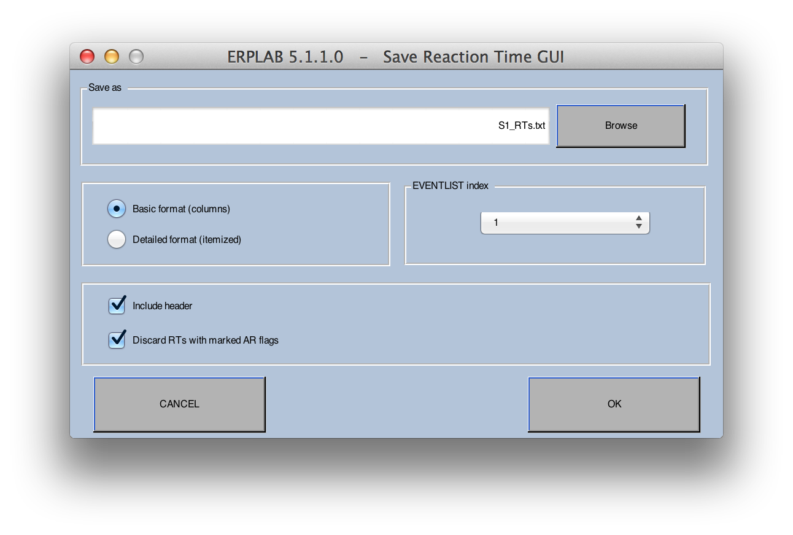

## Behavioral Analyses
ERPLAB does not yet have sophisticated tools for behavioral analyses, although we plan to add a set of tools for behavioral analyses eventually.  For now, you have two main choices.  First, you can write a script that reads the event information from the **EVENTLIST** structure (or from a text file version of the **EVENTLIST** structure) and performs the desired analyses.  Second, you can take the information provided by BINLISTER about the timing and accuracy of behavioral responses and read this into Excel or a Matlab script.

## Analyzing Accuracy
Behavioral accuracy information can be obtained very easily by running BINLSTER and then either using the resulting **EVENTLIST** list structure directly or by saving it as a text file.  The **EVENTLIST** structure contains information about the number of trials that were present in each bin.  If you have some bins that are correct responses and others that are incorrect responses, you can calculate the proportion correct by knowing the number of cases of each of these two bins.  When you save the **EVENTLIST** structure in a text file, the format of the file header was designed to make it relatively easy to read this information into Excel or into a MATLAB script.

For example, for a simple oddball experiment with standards and targets, you might define the following bins:

 ## Comment: 100 = target; 101 = standard; 200 = response for target; 201 = response for standard

Bin 1

Target followed by correct response

.{100}{t<200-1000>200}

Bin 2

Target followed by incorrect response

.{100}{t<200-1000>201}

Bin 3

Standard followed by correct response

.{101}{t<200-1000>201}

Bin 4

Standard followed by incorrect response

.{101}{t<200-1000>200}

After running BINLISTER, the number of occurrences of each of these bins is stored in **EEG.EVENTLIST.trialsperbin**, which you could use to compute the proportion correct for targets and for standards (or d', or A', or any other parameter you would like).  If you save the **EVENTLIST** as a text file, this information is printed just after the header, and it looks something like this:

bin 1,      # 18,       Target followed by correct response                                                                                

bin 2,      # 2,        Target followed by incorrect response       

bin 3,      # 74,       Standard followed by correct response                                                                                

bin 4,      # 6,        Standard followed by incorrect response

In this example, there were 18 instances of a target followed by a correct response, 2 instances of a target followed by an incorrect response, 74 instances of a standard followed by a correct response, and 6 instances of a standard followed by an incorrect response.  This information could be imported into Excel (or a Matlab script, or anything that can read a text file) for further analysis.

Sophisticated Excel users should also be able to import the **EVENTLIST** text file into Excel and directly compute accuracy information from the list of events (e.g., using pivot tables).  This could be done without BINLISTER or after using BINLISTER to add bin information (which could then be used for sorting the trials).

_Note: In many cases, the BINLISTER bin descriptor file that you use for doing behavioral analyses will not be the same as the one you use for creating averaged ERPs.  For example, you may need to break down the data into more bins for your behavioral analysis than for your averaged ERPs._

## Analyzing Reaction Times
For reaction times (RTs), you can use a special aspect of the BINLISTER syntax to extract the single-trial RTs.  For example, imagine that you have a simple oddball experiment with targets and standards.  You could extract the RTs using the **:rt<"variable_name">** syntax as follows:

Comment: 100 = target; 101 = standard; 200 = response for target; 201 = response for standard

Bin 1

Target followed by correct response

.{100}{t<200-1000>200:rt<"target_rt">}

Bin 2

Standard followed by correct response

.{101}{t<200-1000>201:rt<"standard_rt">}

When BINLISTER encounters an event that matches a given descriptor, the **:rt<>** syntax causes the time of the event to which it is linked (e.g., the response event code) to be saved in the **bdf** field of the EVENTLIST variable.  The time is given relative to the time of the time-locking event (e.g., relative to the target stimulus).  These time values can then be saved to a text file, allowing you to use Excel or other programs to compute means, RT distributions, etc.

It is possible to save the timing of multiple responses for each bin by simply giving them different labels, as in:

Bin 1

Target followed by two correct responses

.{100}{t<200-1000>200:rt<"rt1">;t<200-1000>201:rt<"rt2">}

_Note: ERPLAB does not make a distinction between stimuli and responses, so this feature can be used to determine the time between any type of event and the time-locking event._

You can access the single-trial RT values directly from the EVENTLIST variable or by exporting them to a text file.  The former method is good for people with lots of Matlab scripting experience, and the latter method is good for everyone else.  Note that even people with lots of scripting experience may want to export the values to a text file if they want to exclude trials that were rejected because of artifacts, which can be complicated (as described in a later section).

To export the RT values to a text file, select **ERPLAB > EventList > Export Reaction Times to Text > From EEG** (if you want to access the RTs in the current EEG dataset) E**RPLAB > EventList > Export Reaction Times to Text > From ERP** (if you want to access the RTs in the current ERPset).  A window like the following screenshot will appear:

There are two formats you can choose for the text file.  In the **Basic format**, each column lists all of the RTs from a given bin.  The first line is the first RT from each bin; the second line is the second RT from each bin; etc.  With this format, the relationship between the different RTs on a given line is completely arbitrary; the RTs within a column are in order only with respect to the bin represented by that column.  The number of RTs will often differ across bins, leading to empty cells in the bins x trials matrix, and NaN (not a number) is used to pad the empty cells.  This format is particularly useful if you simply want to read in the RT values from each bin (e.g., with Excel or Matlab) and compute the mean or median RT values.  Note that the first row of the file is a set of labels for each column, with each label formed by concatenating the name of the bin with the label for the RT that you provided in the BDF (e.g., "standard rt"); any white space characters (e.g., spaces) are replaced by underscores.  For example, the label for the first of the two RTs in Bin 1 in the example above would be "Target_followed_by_two_correct_responses_rt_1".

The **Detailed format** is designed to work with Excel's pivot table feature, which provides a great deal of power and flexibility (at the cost of a small increase in complexity). In this format, each line of the output file contains the RT from a single trial, along with information about the bin number, bin label, RT label, etc., which can be used to sort the RTs with a pivot table.  Here's an example of this output format:

    Item    RTime     HomeCode RespCode  Bin#    BinLab

    2      608.000      101      9        1      Frequent_RT

    4      507.999      121      10       2      Rare_RT

The **Item** column indicates the item number from the original list of events in the EEG.  The **RTime** column indicates the reaction time.  The **HomeCode** column shows the event code of the time-locking event from that trial. The **RespCode** column shows the event code of the response event from that trial. The **Bin#** column shows the bin number, and the **BinLab** column shows the bin label.

_Note: The various values are separated by tabs, so they may not appear to line up properly when you open the file in a text editor.  However, the will be fine when you open the file with Excel._

## Excluding Trials with Artifacts or Invalid EEG Data from Behavioral Analyses
In many cases, you will want your behavioral analyses to be based on the same trials that were included in your averaged ERP waveforms, which means that trials that were rejected from the averages need to be excluded from your behavioral analyses.  This can be accomplished fairly easily with ERPLAB.  When you use ERPLAB's artifact detection functions, artifact flag 1 in the **EVENTLIST** will automatically be set for trials that are rejected.  You can then use this information to perform behavioral analyses in a manner that excludes trials for which this flag is set.  In most cases, you will want to use the **EVENTLIST** from an ERPset (ERP.EVENTLIST) rather than from a dataset (EEG.EVENTLIST), because then you can be guaranteed that the same trials that were averaged together in the ERPset are being used for the behavioral analysis.

_Important note: Although ERPLAB keeps track of artifacts using the artifact flags in the **EEG.EVENTLIST** structure, EEGLAB instead uses the **EEG.reject** structure.  If you are using EEGLAB's artifact detection routines, you should synchronize the information in **EEG.EVENTLIST** and **EEG.reject** with the **ERPLAB > Artifact Detection > Synchronize Artifact Info in EEG and EVENTLIST** command prior to performing your behavioral analyses._

Let's start by seeing how this would be done with RT data.  Assuming that some of your bin descriptors included the **:rt<"variable_name">** syntax described in the preceding section, you can simply export the RT values to a text file using **ERPLAB > EventList > Export Reaction Times to Text > From ERP**.  Simply select the **Discard RTs with marked AR flags** option, and trials for which the artifact flags were set will be excluded from the text file.  Note that ERPLAB will check for artifacts in the time-locking event for a given trial, not the actual response event, because it is the artifact flag for the time-locking event that determines whether or not the event will be included in the averaged ERP waveform.

There are two main ways to eliminate trials with artifacts from analyses of accuracy.  First, one could simply read the information about individual events in the **EVENTLIST** structure, but excluding trials for which the artifact flags are set.  However, this requires fairly advanced Matlab or Excel skills.  Second, one can run BINLISTER a second time, using a bin descriptor file that is designed to use the information about artifact rejection that has been stored in the flags.  ERPLAB always sets least significant bit (rightmost digit) in the artifact flag to 1 for events with artifacts, and it is 0 for events without artifacts, so you could use the following syntax to exclude trials with artifacts.

Bin 1

Target without an artifact followed by correct response

.{100:fa<0>}{t<200-1000>200}

Bin 2

Target without an artifact followed by incorrect response

.{100:fa<0>}{t<200-1000>201}

In this example, **fa<0>** means that the rightmost artifact flag has a value of zero (i.e., it has not been set to a value of 1).  Note that, when an artifact is detected for a given epoch, the flag is set for the time-locking event, not for the other events that are used to define a given bin (e.g., the response events in this example).  If you wanted to include an event only if there was no artifact for the stimulus AND no artifact for the response, you could check the artifact flag for both the stimulus and the response, as in:

Bin 1

Target without an artifact followed by correct response without an artifact

.{100:fa<0>}{t<200-1000>200:fa<0>}

If you have set additional artifact flags to indicate different types of artifacts (e.g., flag 3 for eye movements and flag 4 for blinks), you could perform analyses that include or exclude specific types of artifacts.  For example, to examine accuracy for trials with an eye movement, you could set flag 3 for epochs with eye movements during artifact detection and then use **a<1xx>** in your bin descriptors to indicate that events should be included only if flag 3 is set (the x's mean that these flags can be any value).

It is important to keep in mind that BINLISTER is ordinarily used to assign events to bins prior to epoching the data.  However, artifact detection can be performed only after the data have been epoched, and the best time to do behavioral analyses is after averaging (so that you can be 100% certain of which events were included versus excluded from the averages).  To use BINLISTER to perform behavioral analyses that exclude rejected trials, you should first perform artifact detection and then averaging.  You can then save the EventList from the newly created ERPset to a text file by selecting **ERPLAB > EventList > Export ERP EventList to Text File**. BINLISTER can then read from this text file and save its output to a new text file (or save the **EVENTLIST** structure in the workspace, so you can access it directly from a script).
