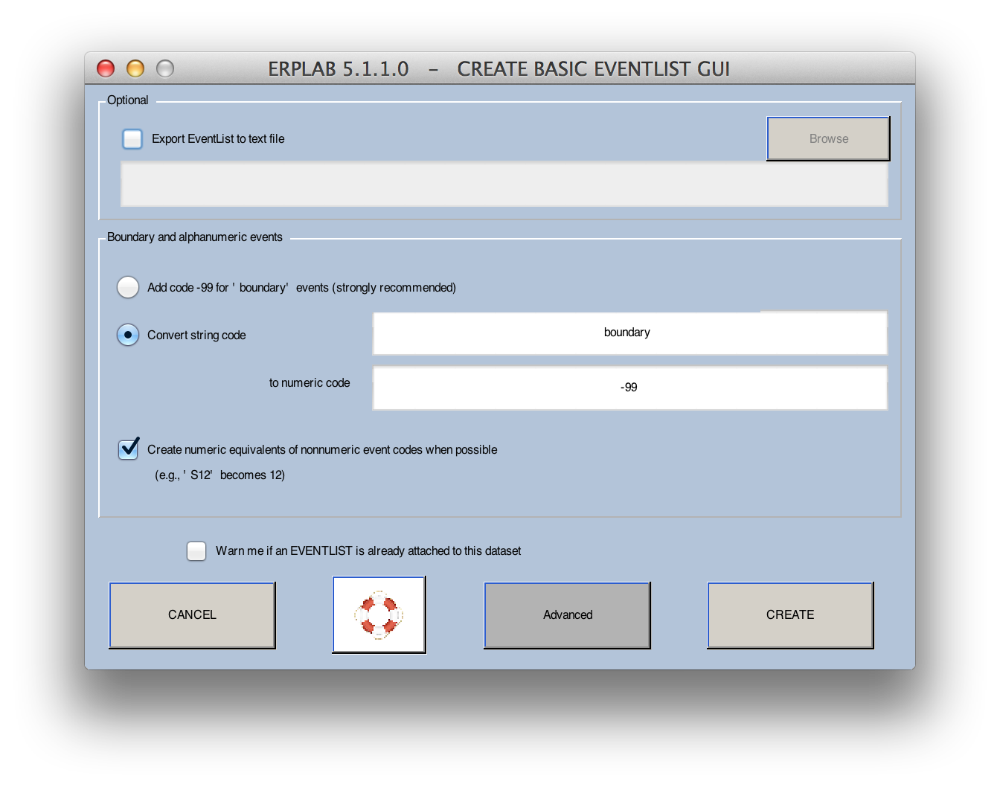
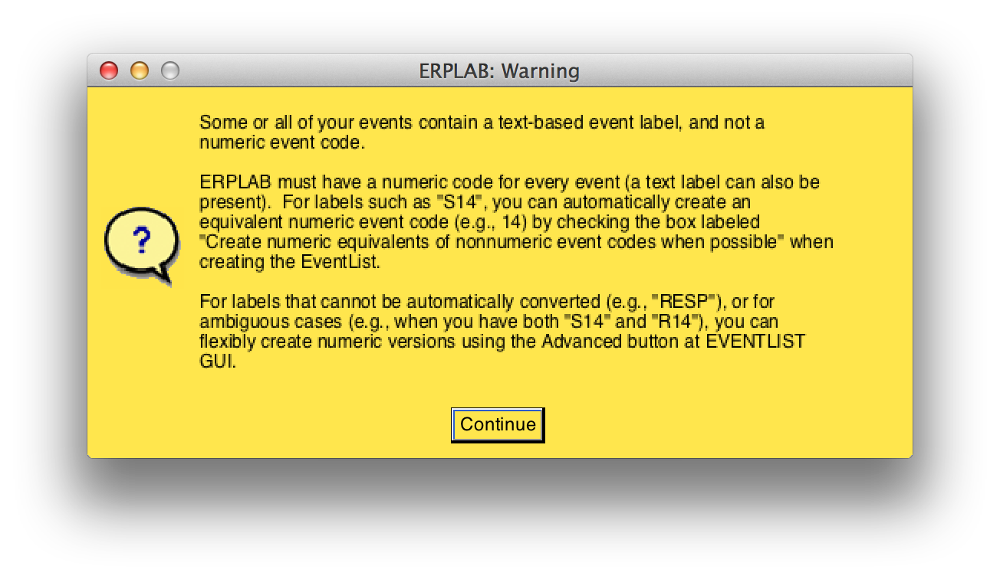
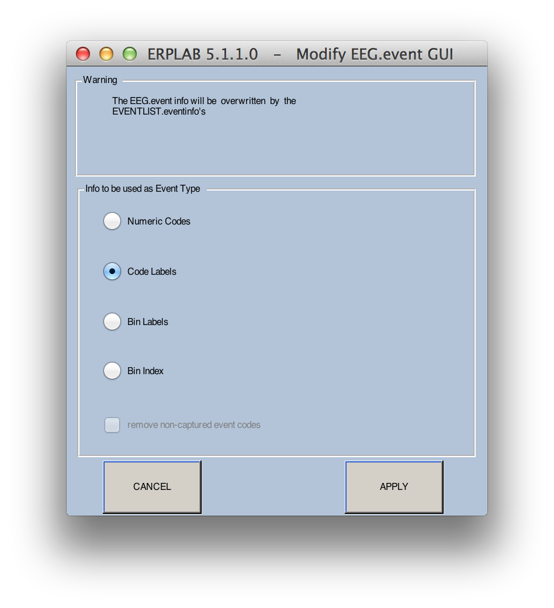
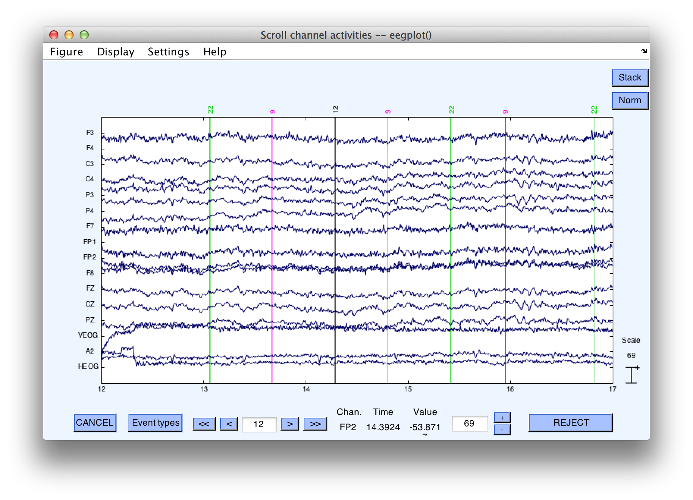

## Creating an EVENTLIST
This page describes how to create an **EVENTLIST**.

You must create an **EVENTLIST** structure for a given dataset to use it with ERPLAB (see the [EventList documentation](./The-EVENTLIST-Structure) for more details). This is usually done on the continuous EEG data, prior to using any ERPLAB routines to process the dataset.  An EventList is created from the current dataset using **ERPLAB > EventList > Create EEG EventList**. In many cases, this is a very simple process using the window shown below. You simply click **CREATE** and the events in **EEG.event** are stored in the **EVENTLIST** structure, which is then added onto the current **EEG** structure.

Some systems (e.g., EGI and Brain Products) use text strings rather than numeric values as event codes. In some systems, this is very subtle (e.g., the codes might be 'S21', which looks like a number but isn't). ERPLAB will usually be able to detect this, leading to the following warning message:

If you see this warning, you must convert the text strings to numeric values. There are several ways to do this. First, if your string values contain numbers (e.g., 'S21'), they can be converted into numeric values by selecting the **Eliminate nonnumeric information** option when you create the EVENTLIST. Second, you can do the same thing from a script (or from the command line) using a function called letterkilla (i.e., you would type **EEG = letterkilla(EEG); eeglab redraw;**). Third, you can use the advanced options in Create EventList, as described next.

More advanced options for creating an EventList can be accessed by clicking the **Advanced** button, which brings up the window shown below.  This version allows you to assign a text label to each event code, and you can also use it to assign event codes to bins (if there is a simple 1:1 mapping between event codes and bins).  If your data acquisition system uses text labels instead of numeric event codes for each event (e.g. EGI), you could assign a numeric event code to each label and/or assign each event label to a bin.

Note: ERPLAB does not yet make full use of event labels, so you will likely need numeric event codes.

The example shown in the screenshot above is from a simple oddball experiment in which the standard stimulus corresponds to an event code of 122, the target corresponds to an event code of 112, target responses correspond to an event code of 9, and standard responses correspond to an event code of 8.  Each occurrence of the target is assigned to Bin 1 (labeled "target bin") and each occurrence of the standard is assigned to Bin 2 (labeled "standard bin").  The response event codes were not assigned to any bin.  To set up this mapping, a table was created (shown in the left portion of the window).

To assign event labels to your event codes (or vice versa), you begin by using the GUI to build a table in which each line specifies one type of event, giving the event code and event label for that event type (and, optionally, a bin number and bin description).  Once you have built the table and click **APPLY**, the program will find each event matching the event code and add the corresponding label in the **EVENTLIST.eventinfo** structure (or vice versa if you have event labels but not event codes).  If you do not provide a label for a given event code, the event code will still appear in the **EVENTLIST.eventinfo** structure.  In addition, if you provide bin information, the **EVENTLIST** structure will contain bin assignments for each event for which a bin has been defined.  It is fine if some events are not assigned to a bin (e.g., the response events in the screenshot above).

The table is created as follows.  When you begin, the only line in the table (shown in the left portion of the window) will be **new line**, and it will be highlighted.  You can then enter an event code, an event label, and bin number, and a bin description in the right portion of the window.  You then click on **update line** and it will create a line in the table with that event code, event label, bin number, and bin description.  The bin number and bin description are optional; in most cases, you will not assign bins at this stage (the typical method is described in the next section).  The screen shot shows how the window looks after several events have been described.  To edit a line, simply click on it and update the values for that line; you must then click **update line** to update the values in the current line.

Once you have created the table, you must save it as a file (this will allow you to use it again, either for the same dataset or for a different dataset from another subject).  To do this, simply click **save list**.  To open a previously saved list, simply click **open list**.  Once you have the list, you can create the **EVENTLIST** structure by clicking the **UPDATE** button.  You can easily create this list with Matlab's text editor instead of using the **Create Eventlist** GUI; if you use the GUI to create a simple table, you will readily see the format for this table.

There are two important options. The first is **Create EventList text file output**.  Selecting this option (and specifying a filename) will save a copy of the **EVENTLIST** structure in a text file.  In the next section, we will take a look at the contents of an EventList text file, which will give you a better idea of what information is stored in the **EVENTLIST** structure.  Note that if you don't save the EventList as a file at this point, you can do it later by selecting **ERPLAB > EventList > Export EventList to Text File**.

The second option is **Transfer EVENTLIST info to EEG.event**.  You will usually want to do this, because it gives you the ability to use the text labels you have just created for each event code when viewing the EEG in EEGLAB's plotting functions (e.g., **Plot > Channel data scroll**).  If you select this option, it will cause another window to pop up (after you click **APPLY**).  This window is shown in the screenshot to the left.  It allows you to choose whether the event info in the **EEG** structure will contain the numeric event codes, the code labels, or the bin labels for each event (which then determines how event codes are labeled when you plot the data).  You will usually want to select **Code Labels**.  The two screenshots below show what the EEG will look like when you view it with the original event codes (top screenshot) and with the event labels (bottom screenshot).  Note that a limited amount of space is provided by EEGLAB for showing the labels, so it is usually best to have relatively short labels (10 characters or less).

Instead of event codes or event labels, you can choose to store **Bin Labels** in the **EEG** structure.  This alternative applies only after you have assigned events to bins (either at this stage or by means of the [BINLISTER](./Assigning-Events-to-Bins-with-BINLISTER) routine at a later stage).  The bin label is a string that indicates the bin to which the epoch has been assigned.  The original event label or event is also provided (in parentheses) for your information.  For example, if an event code of 100 was assigned to Bin 1, the bin label for this event code would be changed to **B1(100)**.  If a given event code is assigned to multiple bins, the bins are separated by commas.  That is, if an event code of 100 was assigned to Bins 1 and 7, the label for this event code would be changed to **B1,7(100)**.  If event labels are present, they are used inside of the parentheses instead of event codes (e.g.,  **B1,7(target)**).

Note: We will eventually make it possible to use event labels in addition to event codes when using BINLISTER to assign events to bins.  However, this has not yet been implemented, so the main use of event labels at present is during viewing of the raw EEG data.

----
<table style="width:100%">
  <tr>
    <td><a href="./Background-Concepts:-Datasets,-ERPsets,-and-Bins">   <b> Background Concepts: Datasets, ERPsets, and Bins </a></td>
    <td><a href="./Tutorial">   <b> Tutorial</a></td>
    <td><a href="./Advanced-EventList-Options">   <b> Advanced EventList Options </a></td>
  </tr>
</table>
