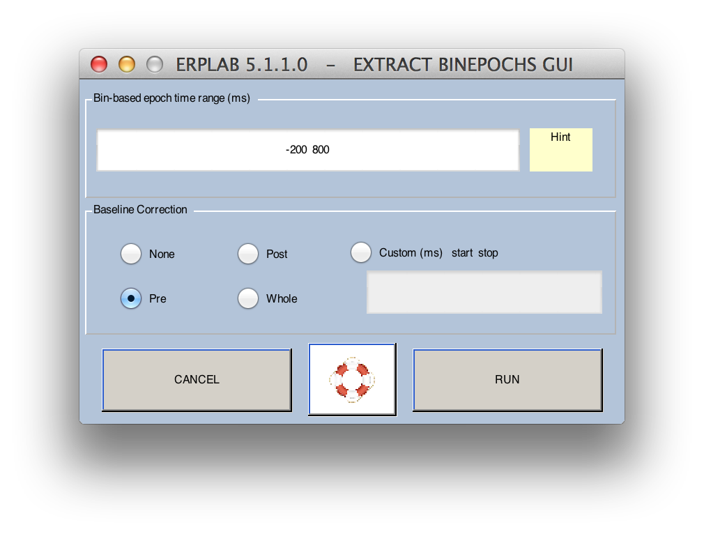
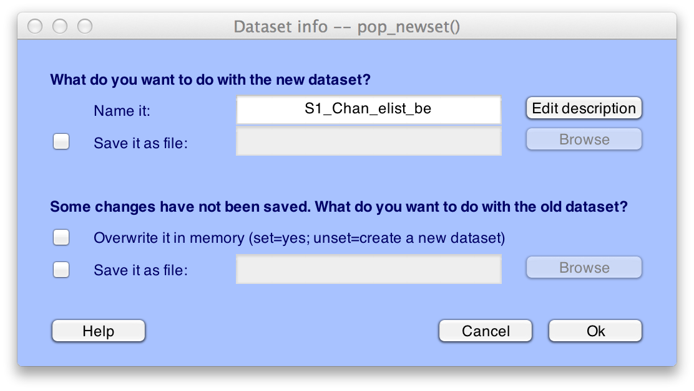
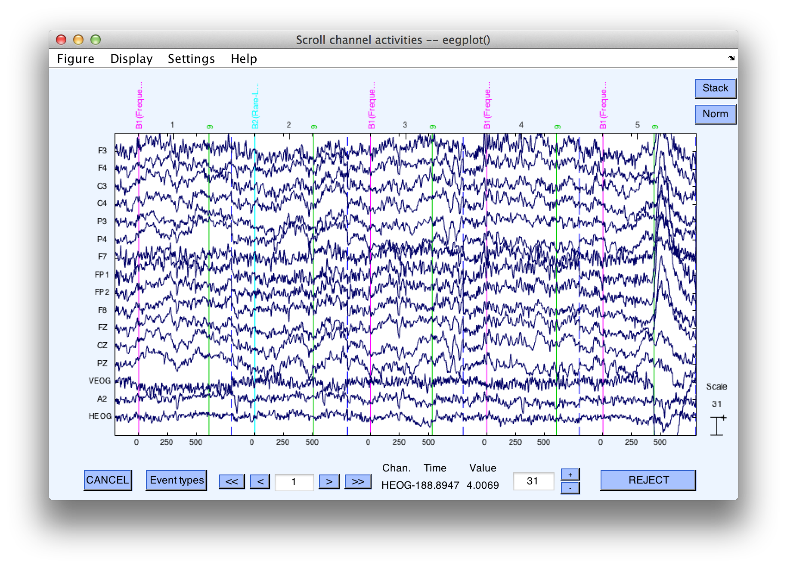

## Creating Bin-Based EEG Epochs
The next step after creating the EventList is usually to sort the events into different bins (in preparation for averaging).  However, we already did this by assigning bins for the rare and frequent stimuli when we created the EventList using the **Advanced** button. If you skipped that step, go back up a step or use [BINLISTER](./Assigning-Events-to-Bins-with-BINLISTER:-Tutorial) to do the bin assignments before proceding with the rest of this tutorial.

Once the events have been assigned to bins, the next step is to divide the continuous EEG into a set of fixed-length epochs (also known as _segments_), each of which is time-locked to an event that has been assigned to a bin.  In the present example, we will extract the EEG during a period that begins 200 ms prior to the onset of a stimulus and ends at 800 ms.  This will be done for each event code that has been assigned to a bin (which is, in the present example, the frequent letters and rare digits, not the responses).  Note that EEGLAB has an epoching function (**Tools > Extract epochs**); you should not use this function if you are using the ERPLAB functions for processing the epochs (e.g., averaging, plotting, etc.).

Instead in ERPLAB, select **ERPLAB > Extract Bin-based Epochs**. This will open the **Extract Bin Epochs** window:



```Matlab
    Equivalent Script Command:

    % Create Bin-Based EEG Epochs
    % Extracts bin-based epoch from -200 ms to +800 ms
    % 'pre' means use the prestimulus period for baseline correction
    % Use 'post' to use the poststimulus period for baseline correction
    % Use 'all' to use the poststimulus period for baseline correction
    % Use two numbers in quotes (e.g., '-150 +50') to specify a custom interval for baseline correction
    EEG = pop_epochbin( EEG , [-200.0  800.0], 'pre')
```

The **Extract Bin Epochs** window allows you to select the time period for the epoch (relative to the event code).  **Baseline correction** will be enabled by default, and you will almost always want to do this.  The prestimulus period (**Pre**) is usually the period used for baseline correction.  That is, the average voltage during the prestimulus period for a given trial is subtracted from every point in the epoch (separately for each channel).  Alternatively, you can use the poststimulus interval (**Post**), the entire interval (**Whole**), or some time range of your choice (**Custom**).  

For this example, leave **Pre** as selected.  
Click the **RUN** button  

A new dataset with the epoched data will be created (it will take a few seconds).  The standard window for saving a new dataset will appear.



Click **OK** and it will name the new dataset "S1_EEG_elist_be" ("be" stands for bin-epoched).  

  Save the dataset to a file on your hard drive, because it will be needed for completing the section on   [combining artifact rejection and artifact correction](./Exporting-and-Importing-EventLists-to-Combine-Artifact-Rejection-and-Artifact-Correction).  You can always do this later by selecting the appropriate dataset in the **Datasets** menu and then selecting **File > Save current dataset(s) or File > Save current dataset as**.

```Matlab
    Equivalent Script Command:

    % Saving after Epoching
    % Setname is S1_EEG_elist_be
    % Filename is S1_EEG_elist_be.set
    % Path is /Users/etfoo/Desktop/tutorial_script/
    % Note that you will need to replace the path with the actual location in your file system
    EEG.setname='S1_EEG_elist_be'
    EEG=pop_saveset(EEG, 'filename', 'S1_EEG_elist_be.set', 'filepath', '/Users/etfoo/Desktop/tutorial_script/');

    % The following command uses Matlab's Current Folder
    EEG.setname='S1_EEG_elist_be';

    EEG=pop_saveset(EEG, 'filename', 'S1_EEG_elist_be.set')  
```

Make sure that this new dataset is the active dataset (by looking in the **Datasets** menu).
Select **Plot > Channel data (scroll)**.

The following screen shows what it should look like.  here should still be continuous EEG data, but if you look more closely you will see a vertical dashed line 800 ms after (and 200 ms before) each event.  This dashed line marks the end of one epoch and the beginning of the next.  If you find this disconcerting, you can simply change **Settings > Time range to display** to a period of 1 second (in the plotting window).

_Note: EEGLAB routines typically ask you to enter time information in seconds, whereas ERPLAB routines typically ask for milliseconds._  



Because the epoch length in this experiment is shorter than the interval between consecutive stimuli, the epoched data will now be missing a period of time between the end of one epoch and the beginning of the next epoch.  If, however, we used a 2000-ms epoch length, the last part of one epoch would contain the same EEG data as the beginning part of the next epoch.

----
<table style="width:100%">
  <tr>
    <td><a href="./Advanced-EventList-Options"> <br> <b> Advanced EventList Options </a></td>
    <td><a href="./Tutorial"> <br> <b> Tutorial</a></td>
    <td><a href="./Artifact-Detection"> <br> <b> Artifact Detection </a></td>
  </tr>
</table>