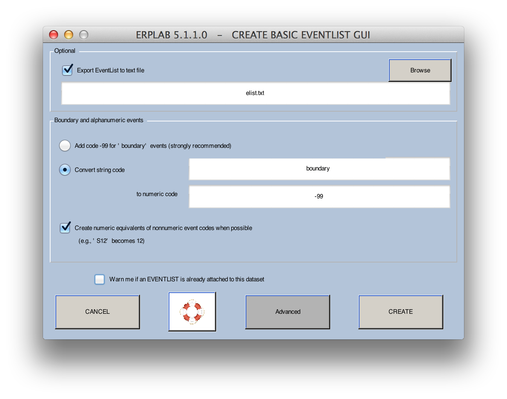
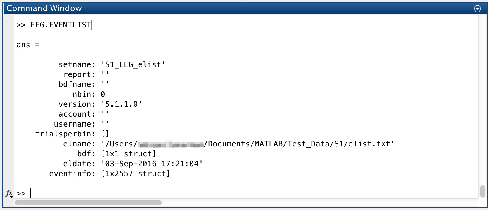
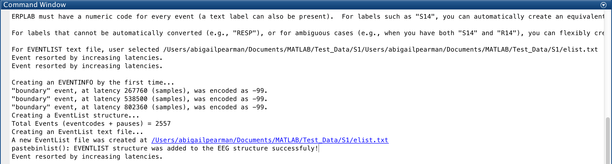

## Creating an EventList
We are now ready to get into the ERPLAB functions.  We will begin with some housekeeping, then do artifact rejection, and finally averaging.

The event codes are embedded in a dataset within EEGLAB's **EEG** structure, which is pretty complicated.  To make it easier to see and manipulate the event codes, ERPLAB creates an EventList, which is a list of all of the event codes and associated information.  Internally, ERPLAB stores this as an **EVENTLIST** structure (which is appended onto the **EEG** structure as **EEG.EVENTLIST**).  But the EventList can also be saved in a text file, where you can easily see and manipulate the event information. If you make any changes, you can import it back into the **EEG** structure.  We will show an example of this later in the tutorial.

1. To use ERPLAB, first create an EventList for the **EEG** stored in your dataset. In the ERPLAB menu, select **EventList > Create EEG EVENTLIST**. (A warning may popup warning you that some of all of your events contain an event-based event label, and not a numeric event code. For now, ignore it and click the **Continue** button)

The following popup window titled _Create Basic EventList GUI_ will appear:

2. Check the option **Export EventList to text file** and enter the filename: **elist.txt**. To save to a specific folder location, click the **Browse** button. Otherwise, the **elist.txt** file will be save to Matlab's current directory. This is to get a better idea of what an EventList is, however in most cases you will simply click the **Create** button.

3. Check the option **Create numeric equivalents of nonnumeric event codes when possible (e.g., S12 becomes 12)**. Some systems (e.g., EGI and Brain Products) use text strings rather than numeric values as event codes. In some systems, this is very subtle (e.g., the codes might be 'S21', which looks like a number but isn't). You must convert these to numeric values. This can be done with the advanced options in Create EventList, as described next. Alternatively, if your event markers contain both numeric and non-numeric information (e.g., 'S21'), you can use a function called letterkilla to strip out the non-numeric information. From the Matlab command window or a script, you will type **EEG = letterkilla(EEG)**; You can then type **eeglab redraw** to make the updated dataset available from the EEGLAB GUI.

4. Click the **Create** button to create the EVENTLIST. This will create the EVENTLIST structure, add it onto the current EEG structure and creating a new dataset. Any operation that creates a new dataset will put up the window as shown below, which gives you some options for saving the new dataset. First, you need to specify a name for the new dataset. This name will be stored inside the dataset, and it will be shown in the **Datasets** menu. It is not necessarily the same as the name of the file in which the dataset is stored on disk, but we recommend that you use the same name for the file (if you save it as a file on disk). ERPLAB will automatically suggest a name for the dataset, appending a string onto the end of the name of the dataset from which the new dataset was created.

When an EventList is generated, it suggests adding "_elist" onto the dataset name (going from "S1_Chan" to "S1_Chan_elist"). This is not required, but it is recommended (otherwise you will have a hard time remembering what is in a given dataset. If you check the **Save it as file** button and use the **Browse** button to select a filename, the dataset will be saved to disk. You can also choose to either keep the previous dataset in the **Datasets** menu (this is the default) or overwrite the previous dataset in this menu.

_Tip: It is good practice to save the dataset to disk after you've gone through several steps; otherwise all your work will be lost if the program crashes.  And you should obviously save to disk if you are going to quit the program and you don't want to lose what you've created.  However, it usually isn't necessary to save every dataset you create – this ends up leading to a lot of big files on your hard drive.  Also, we don't usually overwrite the previous dataset, because then we can't easily back up to the previous step.  However, there are no hard-and-fast rules here; you will eventually develop a set of habits that make sense for your own needs._

There are two ways to see the EventList that you just created:  
1. The first way is to type **EEG.EVENTLIST** in the Matlab command window. Doing so, will display following in the Matlab Command window:

If you have some Matlab experience, you can drill further into this structure to see what it contains.  
2. The second (easier) way is to open the text file that you created (elist.txt) in Matlab's text editor. When it was created, ERPLAB put a link to the file in the Matlab command window, as shown by the underlined blue text in the following screenshot. Click on this link and the file will open.

Take a look at this file to see that it has all the event code information.  

    Equivalent Script Command:

    % Create an EventList, saving a text version in a file named 'elist.txt' in Matlab's current folder
    EEG  = pop_creabasiceventlist( EEG , 'Eventlist', 'elist.txt', 'BoundaryNumeric', { -99 } ...
                                 , 'BoundaryString', { 'boundary' }, 'Warning', 'on' );
