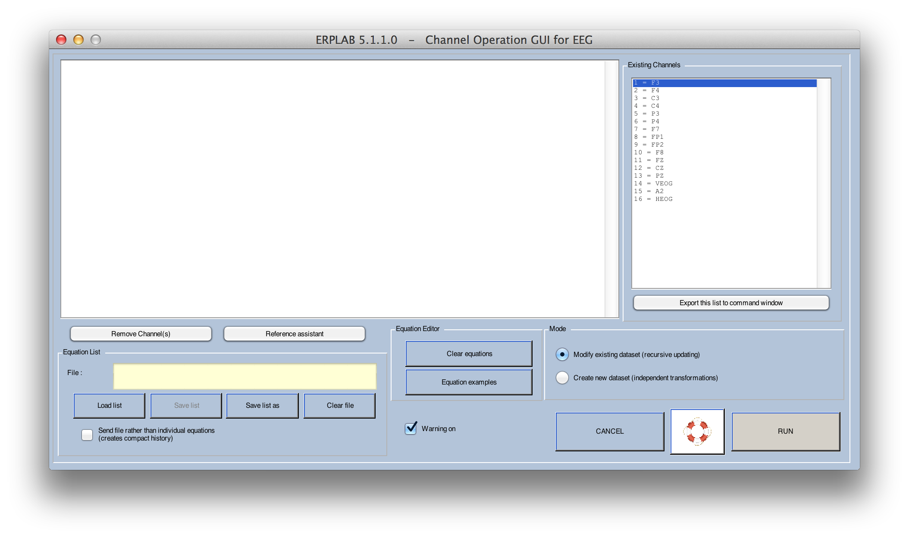
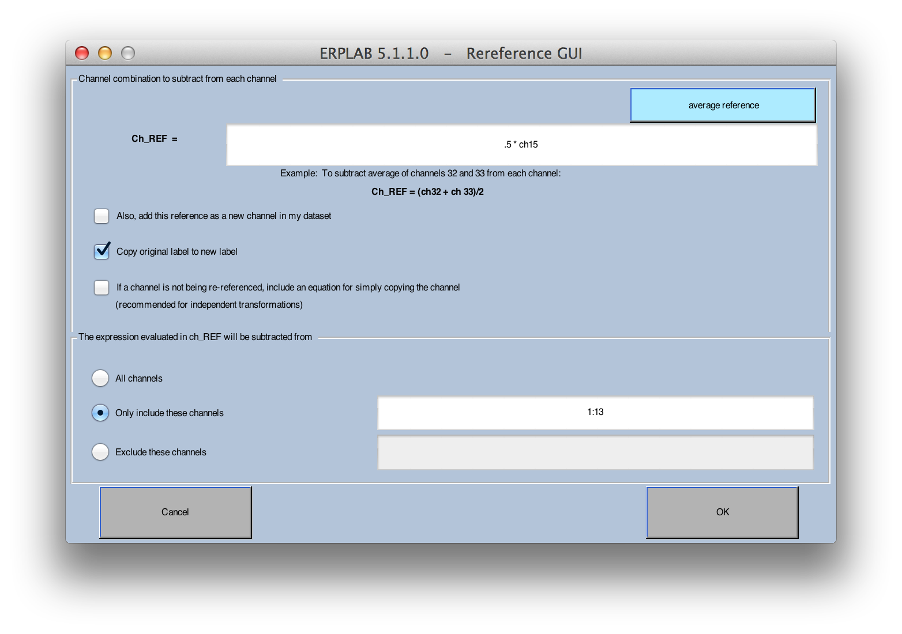

## Creating and Modifying Channels with Channel Operations
We will now discuss how you can create and modify channels.  The most common use for this is to re-reference all (or most) channels to a different reference electrode (or combination of electrodes).  A second use is to create a bipolar channel that better isolates an artifact (e.g., to isolate the vertical or horizontal EOG signals).  A third use is to replace a bad channel with interpolated values from surrounding channels (which is described in the [ERPLAB User's Manual](./Manual)). These operations can be done either on the EEG in a dataset (E**RPLAB > EEG Channel Operations**) or on the ERPs in an ERPset (**ERPLAB > ERP Channel Operations**).

Like Bin Operations, Channel Operations has two modes of operation.  In one mode, you use a set of equations to modify existing channels and add new channels within the current dataset or ERPset.  In this mode, you can modify one channel and then use this modified channel to create or modify another channel (this is called _recursive updating_).  In another mode, the current dataset or ERPset serves as the input to a set of equations that create a new set of channels in a new ERPset (this is called creating a set of _independent transformations_).  Either mode can be used for most situations, but only the independent transformations mode can be used to re-order the channels, and the recursive updating mode can be more efficient for certain complicated transformations.  We will show examples of both modes here.

### Creating a bipolar VEOG channel by updating the current dataset
In our first example, we will take the VEOG signal (which was recorded as the potential between an electrode under the left eye and a left mastoid reference electrode) and create a bipolar derivation representing the difference between the potential under the eye and the average of the Fp1 and Fp2 electrodes.  To get started, make sure that the "S1_Chan" dataset is loaded and selected in the **Datasets** menu, and then select **ERPLAB > EEG Channel Operations**.  This will bring up the window shown below.  The right panel shows the channels in the current dataset, and the left panel shows a set of equations that will be used to define the bins in the newly created dataset.



```Matlab
    Equivalent Script Command:

    %Load S1_Chan
    EEG = pop_loadset( 'filename', 'S1_Chan.set', 'filepath',  '/Users/etfoo/Desktop/tutorial_script/');

    %The following command uses Matlab's Current Folder
    EEG = pop_loadset( 'filename', 'S1_Chan.set');  
```
In this example, we will create a new channel (channel 17) that is the difference between the original unipolar VEOG channel (channel 14) and the average of Fp1 and Fp2 (channels 8 and 9), giving the new channel the label "biVEOG".  Put the equation for this new channel into the panel on the left side of the window, as shown in the screenshot below.  And because we are updating the current dataset, make sure that **Modify existing dataset (recursive updating)** is selected.


Once the window looks like the screenshot above, click **RUN**.  You can also see in the EEGLAB menu that the Channels per frame have now been updated to 17.  To see the result, select **Plot > Channel data (scroll)**.  It should look like the screenshot below (you may need to increase the plotting scale).


It's a bit difficult to see the new channel, because it is at the bottom of the window.  It would be nice to insert this new channel prior to the original VEOG channel rather than at the end, but it is difficult to do this in recursive mode.  The next example shows how to do this by creating a new dataset (independent transformations mode).  

```Matlab
    Equivalent Script Command:

    % First we will load S1_Chan
    EEG = pop_loadset( 'filename', 'S1_Chan.set', 'filepath',  '/Users/etfoo/Desktop/tutorial_script/');

    % The following command uses Matlab's Current Folder
    EEG = pop_loadset( 'filename', 'S1_Chan.set');

    % Create bipolar VEOG channel
    % ch17=ch14-((ch8+ch9)/2) label biVEOG
    EEG = pop_eegchanoperator( EEG, {'ch17=ch14-((ch8+ch9)/2) label biVEOG'});  
```

### Inserting a bipolar VEOG channel by creating a new dataset
In this example, we will use the independent transformations mode to create the bipolar VEOG channel and place it in the middle of the set of channels rather than at the end.  To get started, re-open the "S1_Chan" dataset (the existing S1_Chan dataset was modified in the previous example, and we want the original version).  Now select **ERPLAB > EEG Channel Operations** and set it up as shown in the screenshot below. Because we are creating a new dataset, we need to copy any of the original channels (listed as ch1, ch2, ch3, …) that we want to keep to the new channels (listed as nch1, nch2, nch3, …).  In this example, we first copy channels 1-13 from the current dataset to the new dataset, then add the bipolar VEOG as channel 14, and then copy channels 14-16 from the current dataset to channels 15-17 in the new dataset.  Note that the left side of each equation must indicate that we are creating channels within a new dataset (e.g., nch1) rather than adding or modifying channels within an existing dataset (e.g., ch1). And because we are creating a new dataset, make sure that **Create new dataset (independent transformations)** is selected.


This is a pretty long list of equations, and you wouldn't want to retype it every time you want to perform this transformation.  To avoid retyping, you can save the list of channel equations to a text file (**Save list**) and reload it later (**Load list**).  You can also use Matlab's text editor to create and modify these lists of equations, which can be convenient for complex transformations that contain many lines.  Note that a file with these equations should already be in the **S1** folder (named **chan_mapping.txt**).


Once you have the window set up as shown in the screen shot above, click the **RUN** button.  You will then be asked how to save the new dataset.  Name it "S1_Chan_biVEOG" (you can also save it to the disk if you'd like).  If you plot it using **Plot > Channel data (scroll)**, you will see something like the following screenshot (you may need to increase the plotting scale to make it look like this).  Note that the blinks look somewhat larger in the new biVEOG channel than in the original VEOG channel.  

```Matlab
    Equivalent Script Command:   % Insert a bipolar VEOG channel by creating new dataset
      EEG = pop_eegchanoperator( EEG, {'nch1=ch1' 'nch2=ch2' 'nch3=ch3' 'nch4=ch4' 'nch5=ch5' 'nch6=ch6' ...
         'nch7=ch7' 'nch8=ch8' 'nch9=ch9' 'nch10=ch10' 'nch11=ch11' 'nch12=ch12' 'nch13=ch13' ...
         'nch14=ch14-((ch8+ch9)/2) label biVEOG' 'nch15=ch14 label VEOG' 'nch16=ch15 label A2' 'nch17=ch16 label HEOG'});
      % Alternatively, if the list of equations is stored in a file named 'channel_mapping.txt' in the current directory,
      % you can send the file instead of the individual equations:
      % EEG = pop_eegchanoperator( EEG, 'chan_mapping.txt');
      % Note that this routine uses the format of the equations to determine whether it should use recursive updating mode
      % (equations beginning with 'chXX = ') or independent transformations mode (equations beginning with 'nchXX = ').
```

### Using the Reference Assistant to re-reference to the average of the left and right earlobes or mastoids
You can also use Channel Operations to re-reference your data to a common, derived reference, such as the average of the left and right mastoids, the average of the left and right earlobes, or the average of all scalp sites.  In this example, we will re-reference to the average of the left and right earlobes (the next example will show how to re-reference to the average of all electrodes).

To begin, re-load the "S1_Chan" dataset.  Each channel in this dataset, with the exception of HEOG, was originally referenced to the left earlobe (A1).  To re-reference to the average of the left and right earlobes, we need to subtract 50% of the right earlobe (A2) signal from all of the sites (see pp. 107-108 in Luck, 2005).  But we don't want to re-reference the A2 site or the HEOG site.  This would be done using the equations shown in the screenshot below.  In this example we are updating the existing dataset (recursive mode), but it would work exactly the same way in the independent transformations mode (except that the left part of each equation would start with nch1, nch2, etc. rather than ch1, ch2, etc., and you would also need to specify equations for the channels that will simply be copied without being rereferenced [e.g., 'nch14 = ch14']).

Rereferencing your electrodes will require you to create an equation for each channel being re-referenced.  This could be a lot of equations.  To make life easier (and reduce typos), Channel Operations contains a **Reference Assistant** button that can create the equations for you.  You simply specify what you want subtracted away from each channel, and which channels should be re-referenced, and it will fill in the appropriate equations.  To see how this works, make sure that you've re-loaded the "S1_Chan" dataset, select **ERPLAB > EEG Channel Operations**, and make sure the equations area at the left of the Channel Operations window is empty (you can click **Clear equations** to clear any previous equations).  Then click the **Reference Assistant** button.  It will bring up a window like that shown in the screenshot below.



You will need to type ".5*ch15" in the "Ch_REF = " field, as shown in the screenshot.  This indicates that you want to subtract 50% of the channel 15 (A2) voltage from each re-referenced channel.  Note that it will automatically subtract this value—you don't need to include a negative sign in the equation.  We want to leave __Copy original label to new label__ checked by default so that reference assistant can automatically apply the original labels to each channel. In this example, we want to re-reference the scalp channels (channels 1-13), but we want to leave the VEOG, A2, and HEOG channels alone.  This is specified in the bottom half of the window by typing "1:13" in the "Only include these channels" field.  (You could, instead, select "Exclude these channels" and specify channels 14:16.)

Once you've filled in these fields, click **OK**.  The Assistant will then fill in the appropriate equations in the Channel Operations window, as shown in the screenshot below.


Note that this example uses the recursive updating mode.  This means that channels 1-13 in the current dataset will be updated, and channels 14-16 will be untouched.  If you used the independent transformations mode to create a new dataset, you would need to add equations to copy channels 14-16 from the original dataset to the new dataset (e.g., "nch14 = ch14", etc.).

When everything is ready, click **RUN**.  This should update the current dataset.  If you plot the data before and after re-referencing, you should be able to see small differences.

_Hint: You can apply Channel Operations on either the EEG data in a dataset (using **ERPLAB > EEG Channel Operations**) or the ERP data in an ERPset (using **ERPLAB > ERP Channel Operations**).  In most cases, you will perform linear transformations of the data with these operations (i.e., new channels are created by adding together a set of scaled old channels).  The order of operations does not matter for linear operations.  Averaging is also a linear operation.  Consequently, performing channel operations on the EEG and then averaging will give you the same results as averaging the EEG and then performing channel operations.  However, artifact detection/rejection is a nonlinear process, so it will matter whether you perform channel operations before or after artifact detection.  Whether you do it before or after will depend on what you are trying to achieve.  For example, creating a bipolar VEOG channels (as in the first example of channel operations) can make it easier to find and reject blinks, so this is usually done prior to artifact detection.  In contrast, re-referencing to the average of the two earlobes won't usually change the results of artifact detection, so you can do it either before or after artifact detection (or even after averaging)._  

```Matlab
    Equivalent Script Command:

    %Re-referencing average of left and right earlobes or mastoids
    EEG = pop_eegchanoperator( EEG, {'ch1=ch1-.5*ch15 label F3'...
      'ch2=ch2-.5*ch15 label F4' 'ch3=ch3-.5*ch15 label C3'...
      'ch4=ch4-.5*ch15 label P3' 'ch6=ch6-.5*ch15 label P4'...
      'ch7=ch7-.5*ch15 label F7' 'ch8=ch8-.5*ch15 label Fp1'...
      'ch9=ch9-.5*ch15 label Fp2' 'ch10=ch10-.5*ch15 label F8'...
      'ch11=ch11-.5*ch15 label Fz' 'ch12=ch12-.5*ch15 label Cz'...
      'ch13=ch13-.5*ch15 label Cz' 'ch14=ch14-.5*ch15 label VEOG'...
      'ch15=ch15 label A2' 'ch16=ch16 label HEOG' });  
```

### Re-referencing to the average of all scalp sites
Using the average of all electrode sites as the reference (called the average reference derivation) is quite popular, but it has some significant shortcomings that you should understand before using it (see Chapter 3 in _An Introduction to the Event-Related Potential Technique_).  The general approach used to re-reference to the average of the two earlobes in the previous example could be used to create the average reference derivation, but it would lead to very long equations (e.g., "nch1 = ch1 – (ch1 + ch2 + ch3 +…)/16").  To make this simpler, ERPLAB provides the **avgchan** function, which computes the average of a set of channels.  For example, you might want to use the average of all channels except the VEOG and HEOG channels to re-reference.  To do this, you need the average of channels 1-13 and 15 (excluding channels 14 and 16, which are the VEOG and HEOG channels), which you can obtain by specifying **avgchan(1:13,15)**.  The following screenshot shows how this would be implemented (you can load the equations from the file **chanops_avg_reference.txt**).  But make sure you start with the original version of S1_Chan, not the version that has already been updated.  That is, make sure that you've re-loaded the "S1_Chan" dataset, select **ERPLAB > EEG Channel Operations**, and make sure the equations area at the left of the Channel Operations window is empty (you can click **Clear equations** to clear any previous equations). You could also use the Reference Assistant to create the equations (by specifying **avgchan(1:13,15)** in the "Ch_REF = " field).


Important note: To use the average of all sites as the reference, you must use the "Create new dataset (independent transformations)" mode. If you use the "Modify existing dataset (recursive updating)" mode, then the average of all sites will change after each site has been created. That is, when you re-reference channel 1 to the average of all channels, everything will be fine; but when you then try to re-reference channel 2, the new re-referenced version of channel 1 would be used to compute the average of all channels, and that would be incorrect.

After you click **RUN**, each channel that is being recomputed is displayed in the MATLAB command window. You can then plot the data using **Plot > Channel data (scroll)**, which should look like the following screenshot.


----
<table style="width:100%">
  <tr>
    <td><a href="./Combining-ERP-Waveforms-with-Bin-Operations"> << Combining ERP Waveforms with Bin Operations </a></td>
    <td><a href="./Tutorial"> Tutorial</a></td>
    <td><a href="./Assigning-Events-to-Bins-with-BINLISTER">  Assigning Events to Bins with BINLISTER >>  </a></td>
  </tr>
</table>
