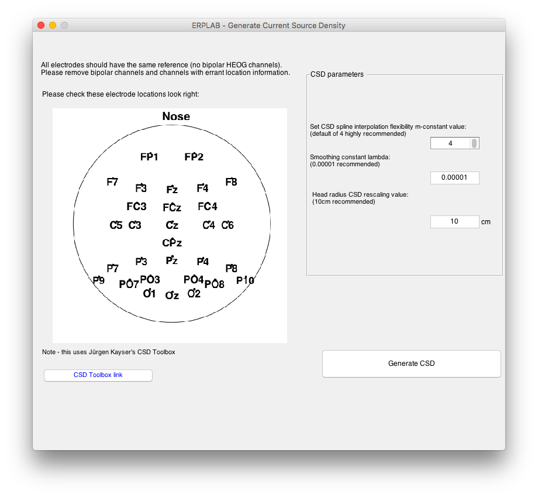
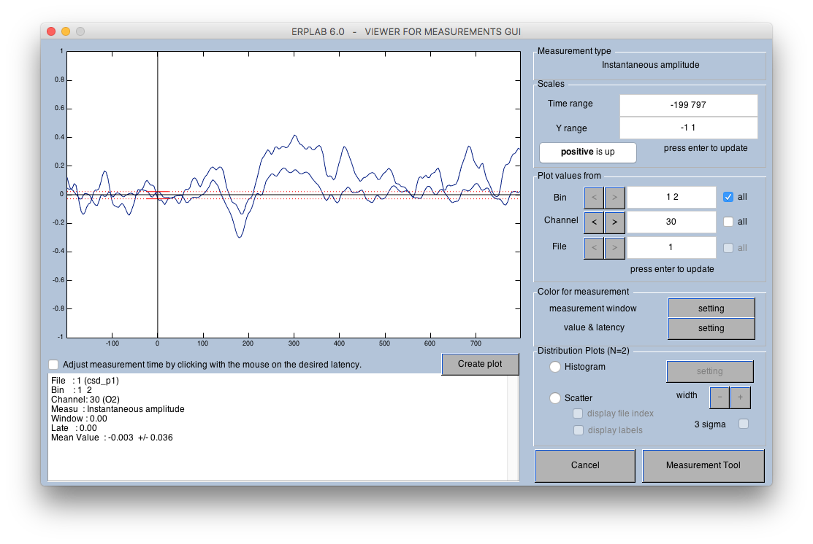
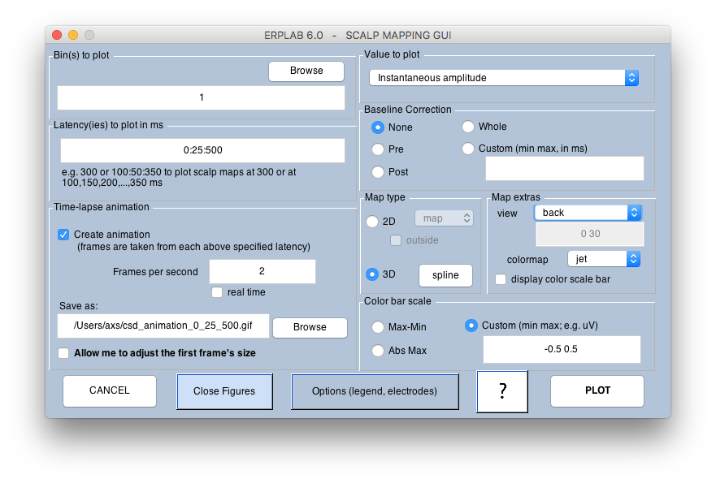
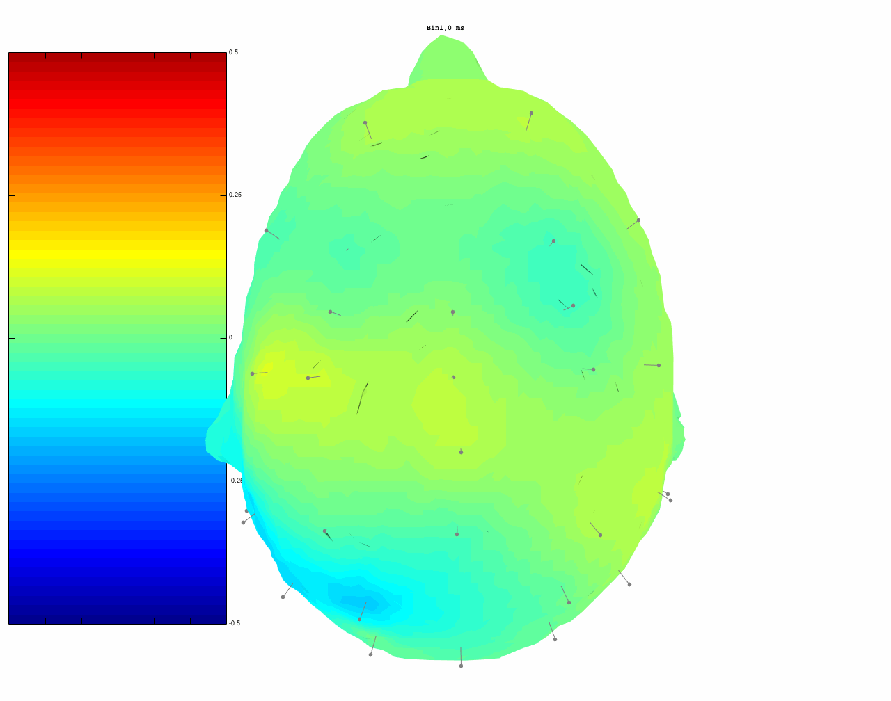

**ERPLAB -> Datatype Transformations -> Compute CSD from EEG set data**

**ERPLAB -> Datatype Transformations -> Compute CSD from averaged ERP set data**

EEG or ERP data can be used to compute an estimate of the Current Source Density (CSD). The ERPLAB CSD tool takes data loaded in ERPLAB (either EEG or ERP), and uses this to generate CSD transformed data. This uses CSD methods adapted from Jürgen Kayser (from the [CSD Toolbox](http://psychophysiology.cpmc.columbia.edu/Software/CSDtoolbox/)).

These tools can be found in the 'ERPLAB -> Datatype Transformations -> ' menu. A new dataset is generated, with CSD data in the place of EEG/ERP data. This is indicated within the data structure in the field EEG.datatype or ERP.datatype, which will be set to 'CSD'.

#### Requirements
- ERPLAB v6.0 or higher.
- A loaded EEGset or ERPset.
- Correct channel locations must be set for all electrodes.
- All electrodes should have the same reference. No bipolar electrodes or reconstructed channels.

With these requirements met, the CSD can be loaded from the ERPLAB menu. If you have bipolar channels, reconstructed HEOG channels, or channels where location information is not available, you can remove these using **EEGLAB -> Edit -> Select Data** or **ERPLAB -> EEG Channel Operations**, and running the CSD tool on a dataset without these channels.

Please inspect the sketch of electrode locations and check that this agrees with the actual electrode positioning. This is a 2D sketch of the head as seen from above, with the nose at the top. For more details about the parameter values, look in the [CSD Toolbox](http://psychophysiology.cpmc.columbia.edu/Software/CSDtoolbox/).

With CSD data generated, data can be examined using most ERPLAB tools as if it were ERP data. For example, the ERPLAB Measurement Tool and ERP Viewer can be used to visualize CSD ERPs across locations and bins. Note that the range of values is quite different to that of EEG/ERP values, and the auto-fit might not work for CSD data. You can still manually adjust the 'Time Range' and 'Y Range' in the upper-right of the window to see the CSD data.

 
Also, CSD can be visualized in ERPLAB scalp maps. This can be done in 2D or 3D. For example, with **ERPLAB -> Plot ERP -> Plot scalp maps** set up as this:

We can generate animations to show CSD like this:

