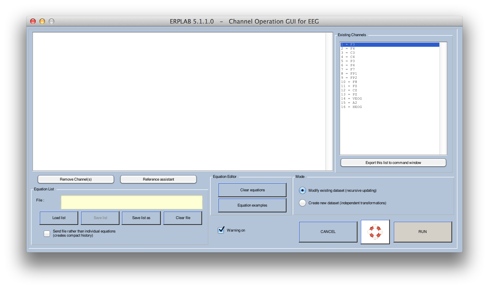
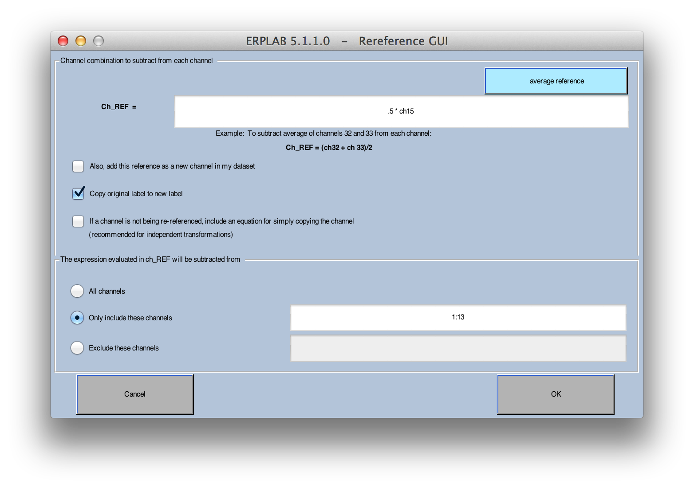

## EEG and ERP Channel Operations
Just as bins can be created and modified with Bin Operations, channels can be created and modified with Channel Operations.  There are separate routines for doing this on raw EEG (`ERPLAB > EEG Channel Operations`) and on averaged ERPs (`ERPLAB > ERP Operations > ERP Channel Operations`), but these routines work in the same way.

For example, it is often convenient to compute bipolar channels from the monopolar channels in the EEG and apply artifact rejection to the bipolar channels.  For example, one might create a bipolar channel representing the difference between an electrode above the eyes and an electrode below the eyes, which makes it easier to detect blinks.  Alternatively, one might want to re-reference each channel to the average of all the channels (excluding the artifact channels).  Or you might want to replace a "bad" channel with interpolated values from the surrounding electrodes.  The Channel Operations functions make these kinds of transformations easy.

As illustrated in the screenshot below, simple equations are used to define how a channel should be computed from the current dataset or ERPset.  Imagine, for example, that you want to create a new bipolar VEOG channel by computing channel 32 minus channel 31.  If you had 32 channels of data originally, the new channel could be channel 33.  You would specify the new channel as `ch33 = ch32 – ch31 label VEOG`.  This says that ERPLAB should create a new channel 33, defined as channel 32 minus channel 31, and it should be labeled "VEOG". It is also possible to precede the channels on the right side of the equals sign with coefficients.  For example, you could type `ch33 = 0.5*ch31 + 0.5*ch32 label AVGCHAN` – this would create a new channel 33 that is the average of channels 31 and 32, with the label "AVGCHAN".
`
As in Bin Operations, the list of equations can be saved in a file.  In addition, Channel Operations can either modify the current ERPset/dataset or create a new ERPset/dataset.  The channels on the left side of the equals sign are labeled with "ch" or "chan" when you are modifying the current ERPset or dataset, and they are labeled with "nch" or "newchan" or "nchan" when you are creating a new ERPset.  When modifying the current ERPset/dataset, you may want to first make a duplicate and then operate on the duplicate.  For ERPsets, this can be done with **ERPLAB > Duplicate or rename current ERPset**.  For datasets, you can save the current dataset to disk and then load it again with **FILE > Load existing dataset**.  It is not necessary to operate on a duplicate, but it can make it easier for you to back up and try again if you make a mistake or change your mind.  This is not generally useful when you are creating a new ERPset/dataset, because the current ERPset/dataset is not changed in this mode.




### Channel Operation Examples
- [Re-referecing](#examples-of-re-referencing)
- [Interpolating](#examples-of-interpolating-to-replace-bad-channels)
- [Rectifying EMG](#example-of-rectifying-the-emg)
- [Computing Global Field Power](#example-of-computing-global-field-power)
- [Computing Mahalanobis Distance](#example-of-computing-the-mahalanobis-distance)
- [Deleting Channels](#example-of-deleting-channels)
- [Adding Simulated Noise](#example-of-adding-simulated-noise)

#### Examples of Re-Referencing
If the data were recorded with A1 as the reference, and A2 was recorded with A1 as the reference in channel 15, you could re-reference the first few channels to the average of A1 and A2 by subtracting half of A2 from the other channels (for the reasoning behind this, see Chapter 3 in Luck, 2005, _An Introduction to the Event-Related Potential Technique_):

```
Ch1 = ch1 – ch15/2 label F3
Ch2 = ch2 – ch15/2 label F4
Ch3 = ch3 – ch15/2 label C3
Ch4 = ch4 – ch15/2 label C4
```
To subtract the average of electrodes 1-13 from the first few channels (e.g., to implement the average common reference), you would do something like this:
```
Nch1 = ch1 – avgchan(1:13) label F3
Nch2 = ch2 – avgchan(1:13) label F4
Nch3 = ch3 – avgchan(1:13) label C3
Nch4 = ch4 – avgchan(1:13) label C4
```
_Important note: To use the average of all sites as the reference, you must use the "Create new dataset (independent transformations)" mode. If you use the "Modify existing dataset (recursive updating)" mode, then the average of all sites will change after each site has been created. That is, when you re-reference channel 1 to the average of all channels, everything will be fine; but when you then try to re-reference channel 2, the new re-referenced version of channel 1 would be used to compute the average of all channels, and that would be incorrect._


#### Examples of Interpolating to Replace Bad Channels

There are two options for replacing a bad channel with interpolated values.   First, you can implement a nearest-neighbor interpolation, simply replacing one site with the average of the neighboring sites.  For example, if you wanted to replace channel 12 with the average of channels 9, 14, and 17, you would write an equation like this:
```
ch12 = (ch9 + ch14 + ch17) / 3
```
Alternatively, you could use a spherical spline interpolation that takes into account all of the electrode sites (i.e., using EEGLAB's EEG_INTERP function).  To do this with EEG Channel Operations, you must first make sure that your dataset contains electrode location information (not just the name, but the 3-D coordinates).  Instructions for this can be found in the [ERPLAB Tutorial](./Tutorial).  You would then use the chinterpol function in your Channel Operations equation.  For example, to replace channel 12 with interpolated values, you would write an equation like this:
```
ch12 = chinterpol
```


#### Example of Rectifying the EMG

If you have EMG data in channel 16, you could create a rectified version (absolute value) of the data in channel 17 as follows:
```
ch17 = abs(ch16) label Rect_EMG
```


#### Example of Computing Global Field Power

To create a channel with the mean global field power of channels 1-13, you would do this (which works on ERPsets but not datasets):
```
ch14 = mgfperp(1:13) label MGFP
```


#### Example of Computing the **Mahalanobis Distance**

To create a channel with the mahalanobis distance between channels 1 and 2, you would do this:
```
ch17 = mahaleeg(ch1, ch2) label MAHAL
```


#### Example of Deleting Channels

If you wanted to delete some of the channels, you have a few options.  

First, you could use the mode in which you create a new ERPset/dataset, specifying the channels you wish to retain, as in the following example of the first few lines of a set of equations that would exclude channels 1 and 2 (F3 and F4):
```
nch1 = ch3 label C3
nch2 = ch4 label C4
nch3 = ch5 label P3
nch4 = ch6 label P4
```

Second, you can click the **Remove Channel(s)** button in the GUI (shown below) and enter the numbers of the channels you would like to delete.

Third, you could use the mode in which the current ERPset is modified directly, placing the following at the end of your list of equations (this works only for ERPsets):
```
delerpchan([ 1 2 ])
```

To remove channels from the EEG in a dataset, you can also use the EEGLAB function `Edit>Select data>channel range` and click on **remove these**.

#### The Reference Assistant
Rereferencing your electrodes will require you to create an equation for each channel being re-referenced. This could be a lot of equations.  To make life easier (and reduce typos), Channel Operations contains a **Reference assistant** button that can create the equations for you.  You simply specify what you want subtracted away from each channel, and which channels should be re-referenced, and it will fill in the appropriate equations. In the screenshot shown below, ".5*ch15" will be subtracted from channels 1-13. The reference assistant does not do the re-referencing directly; it simply creates the equations for the re-referencing. That way you can see exactly what it is doing and modify the process any way you'd like.



#### Example of Adding Simulated Noise
Users can add simulated white noise or pink noise to their EEG or ERP data using equations like these:
```
nch1 = ch1 + 2*whitenoise(1) label F3 plus white noise
nch2 = ch1 + 3*pinknoise(4) label F3 plus white noise
```

The whitenoise and pinknoise functions produce noise with a maximum amplitude of ±1 µV. These can be multiplied by any value to change the amplitude of the noise. In the examples above, the white noise was multiplied by 2 to double the amplitude of the noise to ±2 µV, ad the pink noise was tripled to ±3 µV. The value inside the parentheses is a “seed” for the random number generator (Please see our explanation for how seeds work here: link).  By specifying a seed, you can get the same noise each time you run the equation. If you omit the seed (e.g., nch1 = ch1 + 2*whitenoise), a random seed will be used and you will get different noise each time you run the equation.

For adding simulated line noise (or any other kind of oscillation, such as alpha-band activity):
```
nch3 = ch1 + 2*linenoise(60, ‘random’, 1) label F3 plus random 60 Hz line noise
nch4 = ch1 + 2*linenoise(60, ‘fixed’, 30) label F3 plus fixed 60 Hz line noise
nch5 = ch1 + 2*linenoise(10)  label F3 plus 10 Hz alpha activity
```
The linenoise function creates a sinusoidal waveform with peak voltages of ±1 µV. The multiplier of 2 in the above example equations changes this to ±2 µV. The first value within the parentheses specifies the frequency in Hz (e.g., “60” for 60 Hz line noise). Users can then determine the phase shift of the frequency across trials or bins. In the first example, the phase shift across trials or bins will be ‘random’ using a seed of 1. You can omit the seed to use a random seed. 

In the second example, there will be a ‘fixed’ phase shift on every trial or bin. The following number now represents the amount of phase shift in degrees (e.g.,the 30 in this example indicates a phase shift of 30 degrees). The third example shows that the linenoise equation can be used to simulate alpha waves at 10 Hz. When neither ‘fixed’ nor ‘random’ is specified, there will be a random phase shift between trials or bins using a random seed.

Equations can be added together to combine noise, like in this example:
```
nch1 = ch1 + 2*whitenoise(1) + 2*linenoise(60, ‘random’, 1) label F3 plus white noise and line noise
```