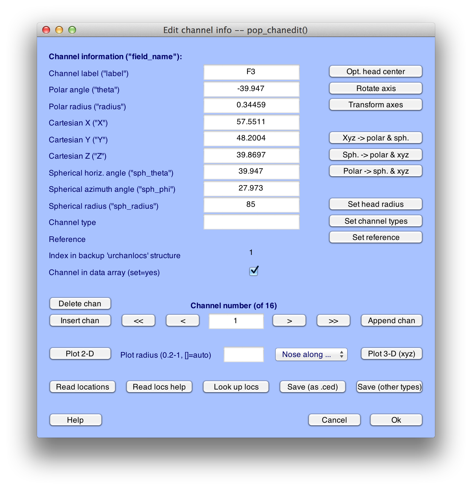

## Example 3: A Simple Script That Actually Does Something Useful
_Note: A complete version of this script is available in **Test_Data > Script_Examples > Script3.m**.  However, this script will not work on your computer without some modifications, because it assumes that the **Test_Data** folder is in a specific location.  See instructions below for details._

Now we're ready to make a slightly more complicated script that actually does something useful: It does all the processing steps between loading an EEG and making an average for a single subject.  Why is this useful?  Imagine that you've spent 30 minutes processing a subject's data with the EEGLAB GUI, and then you decide you want to change something at an early stage of the processing sequence.  Repeating all the subsequent steps can be boring and time-consuming, and using a script can save you time and aggravation.  In addition, the script then becomes a record of exactly how the data were processed, which can be useful 3 years later when you finally write a paper.  An even bigger benefit comes with slightly more complex scripts that can loop through all of your subjects.  And once you master that, you will be ready to write scripts that process the data in completely new ways that would not be possible from the GUI.

In this example, we will use the GUI to do several processing steps on an EEG dataset for one subject, look at the history, and then use the history to create a simple script that can be used to repeat these steps on another subject.  The processing steps will be the first few steps from the ERPLAB Tutorial.  Specifically, we'll load an EEG dataset (S1_EEG.set), add channel location information, add a simple EVENTLIST structure, run BINLISTER to assign events to bins, epoch the data, perform artifact detection, and average the epochs to create an ERPset.  Here we will provide an abbreviated description of how to accomplish each step in the GUI; see the ERPLAB Tutorial for a more detailed explanation.

### Getting Started
To begin, launch Matlab and EEGLAB; if they have already been launched, quit from EEGLAB, type **clear all**, and launch EEGLAB again.  This will make sure that you are "starting from scratch" and won't get confused by old things in the history.  Now set Matlab's current directory to be the folder with the tutorial data from subject S1.  To do this, look at the top of the Matlab command window, where you will see a drop-down menu displaying the current directory (see screenshot below).  Click on the **browse** button (labeled with '…') to the right of the current directly and choose the **S1** folder.  The top of the window will then look something like this (although the details depend on what operating system you are using and where you've put the tutorial data):

### Doing the processing steps with the GUI to create a history
Now we will do several processing steps in the GUI so that we can create a history that will be the basis of the script.

_Step 1: Load the original EEG dataset._ Our first step is to load the original EEG file using **FILE > Load existing dataset** to load the file named **S1_EEG.set**.  After you do this, typing **EEG.history** will show you the script command for this step:  

    >> EEG.history

    ans =

    EEG = pop_loadset('filename','S1_EEG.set','filepath','/Users/luck/Documents/Software_Development/ERPLAB_Toolbox/Test_Data/S1/');

    EEG = eeg_checkset( EEG );  

_Step 2: Adding channel locations._ Our next step is to add location coordinates for each electrode site.  Select **Edit > Channel locations**, which will bring up the window shown here:

Click **Ok**, and you will see the window shown here:

Accept all of the default values and simply click **Ok**.  This will add the coordinates to the current dataset.

Next, you should change the name of the dataset to **S1_Chan** so that you can differentiate between this version and the original version.  To do this, select **Edit > Dataset info**.  This will bring up the window shown below, and you should enter **S1_Chan** in the **Dataset name** field.  Click **Ok**, and then look in the **Datasets** menu.  You should now see that it is named **S1_Chan**.

You can now save the modified dataset by selecting **File > Save current dataset as**, naming the file **S1_Chan**.

Now if you type **EEG.history**, you will see several additional commands have been added, corresponding to adding the electrode locations, changing the name of the dataset, and saving it as a file:  

    >> EEG.history

    ans =

    EEG = pop_loadset('filename','S1_EEG.set','filepath','/Users/luck/Documents/Software_Development/ERPLAB_Toolbox/Test_Data/S1/');
    EEG = eeg_checkset( EEG );
    EEG = pop_chanedit(EEG, 'lookup','/Users/luck/Documents/Software_Development/eeglab9_0_8_6b/plugins/dipfit2.2/standard_BESA/standard-10-5-cap385.elp');
    EEG = eeg_checkset( EEG );
    EEG = pop_editset(EEG, 'setname', 'S1_Chan');
    EEG = eeg_checkset( EEG );
    EEG = pop_saveset( EEG, 'filename','S1_Chan.set','filepath','/Users/luck/Documents/Software_Development/ERPLAB_Toolbox/Test_Data/S1/');
    EEG = eeg_checkset( EEG );  

_Step 3: Creating the EVENTLIST structure._ Next you will add an EVENTLIST structure to the EEG structure.  We will do a very simple version of this here (without adding text labels for the events).  To do this, select **ERPLAB > EventList > Create EEG EventList**, and just run it with the default parameters as shown in the screenshot below:

This will create a new dataset, and ERPLAB will suggest that you name it S1_Chan_elist.  Go ahead and use this name.  You do not need to save it as a file.  You will be able to see this new dataset in the **Datasets** menu.

_Step 4: Assigning events to bins with BINLISTER._ The next step is to use BINLISTER to figure out which events belong in which bins.  In the parent directory (the folder that contains the S1 folder), you should find a bin descriptor file named **binlist_demo_1.txt**.  If you can't find it, you can create it with the following contents:  

    bin 1

    Frequent followed by correct response

    .{11;122;22;111}{9}

    bin 2

    Rare followed by correct response

    .{21;112;12;121}{9}  

Run BINLISTER by selecting **ERPLAB > Assign Bins (BINLSTER)**.  Tell BINLISTER to load the bin descriptor file from **binlist_demo_1.txt** (or the file you created) and then run it with the default parameters, as shown in the following screen shot:

When it is done, BINLISTER will suggest **S1_Chan_elist_bins** as the name of the dataset, and you should use this name.

_Step 5: Epoching the data._ The next step is to extract epochs based on the bins created in the previous step.  To do this, select **ERPLAB > Extract Bin-based Epochs** and enter the parameters shown in the screen shot:

The epoching routine will suggest **S1_Chan_elist_bins_be** as the name of the dataset, and you should use this name.

_Step 6: Artifact Detection._ The next step is to detect artifacts with **ERPLAB > Artifact detection in epoched data > Moving window peak-to-peak threshold** with the parameters shown in the screen shot:

It should reject 28.8% of the trials (as indicated in the command window).  Accept the results and use the recommended name of **S1_Chan_elist_bins_be_ar** for the dataset.

_Step 6: Averaging._ We are now ready to average the data with **ERPLAB > Compute averaged ERPs** with the default parameters (which should look something like the following screenshot):

Use S1_ERP as the name of the ERPset and save it in a file named S1_ERP.erp, as shown here:

You can see the whole series of commands by typing **ERP.history** in the command window. The history in the **ERP** structure contains all of the history from the EEG that was used to create the averaged ERP, plus the history for everything done to the averaged ERP. EEGLAB doesn't "know" anything about ERPLAB commands, so it doesn't save them in **EEG.history**. Typing **ERP.history** should produce something like this:  

    >> ERP.history

    ans =

    EEG = pop_loadset('filename','S1_EEG.set','filepath','/Users/luck/Documents/Software_Development/ERPLAB_Toolbox/Test_Data/S1/');
    EEG = eeg_checkset( EEG );
    EEG = pop_chanedit(EEG, 'lookup','/Users/luck/Documents/Software_Development/eeglab9_0_8_6b/plugins/dipfit2.2/standard_BESA/standard-10-5-cap385.elp');
    EEG = eeg_checkset( EEG );
    EEG = pop_editset(EEG, 'setname', 'S1_Chan');
    EEG = eeg_checkset( EEG );
    EEG = pop_saveset( EEG, 'filename','S1_Chan.set','filepath','/Users/luck/Documents/Software_Development/ERPLAB_Toolbox/Test_Data/S1/');
    EEG = eeg_checkset( EEG );
    EEG = pop_creabasiceventlist( EEG , 'AlphanumericCleaning', 'on', 'Newboundary', { -99 }, 'Stringboundary', { 'boundary' }, 'Warning', 'on' );
    EEG = eeg_checkset( EEG );
    EEG = eeg_checkset( EEG );
    EEG = pop_binlister( EEG , 'BDF', '/Users/luck/Documents/Software_Development/ERPLAB_Toolbox/Test_Data/S1/binlister_demo_1.txt', 'ImportEL', 'no', 'Saveas', 'on', 'SendEL2', 'EEG', 'Warning', 'on' );
    EEG = eeg_checkset( EEG );
    EEG = pop_epochbin( EEG , [-200.0 800.0], 'pre');
    EEG = eeg_checkset( EEG );
    EEG = pop_artmwppth( EEG , 'Channel', 1:16, 'Flag', 1, 'Review', 'on', 'Threshold', 100, 'Twindow', [ -200 798], 'Windowsize', 200, 'Windowstep', 50 );
    EEG = eeg_checkset( EEG );
    ERP = pop_averager( ALLEEG , 'Criterion', 'good', 'DSindex', 5, 'Stdev', 'on' );
    ERP = pop_savemyerp(ERP, 'erpname', 'S1_ERPs', 'filename', 'S1_ERPs.erp', 'filepath', '/Users/luck/Documents/Software_Development/ERPLAB_Toolbox/Test_Data/S1', 'warning', 'on');  

We are using **ERP.history** rather than **EEGLAB.history** here because EEGLAB doesn't "know" anything about ERPLAB commands, so it doesn't save them in **EEG.history**. Thus, the ERPLAB commands for averging the ERPs and saving the average to the hard disk aren't in **EEG.history**. However, the history in the ERP structure contains all of the history from the EEG that was used to create the averaged ERP, plus the history for everything done to the averaged ERP.

### Using the history to make a script
We are now (finally!) ready to turn this history into a script.  You can simply copy the **ERP.history** commands into a new script file.  You can leave out the lines that say **EEG = eeg_checkset(EEG)**, which is just some EEGLAB housekeeping that you can usually ignore.

You will also need to make one key change that reflects the fact that you won't be saving every single dataset as a separate entry in the **Datasets** menu. When you execute functions from the GUI, many of the commands create a new dataset in the **Datasets** menu, which is accomplished by storing every **EEG** structure in the **ALLEEG** structure. When you execute commands from a script, saving each **EEG** into the **ALLEEG** structure just wastes time and memory. Thus, each new dataset that you create essentially overwrites the previous one in the **EEG** structure. This leads to one small hiccup in the history: The popaverager function in the history uses **ALLEEG** rather than **EEG** (so that you can, if desired, average across multiple datasets). Thus, you need to change **ALLEEG** to **EEG** in this function, and delete the part that says **'DSindex', 5**, (which told it to select dataset #5 from the **Datasets** menu). The result for pop_averager should look like this:  

    ERP = pop_averager( EEG , 'Criterion', 'good', 'Stdev', 'on' );  

The whole script should look something like the following, but with a different path to the **S1** folder, reflecting the fact that the files are not stored in exactly the same place on your computer that they are stored in my computer.  In addition, the file **standard-10-5-cap385.elp**, which is used for determining electrode locations, will probably be in a different place in your file system (but your history should give the correct location). Make sure that you use your own **ERP.history** to create your script file.  

    EEG = pop_loadset('filename','S1_EEG.set','filepath','/Users/luck/Documents/Software_Development/ERPLAB_Toolbox/Test_Data/S1/');

    EEG = pop_loadset('filename','S1_EEG.set','filepath','/Users/luck/Documents/Software_Development/ERPLAB_Toolbox/Test_Data/S1/');
    EEG = pop_chanedit(EEG, 'lookup','/Users/luck/Documents/Software_Development/eeglab9_0_8_6b/plugins/dipfit2.2/standard_BESA/standard-10-5-cap385.elp');
    EEG = pop_editset(EEG, 'setname', 'S1_Chan');
    EEG = pop_saveset( EEG, 'filename','S1_Chan.set','filepath','/Users/luck/Documents/Software_Development/ERPLAB_Toolbox/Test_Data/S1/');
    EEG = pop_creabasiceventlist( EEG , 'AlphanumericCleaning', 'on', 'Newboundary', { -99 }, 'Stringboundary', { 'boundary' }, 'Warning', 'on' );
    EEG = pop_binlister( EEG , 'BDF', '/Users/luck/Documents/Software_Development/ERPLAB_Toolbox/Test_Data/S1/binlister_demo_1.txt', 'ImportEL', 'no', 'Saveas', 'on', 'SendEL2', 'EEG', 'Warning', 'on' );;
    EEG = pop_epochbin( EEG , [-200.0 800.0], 'pre');
    EEG = pop_artmwppth( EEG , 'Channel', 1:16, 'Flag', 1, 'Review', 'on', 'Threshold', 100, 'Twindow', [ -200 798], 'Windowsize', 200, 'Windowstep', 50 );
    ERP = pop_averager( EEG , 'Criterion', 'good', 'Stdev', 'on' );
    ERP = pop_savemyerp(ERP, 'erpname', 'S1_ERPs', 'filename', 'S1_ERPs.erp', 'filepath', '/Users/luck/Documents/Software_Development/ERPLAB_Toolbox/Test_Data/S1', 'warning', 'on');  

Before running this script, close EEGLAB, type **clear all** in the Matlab command window, and restart EEGLAB.   This way we can avoid being confused by the datasets that you created in the EEGLAB GUI.  Now go ahead and run your new script.  You should see lots of information being printed in the command window as the various commands run. After artifact detection is complete, you will probably see the window for plotting the EEG. In addition, you will probably see a warning message saying that S1_ERP already exists and asking if you want to overwrite it (you should say 'yes'). I will say more about these things in a minute.

If your script generates error messages, you should make sure that it is exactly like the script shown above, except with path information that matches the location of the **S1** folder and the location of **standard-10-5-cap385.elp** on your computer.

Once the script is done running, type **erplab redraw** in the command window. This will allow you to see the **ERP** structure in the ERPset menu. If you want to see the last dataset in the **Datasets** menu, you need the following two commands:  

    [ALLEEG, EEG, CURRENTSET] = eeg_store( ALLEEG, EEG, 0 );

    eeglab redraw  

The first command saves the **EEG** structure into **ALLEEG**, and the second command tells the EEGLAB GUI to update the **Datasets** menu. If you want, you can put these lines (and **erplab redraw**) at the end of your script. ERPLAB is smart enough to do the redraw without first storing the current **ERP** in the **ALLERP** structure. If you wanted to do that, you could just include the following command:  

    ALLERP = ERP;  

Ordinarily, you will not want your scripts to put up windows that require your intervention; you'll want your scripts to run completely automatically. The ERPLAB routines have options that allow  you to control this. For example, the**'warning', 'on'** arguments in **pop_savemyerp** tell the function to put up a warning window if the file already exists. You will probably want to change this to **'warning', 'off'** in your scripts (as long as you are sure that you're not going to overwrite some important file).
