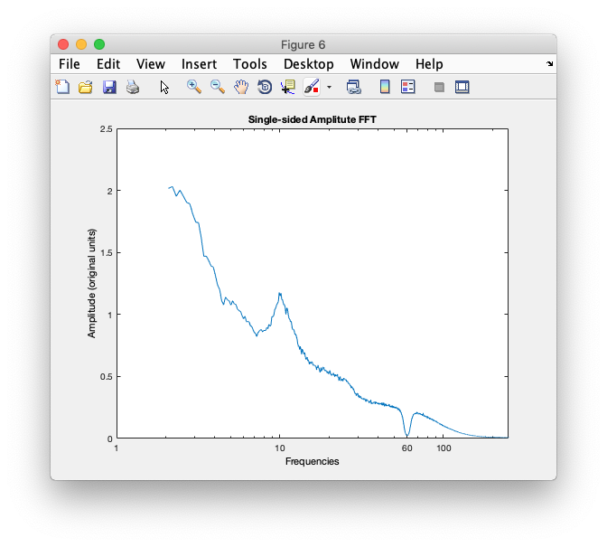

## Generate Frequency Spectra

ERPLAB can return the output of a Fourier Transform (like FFT). This can be useful for examining the frequencies that make up the EEG signal, and show if there are undue artifacts, like 50 / 60 Hz electrical line noise.

### Use case 1: Quick plot
You want to quickly look at frequency spectra to visually inspect that there's nothing too awry in frequency space.

Action:
```
    [fft1, freq_labels] = compute_fourier(EEG);
    plot_fourier(fft1, freq_labels, 2, 125)
```

Result:
This will compute the Fourier Transform of data in the loaded EEG dataset, and output the frequency amplitudes in 'fft1'. The label vector, 'freq_labels', gives the identity of each element. The function 'plot_fourier' takes in 'fft1' and 'freq_labels'. The plot will be constrained between 2 Hz and 125 Hz.




### Use case 2: Save FFT to text file

```
[fft2, freq_labels] = compute_fourier(EEG);
fft_csv = [freq_labels', fft2'];
csvwrite('test_fft.csv',fft_csv);
```

Result:
This will compute the fourier transform, and write the output to text file called 'test_fft.csv'. The first column will be the frequency labels, and the second column will be the amplitude spectra.

### Use case 3: Single channel, downsampled FFT

```
% chan 3, no smoothing
chan_here = 3;
[fft3, freq_labels3, n_freq_bin3, freq_bin_width3] = compute_fourier(EEG,chan_here);

% chan 3, smoothing of 2
smooth_factor = 2;
[fft4, freq_labels4, n_freq_bin4, freq_bin_width4] = compute_fourier(EEG,chan_here, smooth_factor);

before_smooth = [n_freq_bin3, freq_bin_width3]
after_smooth2 = [n_freq_bin4, freq_bin_width4]
```

Result:
This will run the FFT on only channel 3 of the given EEG dataset. Additionally, the 'smooth_factor' is used to downsample the FFT, so that x/2 points are returned. Thus, the output is half as long. The elements are averaged together, so there are half as many frequency bins, each with twice the width. Here, the additional optional output arguments of 'compute_fourier' are shown. The 3rd output argument, n_freq_bin, will return the number of frequency bins, and the 4th output argument is the width of each of these frequency bins.

## See also:
```
help compute_fourier
help plot_fourier
