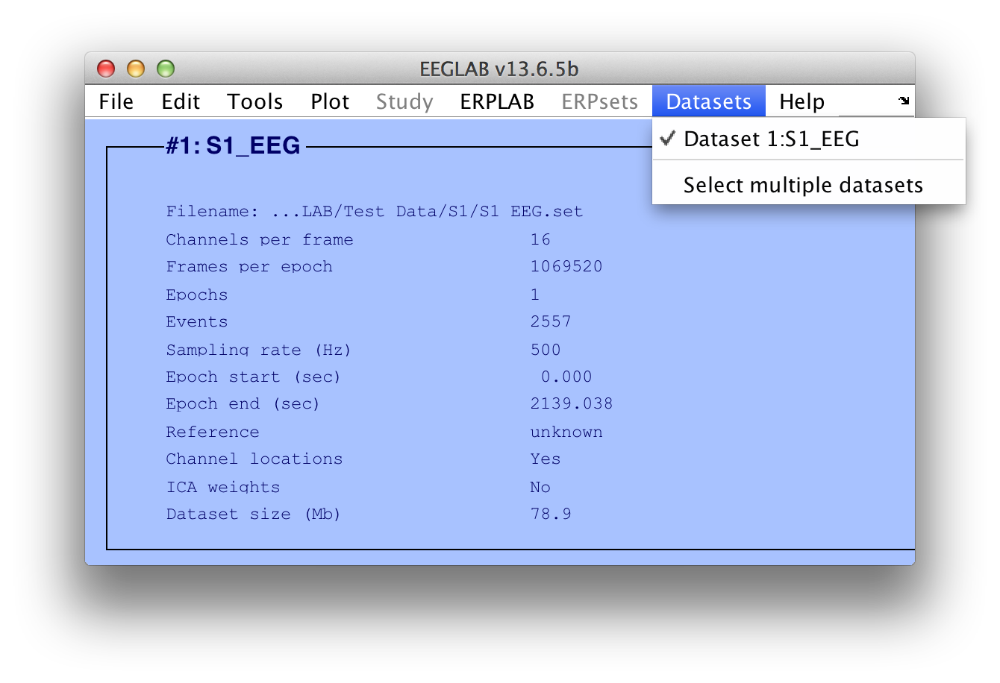
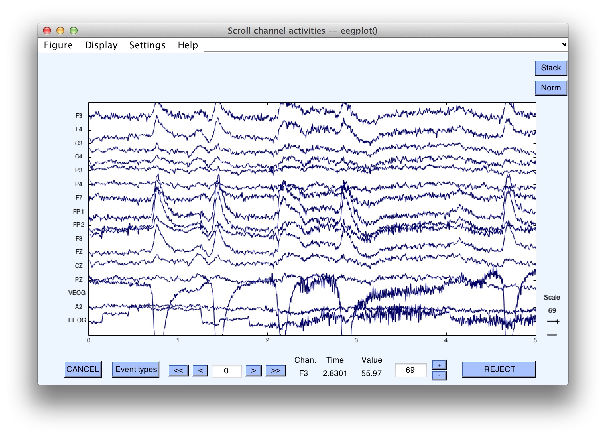
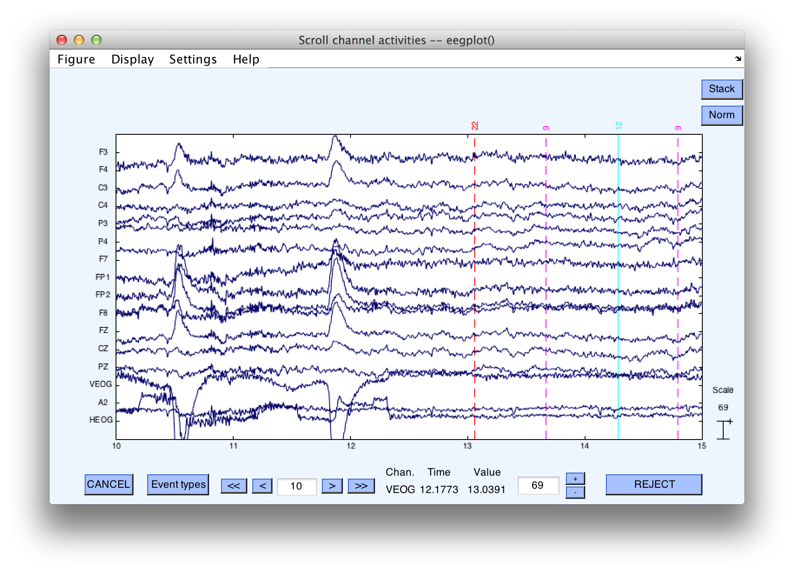

## Getting Started
We assume that you have already installed EEGLAB and ERPLAB, as described in the [ERPLAB Toolbox User's Manual](./Manual).

### Open your first subject's data file in EEGLAB and ERPLAB

1. Open Matlab.  
In the Matlab command window, type the following (each line followed by the **return/enterkey**):  

    >> clear all;
    >> eeglab;  

  This will start you with a fresh EEGLAB and ERPLAB session.  

  _Tip: Follow this procedure when you encounter bugs or unexplained problems with EEGLAB and/or ERPLAB._

2. In the EEGLAB menubar, select **File > Memory and other options**  
    Uncheck "_If set, keep at most one dataset in memory_".

    This will configure EEGLAB's memory settings to allow multiple datasets to be loaded in memory.

3. Download the tutorial files to your hard drive from the [ERPLAB documentation area](.).  The data and related files are in a folder named **Test_Data**, which you can put anywhere on your computer's file system.

4. In Matlab, navigate the current directory to the .../**Test_Data/S1** folder.   
This is where the data from the first subject we will be processing is located. Above Matlab command window, there is a drop-down folder path displaying the current directory (see screenshot below).  Click on the **browse** button to the right of the current directly and choose the **S1** folder.  The top of the window will then look something like this (although the details depend on what operating system you are using):


5. In the EEGLAB menu bar, select **File > Load existing dataset**   
Select the file **S1_EEG.set** and click the **Open** button.

    This will load the S1's data set into EEGLAB. The **S1_EEG.set** file is what EEGLAB calls a "dataset."  The associated file, **S1_EEG.fdt**, contains the actual EEG data points and must be present (but which is accessed indirectly).  The dataset contains a large amount of information, and EEGLAB may take several seconds to load the dataset.

    _Tip: Using EEGLAB and ERPLAB requires a little bit of patience.  If you try to start the next procedure before the current procedure is done, you will cause problems that will ultimately slow you down.  This is especially true during procedures that create or load datasets.  So just take a sip of coffee and wait until you see "Done" in the command window before you take the next step.  Also, ensuring your computer has lots of RAM (and the 64-bit version of Matlab along with a 64-bit operating system) can make things go much faster._

6. Confirm the dataset has finished loading, by selecting the **Datasets** menu, as shown in the following screenshot:



Further confirmation that the S1_EEG.set has loaded can be found in the Matlab Command Window, EEGLAB will print an update on its current processing status. When the file has finished it will print "Done" (Both EEGLAB and ERPLAB print useful information such as this in the command window. Get in the habit of keeping an eye on this window.)


### View the EEG data for the file you just loaded

1. In EEGLAB, select **Plot > Channel data (scroll)** (See the EEGLAB documentation for information on the **Channel data (scroll)** function).


2. Click the **>>** button twice to scroll forward in time (10 seconds each click).
Event codes (aka stimulus markers, trigger codes) will appear in the EEG plot as vertical lines with their corresponding numbers:



_Tip: Selecting an EEGLAB or ERPLAB command that puts up a window typically "locks up" Matlab so that other things won't work until that window has been dismissed. For example, you may not be able to open a text file with the Matlab text editor, or you may not be able to execute commands on the command line. Sometimes the open window is hidden by other windows. If you find that nothing seems to be working, take a look at Matlab's Windows menu to see if there are open windows that should be closed._

```Matlab
 Equivalent Script Command:

    % Load S1_EEG.set
    % Filename is S1_EEG.set
    % Note that you will need to replace the path with the actual location in your file system
    % Make sure that your file names and folder names do not contain spaces or other special characters
    % Note that the dataset will not appear in the Datasets menu in the EEGLAB GUI
    EEG = pop_loadset('filename', 'S1_EEG.set', 'filepath',  '../Test_Data/S1/');

    %Alternatively, the following version will look for the file in Matlab's Current Folder
    EEG = pop_loadset('filename', 'S1_EEG.set');

    % To view the EEG data enter the following command:
    pop_eegplot(EEG);
```

----
<table style="width:100%">
  <tr>
    <td><a href="./Overview-and-Scripting">  Overview and Scripting </a></td>
    <td><a href="./Tutorial">  Tutorial</a></td>
    <td><a href="./Brief-Description-of-the-Example-Experiment">  Brief Description of the Example Experiment </a></td>
  </tr>
</table>
