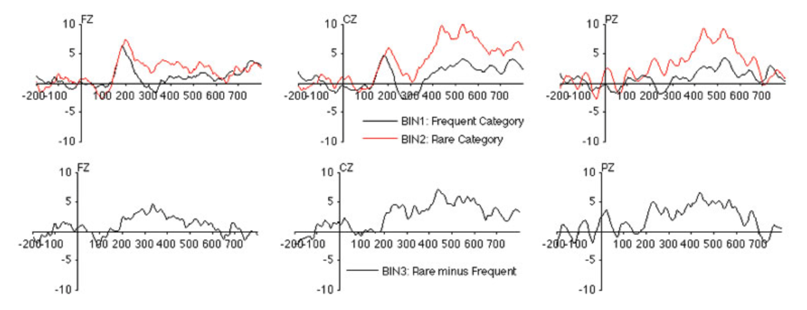
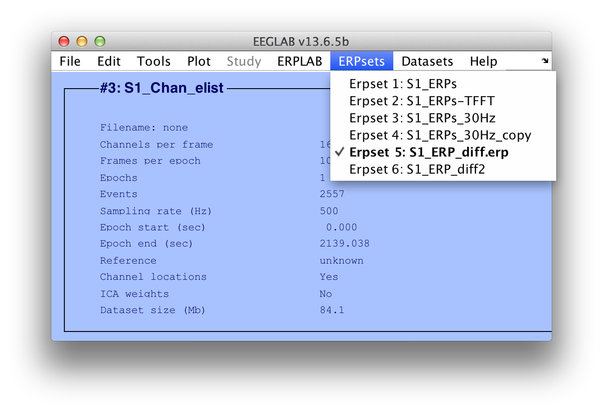
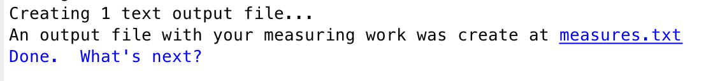
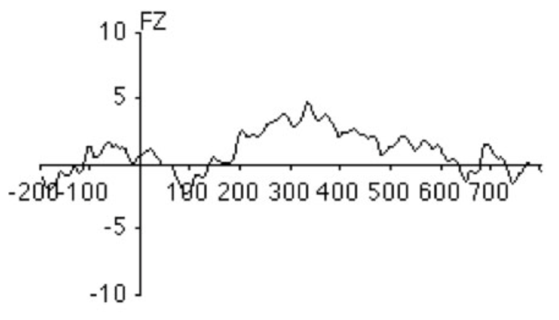
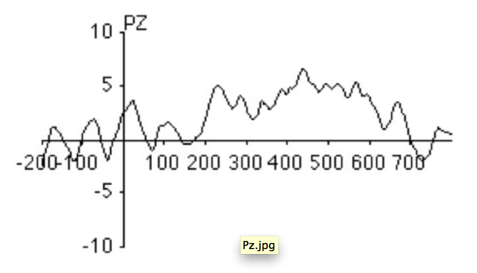
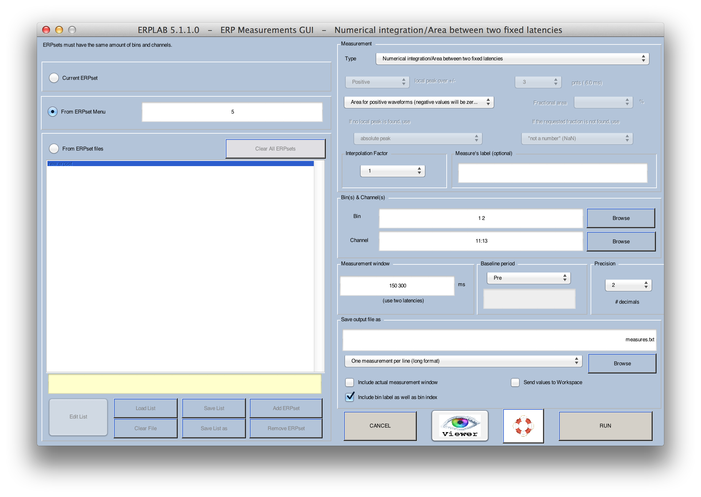
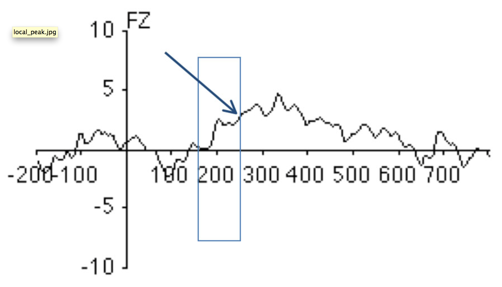
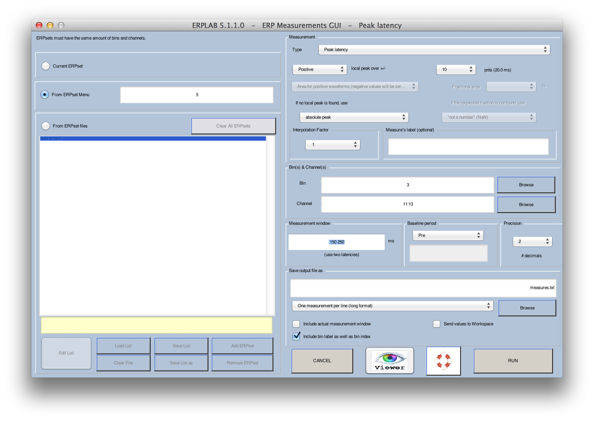

## Measuring amplitudes and latencies with the ERP Measurement Tool
In this section, we will describe how to measure amplitudes and latencies.  First, use ERPLAB>Load existing ERPset to load the file S1_ERPs_diff.erp (or select it from the ERPsets menu if it is already loaded), which was created in the Bin Operations example.  In the examples here, we will focus on the Fz, Cz, and Pz electrodes.  The waveforms are shown below (rare, frequent, and rare-minus-frequent difference wave).



Now select **ERPLAB> ERP Measurement Tool**, which will launch the window shown in the next screenshot.





When analyzing the data from multiple subjects, you will typically use the large white panel at the left of the window to list the filenames of the ERPsets for each subject.  If all the ERPsets have been loaded into ERPLAB, you can instead select **From ERPset Menu** in the upper left of the window and type the ERPset numbers into the adjacent text box.  For this simple example, we will just measure the values in a single ERPset (S1_ERPs_diff, which you have already loaded).  Type the ERPset number of this ERPset into the text box.  You can see which ERPset number it is by looking at the ERPsets menu.  It is ERPset 5 in the screenshot below, but this might be different for you, so use whatever ERPset number is shown for S1_ERPs_diff in your ERPsets menu.


## Measuring mean amplitude over a latency range
In our first example, we will measure the amplitude of the P3 wave from channels 11-13 (Fz, Cz, Pz) for the rare and frequent stimuli by assessing the mean voltage from 400–700 ms, using the prestimulus interval as the baseline period.  To do this, set up the window as shown in the screenshot above.

_Hint: The baseline voltage is subtracted from the voltage during the measurement window, so any noise or consistent voltages in the baseline interval will contribute to your measurement.  Even if you select "None" for the baseline period, the baseline correction that you did earlier will have the effect of subtracting the baseline voltage from every point in the waveform, so you cannot escape the fact that the baseline will contribute to your amplitude measures.  Because we baselined the data to the prestimulus interval when the data were epoched, it is redundant to select another baseline during measurement.  However, we recommend that you do so anyway, because this will help you to remember that you are always subtracting the baseline voltage, whether explicitly or implicitly._

Note that we have told the Measurement Tool to save the output file as "measures.txt" using **One measurement per line (long format)**.  If you click **RUN**, it will create this file.  You can open this file in Matlab's text editor.

Hint: Most ERPLAB functions that create text files put a link in the Matlab command window (as shown in the next screenshot), and you can simply click this link to open the file.




If you open the file, it will look something like this:

    ERPset           bin                          chinned      chlabel       value
    S1_ERPs_diff     Frequent_Category_(Digit)    11           FZ            1.08
    S1_ERPs_diff     Frequent_Category_(Digit)    12           CZ            2.67
    S1_ERPs_diff     Frequent_Category_(Digit)    13           PZ            2.08
    S1_ERPs_diff     Rare_Category_(Letter)       11           FZ            2.18
    S1_ERPs_diff     Rare_Category_(Letter)       12           CZ            7.42
    S1_ERPs_diff     Rare_Category_(Letter)       13           PZ            6.04  

You can see that the voltage was larger for the rare stimuli than for the frequent stimuli, especially at the Cz and Pz electrode sites, which is the expected pattern for the P3 wave.

Note that the labels don't always line up nicely with the columns of values.  This is because tabs are used between each column, and this doesn't look nice with standard tab width unless the labels are very short.  However, the file will look great if you open it in Excel.

This "long" format looks nice and works well with Excel PivotTables.  However, most statistical programs want the file to have all the values for a single subject on one line.  The **One ERPset per line (wide format)** can be used for this purpose.  

    Equivalent Script Command:   % Mean amplitude between two fixed latencies
      % Path is/Users/etfoo/Desktop/tutorial_script/
      % Bin [1 2], Chan 11:13, between latencies 400:700, prebaseline, precision 2
      % Save output file as measures.txt
      % Note that you will need to replace the path with the actual location in your file system
      [Amp Lat] = pop_geterpvalues( ALLERP, [ 400 700], [ 1 2],11:13 , 'Baseline', 'pre', 'Erpsets',3, ...
          'Filename', '/Users/etfoo/Desktop/tutorial_script/measures.txt', 'Foutput', 'erpset', 'Fracreplace', 'NaN', ...
          'IncludeLat', 'no', 'Measure', 'meanbl', 'Resolution',2, 'Warning', 'on'  );
      % The following command uses Matlab's Current Folder
      [Amp Lat] = pop_geterpvalues( ALLERP, [ 400 700], [ 1 2],11:13 , 'Baseline', 'pre','Erpsets',3, ...
          'Filename', 'measures.txt', 'Foutput', 'erpset', 'Fracreplace', 'NaN', 'IncludeLat', 'no', ...
          'Measure', 'meanbl', 'Resolution',2, 'Warning', 'on' );  

### Measuring integral/area over a latency range
We will now try measuring the area under the curve rather than the mean amplitude.  Launch the ERP Measurement Tool again and select **Numerical integration/Area between two fixed latencies** in the popup menu at the top right of the Measurement Tool window.  You will then see another popup menu below that contains several different variants of area.  If you select **Numerical integration**, the Measurement Tool will compute the integral in the measurement interval.  Specifically, it will treat each sample point in the measurement window as a rectangle, with a height defined by the voltage at that point and a width defined by the sample period.  The integral is then defined as the sum of the areas of these rectangles.  With this approach, negative voltages in one portion of the measurement interval will cancel positive voltages at other portions.  This will be very much like the mean voltage, except that mean voltage sums the voltages at each time point and then divides by the number of time points, which is equal to dividing the area by the duration of the window.  There are some slight complications that arise when the boundaries of measurement window you specify do not fall exactly at sample times; for a detailed description of what happens in this situation, see the [section on Timing Details in the ERPLAB User's Manual](./Timing-Details).

Although _area_ and _integral_ seem like they would be the same, they are technically different from each other.  For an area measure, you need to think of the waveform being combined with the zero-voltage baseline to form a set of polygons, one for each set of consecutive points with the same polarity.  Consider, for example, the difference wave at Fz (see screenshot below).  There would be one polygon from -200 ms to approximately -110 ms, another polygon from approximately -110 to +60 ms, another from approximately +60 to +130 ms, etc.  Each one of these regions has a positive area, irrespective of the polarity of the waveform during the time period of the region.  Thus, an area measure will sum together the areas of the individual polygons, ignoring the polarity of the waveform used to create each polygon.  (Note that each polygon is defined as a set of rectangles, one for each time point, just as in the integral measurement described previously).  Measuring the area is equivalent to _rectifying_ the waveform (turning every negative value into a positive value) and then computing the integral over the measurement window.  If you select **Rectified area (negative becomes positive)**, this is how the Measurement Tool will compute the area. Rectified area might be useful if, for example, the waveform contained an oscillation that went both above and below the baseline and you wanted to measure the strength of the oscillation.




In other cases, you may want to measure the area only for the positive portion of the waveform.  For example, take a look at the difference wave from Pz in the screenshot below.  To measure the P2 wave from 150–300 ms, you might want to exclude the small negative deflection from~150-170 ms.




To do this, select **Area for positive waveforms (negative values will be zeroed)** and a measurement window of 150-300 ms, as shown in the screenshot below.  Try this and see what you get.  You should get the values shown below.




    ERPset           bin                          chinned      chlabel      value
    S1_ERPs_diff     Frequent_Category_(Digit)    11           FZ           0.4
    S1_ERPs_diff     Frequent_Category_(Digit)    12           CZ           0.25
    S1_ERPs_diff     Frequent_Category_(Digit)    13           PZ           0.06
    S1_ERPs_diff     Rare_Category_(Letter)       11           FZ           0.69
    S1_ERPs_diff     Rare_Category_(Letter)       12           CZ           0.5
    S1_ERPs_diff     Rare_Category_(Letter)       13           PZ           0.36  

```Matlab
    Equivalent Script Command:   

    % Numerical integration/Area between two fixed latencies
    % Area for positive waveforms (negative values will be zeroed)
    % Path is /Users/etfoo/Desktop/tutorial_script/
    % Bin [1 2], Chan 11:13, between latencies 150: 300, prebaseline, precision 2
    % Save output file as measures.txt
    % Note that you will need to replace the path with the actual location in your file system
      [Amp Lat] = pop_geterpvalues( ALLERP, [ 150 300], [ 1 2],11:13 , 'Baseline', 'pre', 'Erpsets',3, ...
       'Filename','/Users/etfoo/Desktop/tutorial_script/measures.txt', 'Foutput', 'erpset', ...
       'Fracreplace', 'NaN', 'IncludeLat', 'no', 'Measure', 'areap', 'Resolution',2, 'Warning', 'on');
    % The following command uses Matlab's Current Folder
      [Amp Lat] = pop_geterpvalues( ALLERP, [ 150 300], [ 1 2],11:13 , 'Baseline', 'pre','Erpsets',3, ...
       'Filename', 'measures.txt', 'Foutput', 'erpset', 'Fracreplace', 'NaN', 'IncludeLat', 'no', ...
       'Measure', 'areap', 'Resolution',2, 'Warning', 'on' );  
```
### Measuring peak amplitude and peak latency
Peak amplitude and latency measures were historically important, because they were so easy to determine, but they have many downsides (see Chapter 6 in Luck, 2005, An Introduction to the Event-Related Potential Technique).  Most importantly, the peak of the underlying component may be nowhere near the peaks in the observed waveform from a given electrode site.  Nonetheless, there may be times when you want to measure peak amplitude or peak latency.

This is quite simple, except for one common problem.  Imagine, for example, that you want to measure the amplitude and latency of the P2 peak in the difference wave at Fz (see screenshot below).  The problem is that the P2 (which peaks around 200 ms) overlaps with a larger, slower component.  If we simply found the most positive value between 150 and 250 ms, we would find the value at the edge of the window (at 250 ms – see arrow below).  Thus, it is usually better to search for the "local peak" rather than the most positive (or most negative) value in the time window.




A local peak is defined as the most extreme point within the measurement window that is also larger than the average voltage over the N time points immediately before the peak and the average voltage over the N time points immediately after the peak.  To see how this works, launch the ERP Measurement Tool (still with file S1_ERPs_diff) with the settings shown below and then click **RUN**.  If you look at the measurements file, you will see that it has gotten the local peak at around 200 ms rather than the rising shoulder of the next wave.  In this example, a peak was defined as being larger than the 10 points (20 ms given a 500-Hz sampling rate) on either side of the peak.  Trying changing this to 2 points and running it again.  Now it captures the rising shoulder of the next peak.  In a real experiment, you will need to try different values until you find something that is appropriate given the nature of the peaks and the noise level in your data.



```Matlab
    Equivalent Script Command:   
     % Measuring peak ampltidude and peak latency
     % Path is/Users/etfoo/Desktop/tutorial_script/
     % Bin [3], Chan 11:13, between latencies 150: 250, prebaseline, precision 2
     % Save output file as measures.txt
     % Note that you will need to replace the path with the actual location in your file system
       [Amp Lat] = pop_geterpvalues( ALLERP, [ 150 250],3,11:13 , 'Baseline', 'pre', 'Erpsets',1, ...
         'Filename', '/Users/etfoo/Desktop/tutorial_script/measures.txt', 'Foutput', 'erpset', ...
         'Fracreplace', 'NaN', 'IncludeLat', 'no', 'Measure', 'peaklatbl', 'Neighborhood',10, ...
         'Peakpolarity', 'positive', 'Peakreplace', 'absolute', 'Resolution',2, 'Warning', 'on');
     % The following command uses Matlab's Current Folder
       [Amp Lat] = pop_geterpvalues( ALLERP, [ 150 250],3,11:13 , 'Baseline', 'pre', 'Erpsets',1, ...
         'Filename', 'measures.txt', 'Foutput', 'erpset', 'Fracreplace', 'NaN', 'IncludeLat', 'no', ...
         'Measure', 'peaklatbl', 'Neighborhood',10, 'Peakpolarity', 'positive', 'Peakreplace', 'absolute', ...
          'Resolution',2, 'Warning', 'on');
```
----
<table style="width:100%">
  <tr>
    <td><a href="./Assigning Events to Bins with BINLISTER"> << Assigning-Events-to-Bins-with-BINLISTER </a></td>
    <td><a href="./Tutorial"> Tutorial</a></td>
    <td><a href="./Exporting-and-Importing-EventLists-to-Combine-Artifact-Rejection-and-Artifact-Correction">  Exporting and Importing EventLists to Combine Artifact Rejection and Artifact Correction >>  </a></td>
  </tr>
</table>

