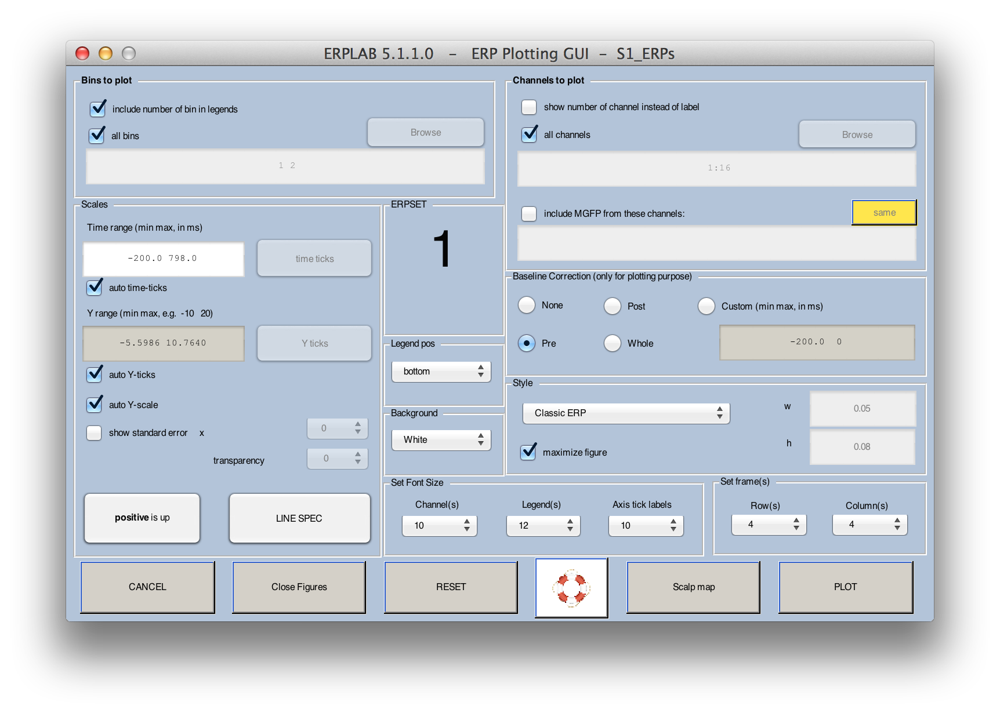
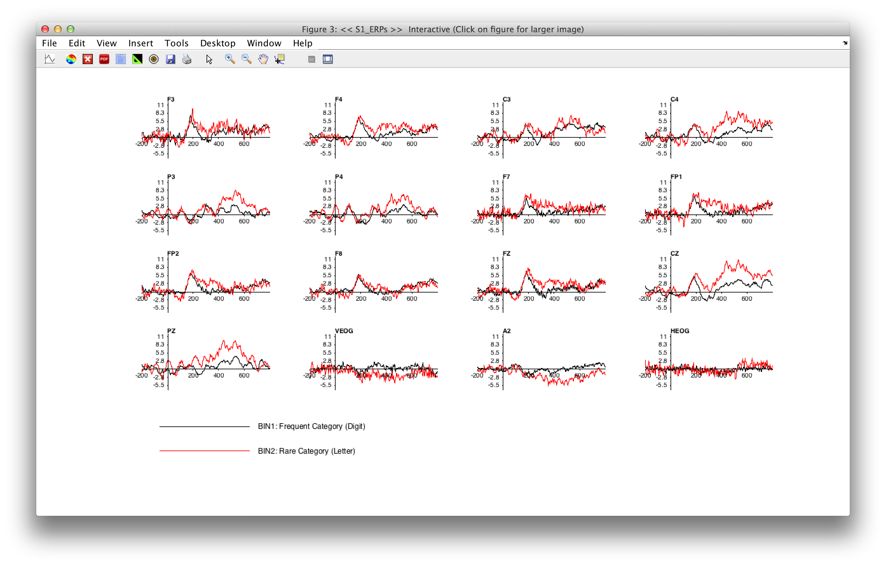
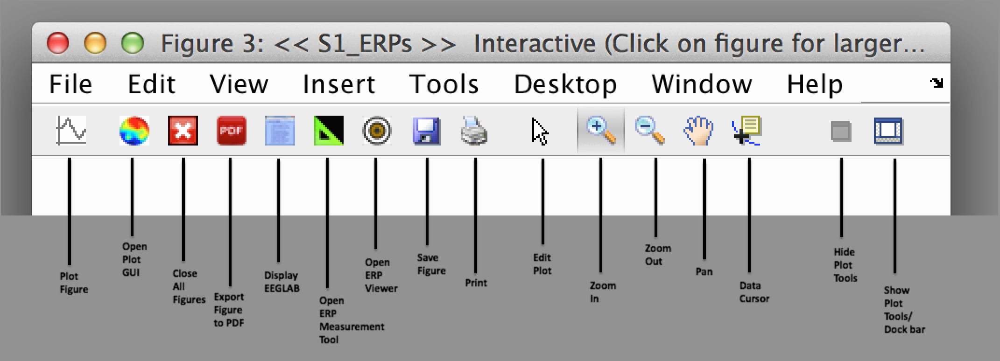
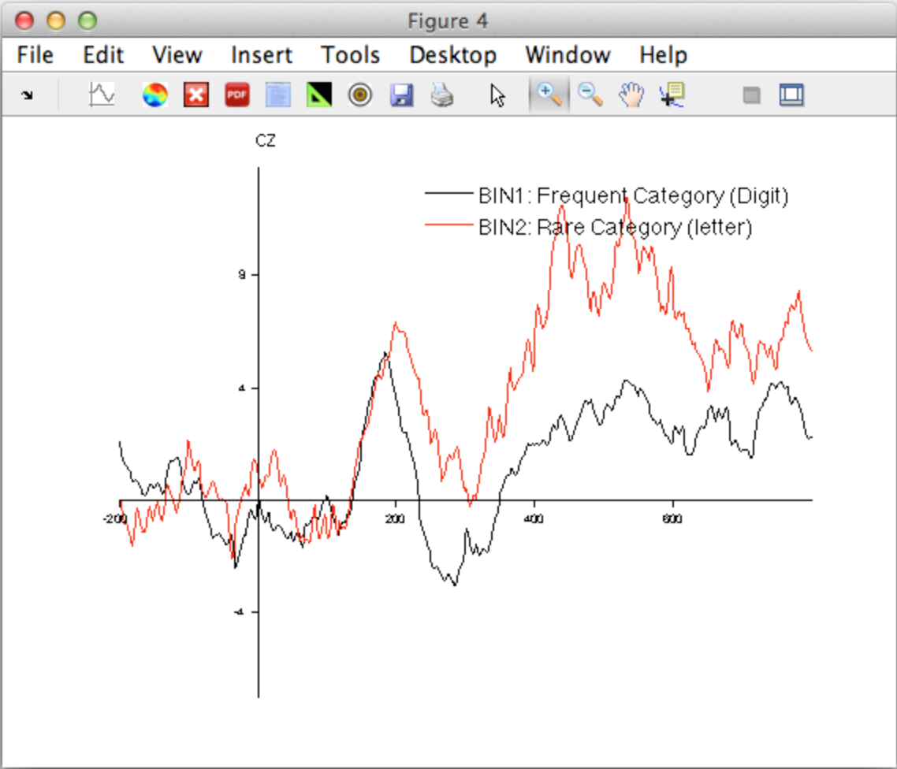
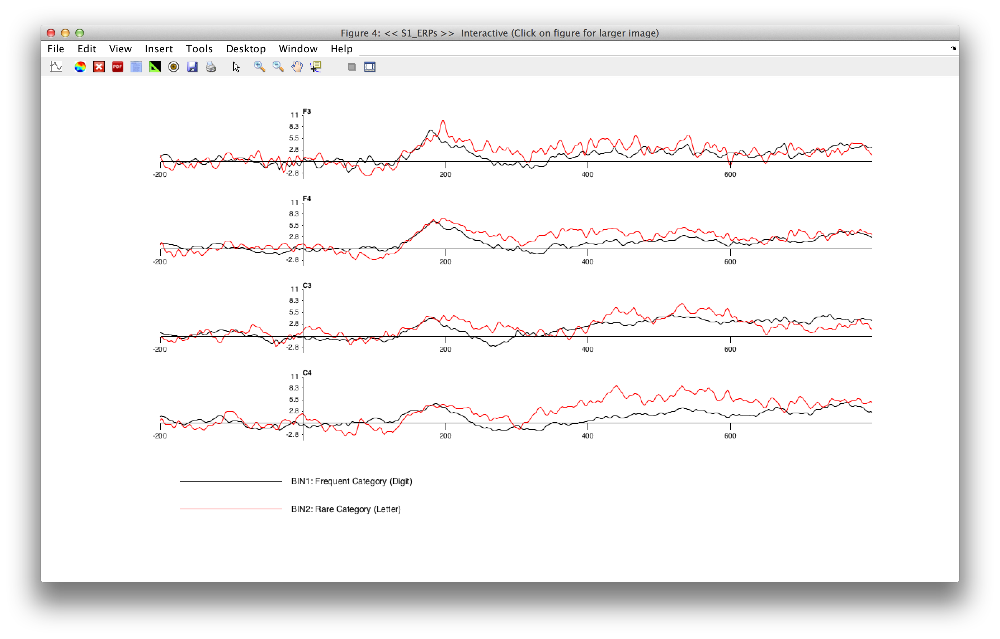

## Plotting Averaged ERP Waveforms
Now that you have created an ERPset, you can look at its contents by selecting **ERPLAB > Plot ERP > Plot ERP Waveforms**, which brings up the window shown in the next screenshot. The top half of the window allows you to specify what information to plot (bins, channels, etc.), and the bottom half allows you to control the details of the plotting (vertical scale, line width, font size, etc.). The window will remember the settings from the last time you used it, but you can revert to the default settings by clicking the **RESET VALUES** button (e.g., when you want to plot a new ERPset that has a different epoch length, set of channels, etc.).



Click the **PLOT** button with the default values, and you should see the following window pop up:



At present, ERPLAB will create a separate panel for each scalp site and overlay the selected channels. In a future version, we will make this more flexible so that you can plot multiple ERPsets and choose which waveforms are overlaid and which waveforms are shown in different panels.For now, you can save the waveforms in a PDF file (by clicking the **PDF** button (i.e. toolbar - PDF button)in the upper toolbar of the resulting ERP plot), import them into a graphics program such as Adobe Illustrator, and then edit them. We recommend that you maximize the figure window before clicking the PDF button. Alternatively, you can export the waveforms as text files using the **ERPLAB > Export and Import ERP > Export ERP to Text** routines and then read them into a program such as Excel or Deltagraph for plotting.  

```Matlab
    Equivalent Script Command:

    % Plotting Averaged ERP Waveform
    % Bins to plot [1,2], Channels to plot [1:16],
    % Pre Baseline Correction, Rows 4, Columns 4, Channels 10, Legends 10
    % Line width 1, Time range [-200 798],
    pop_ploterps( ERP, [ 1, 2],1:16 , 'AutoYlim', 'on', 'Axsize', [ 0.05 0.08], 'BinNum', 'on'                ...
            , 'Blc', 'pre', 'Box', [ 4 4], 'ChLabel', 'on', 'FontSizeChan',10, 'FontSizeLeg',10           ...
            , 'LegPos', 'bottom', 'Linespec', {'k-' , 'r-' }, 'LineWidth',1, 'Maximize', 'on'             ...
            , 'Position', [ 102.833 9.375 108.667 35.125], 'Style', 'Matlab'                              ...
            , 'xscale', [ -200.0 798.0 -100:170:750], 'YDir', 'normal', 'yscale', [ -10.0 10.0 -10:5:10]  );

    % Note that an ellipsis (...) can be used to break a long function call across multiple lines
    pop_ploterps( ERP, [ 1, 2],1:16);  
```

### The toolbar on the figure
Note that in the plotting window, ERPLAB provides a custom toolbar that provides a set of buttons to ERPLAB functions. Play around with it and you should be able to figure out how it works.



Perhaps the most useful tool is the measurement tool (the icon with the small plus mark), which allows you to click on the waveform and see the X and Y values (time and voltage) at that point on the waveform. In addition, this mode allows you to click on one of the panels (e.g., the panel for the Cz electrode site), which will pop up a new window showing an expanded version of that panel, as shown in the screenshot below.



### Other plotting examples
There are many things you can do with the Plotting Waveform GUI. For example, you could plot a single column with multiple channels. For example, set **Channels to plot** to **1:4**, set **Row(s)** to 4, and set **Column(s)** to **1**. You will see something like this:



----
<table style="width:100%">
  <tr>
    <td><a href="./Creating-Averaged-ERPs:-Tutorial"> <br> <b> Creating Averaged ERPs </a></td>
    <td><a href="./Tutorial"> <br> <b> Tutorial</a></td>
    <td><a href="./Filtering-EEG-and-ERPs:-Tutorial"> <br> <b> Filtering EEG and ERPs  </a></td>
  </tr>
</table>