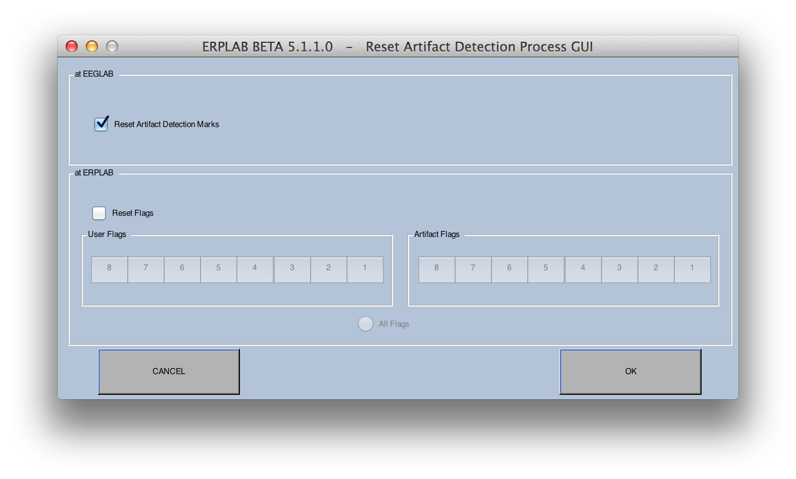
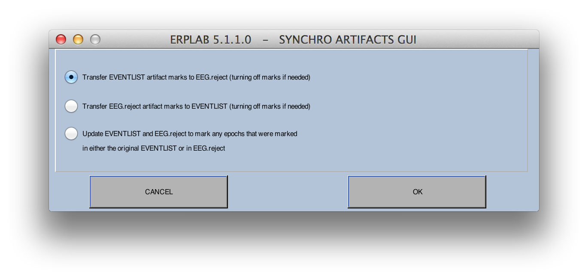
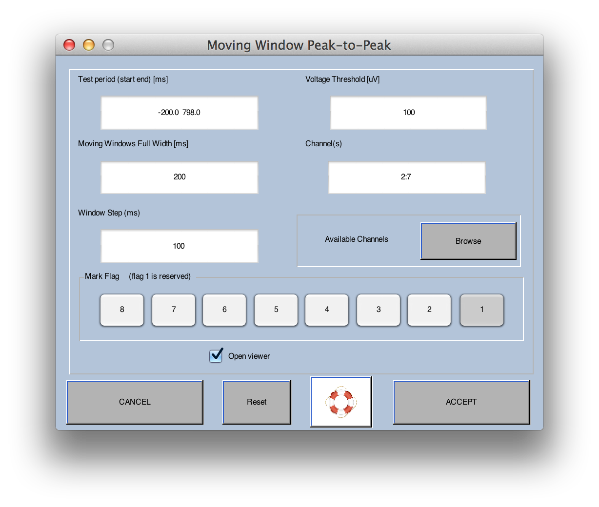
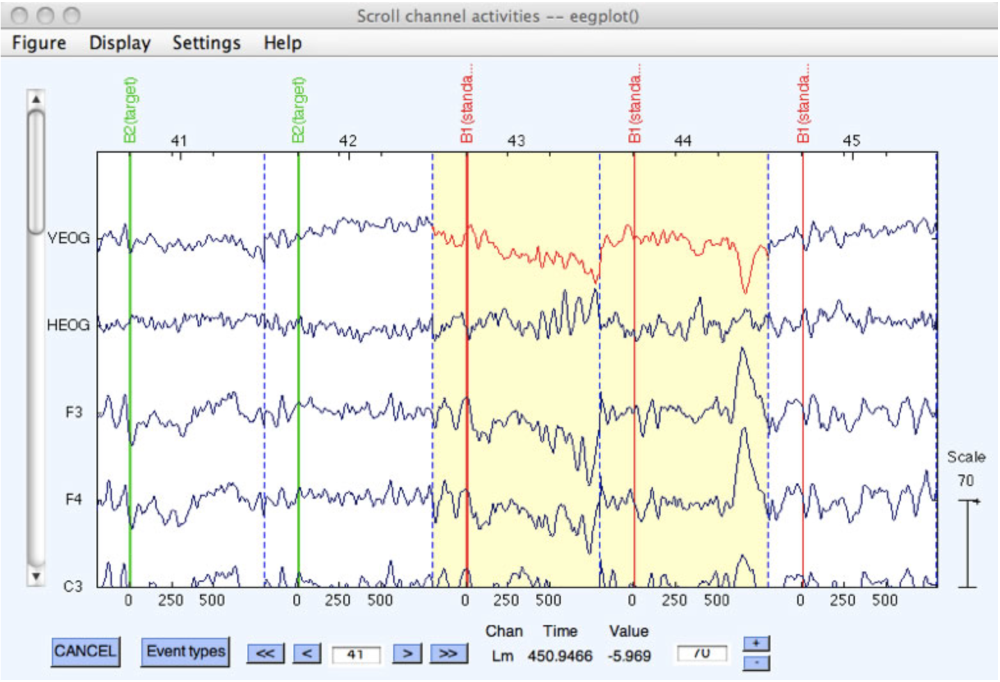
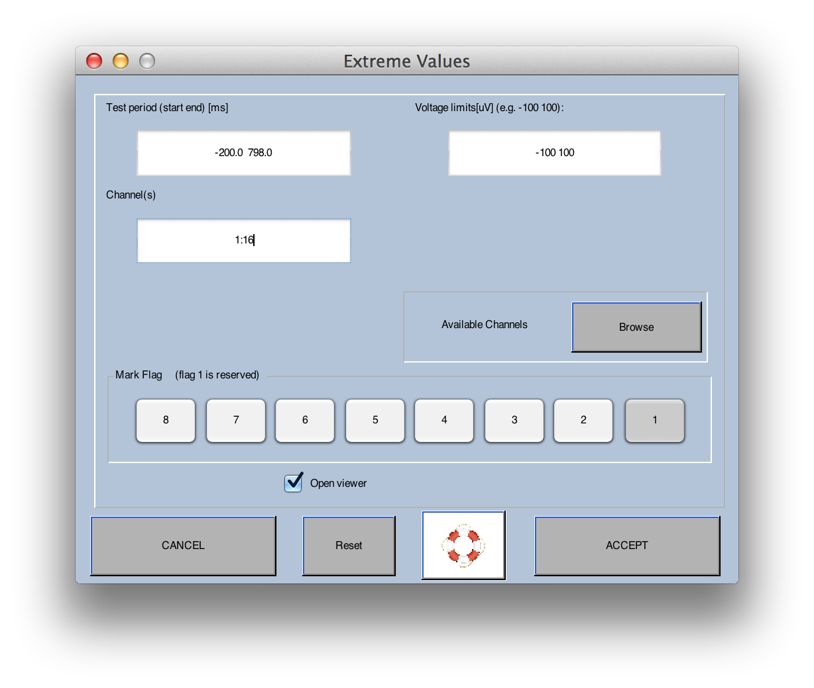
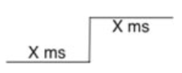
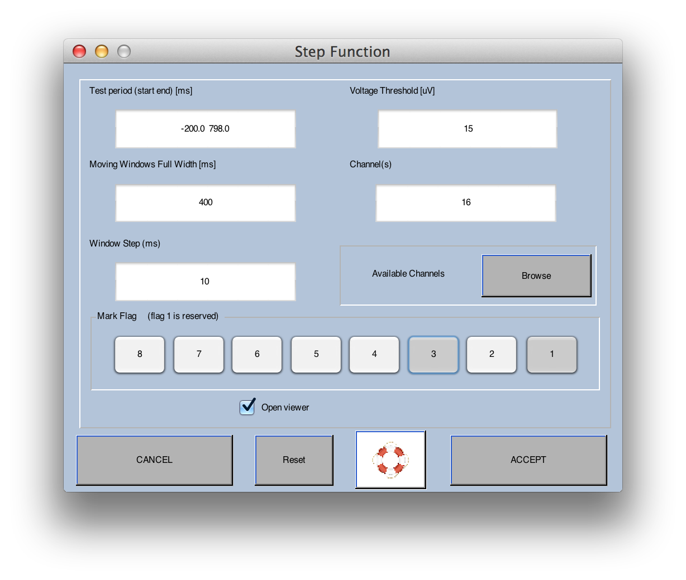
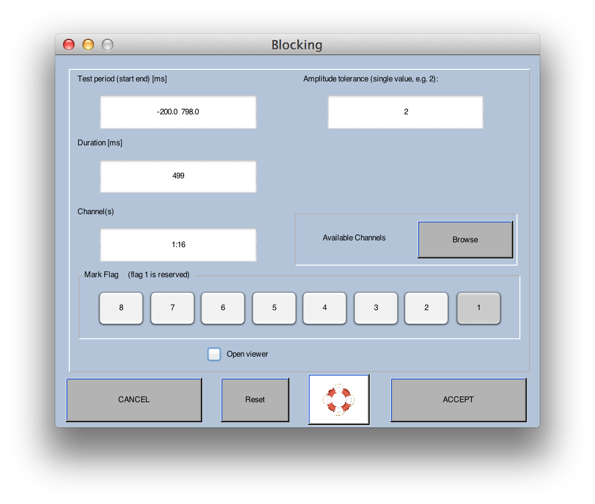

## Artifact Detection in Epoched Data
The combination of EEGLAB and ERPLAB yields several different ways to detect and reject artifacts. It is important to distinguish between _artifact rejection_ and _artifact detection_.  Most of the routines described in this section detect epochs that contain artifacts and mark them in the **reject** field of the **EEG** structure (in the _EEG.reject.rejmanual_ and _EEG.reject.rejmanualE_ fields) as well as in the artifact flags of the **EVENTLIST** structure.  The epochs still remain in the dataset.  Rejection occurs during averaging.  That is, epochs marked for rejection are not included in the ERP averages (unless you tell the averaging routine to include them).

Artifact detection/rejection is ordinarily performed on epoched EEG data. However, it is sometimes useful to delete "crazy" sections of the continuous EEG (e.g., prior to performing ICA). Procedures for this are described [in the next section](./Artifact-Rejection-in-Continuous-Data). The routines described on the present page can be applied only to epoched datasets.

EEGLAB contains several artifact detection functions, and ERPLAB adds a set of additional artifact detection functions.  You can use both the EEGLAB and ERPLAB functions, because they all end up marking artifacts in the same way so that they are excluded from the averaged ERPs (but see below for important information about synchronizing the EEGLAB and ERPLAB artifact tracking information).

Artifact detection is best conceived as a signal detection problem, in which evidence for a signal (the artifact) is compared against a threshold to make a present/absent decision (for a general overview of this conceptualization, see pp. 152-154 in Luck, 2005, _An Introduction to the Event-Related Potential Technique_). ERPLAB contains several different artifact detection functions, each of which is designed to detect a specific type of artifact (e.g., blinks, eye movements, EMG bursts, etc.).  To determine whether an EEG epoch contains an artifact, a function is applied to the data from that epoch.  This function returns a value, which is related to the strength of evidence for the presence of a specific artifact in that epoch.  This value is then compared with a threshold, and the epoch is marked for rejection if the value exceeds the threshold.  The function is applied to a single channel at a time, and EEGLAB keeps track of which channels contained artifacts in each epoch.  However, the entire epoch is excluded from the ERP averages if one or more channels contains an artifact.  It is not currently possible to exclude only some channels from a given epoch.

There are several artifact detection routines, each of which is specialized for detecting a different type of artifacts.  Each can operate on any subset of the channels (or all of the channels).  The epochs that are marked for rejection by one function will stay rejected when you run the next function.  If you want to start over, you can clear all the rejections by selecting **ERPLAB > Artifact Detection > Clear Artifact Detection Marks on EEG**(see screenshot below).  This function allows you to clear EEGLAB's artifact rejection marks in the **EEG** structure and to clear specific flags in the **EVENTLIST** structure. Alternatively, you can just reload a previous dataset (one that was created prior to artifact detection).

## Rejecting epochs by visual inspection
Artifacts can also be manually marked for rejection (or unmarked) in an epoched dataset with EEGLAB's **Tools > Reject data epochs > Reject by inspection** routine.  This routine allows you to view an epoched dataset, and epochs that have already been marked for rejection are shaded.  To manually mark an epoch for rejection, simply click on it (at which point it will become shaded).  If an epoch is already marked for rejection, you can unmark it by clicking on it (which will be indicated by removal of the shading).  When you are done, click the **Update Marks** button to save the marks in the EEG structure.  You will then want to update ERPLAB's artifact rejection marks, as described next.

## Synchronizing EEGLAB and ERPLAB artifact marks
A slight complication arises when EEGLAB's artifact detection features (including rejecting trials by visual inspection) are used in combination with ERPLAB.  Specifically, because EEGLAB doesn't know anything about the artifact flags in the **EVENTLIST** structure, the EEGLAB artifact detection routines and the manual artifact marking/unmarking feature in the **Tools > Reject data epochs > Reject by inspection** routine do not update the artifact flags in the **EVENTLIST** structure.  In addition, if you manually change the artifact flags in the EventList structure (e.g., with a script or by editing a text version of the EventList structure), these changes will not be automatically propagated to **EEG.reject**.  In these cases, you can synchronize the information in the EventList flags and in **EEG.reject** with the **ERPLAB > Artifact Detection > Synchronize Artifact Info in EEG and EVENTLIST** command.  In addition, when you create averaged ERPs using **ERPLAB > Compute Averaged ERPs**, ERPLAB will automatically check for any differences between the EventList flags and **EEG.reject**; if it detects any differences, it will give you the opportunity to synchronize before averaging.

When you synchronize the artifact information, you will see the options shown in the screenshot below.  You can either completely replace the artifact marks in the EVENTLIST with EEGLAB's artifact marks, completely replace EEGLAB's artifact marks with the artifacts in the EVENLIST, or merge them so that any events marked with artifacts in either list will be marked in both lists.  If you do something that turns off previous artifact marks (e.g., with EEGLAB's **Reject by inspection** option), you should use one of the first two options; otherwise no marks will be turned off.

## Seeing the number of trials marked for rejection
When you run an artifact detection routine, the routine will print out the number of artifacts detected in the command window after it finished.  If you want to see how many trials have been marked for rejection in a given dataset at some later time, you can select one of the options in **ERPLAB > Summarize Artifact Detection**.  These options create a table or figure showing the number of trials marked for rejection in each bin, along with the number of occurrences of each flag (which ordinarily corresponds to different types of artifacts).

You may also want to check the number of rejected trials after averaging.  This will give you definitive information about how many trials were included in each bin. To do this, you can select **ERPLAB > Summarize Artifact Detection > ERP Artifact Detection Summary Table**. You can also check the number of accepted and rejected files in the **ERP** structure from the command line, because this information is stored in the **ERP.ntrials** field.  For example, if you type **ERP.ntrials** into the command window (with an ERPset loaded), you will see something like this:

    >> ERP.ntrials

    ans =

        accepted: [515 115]

        rejected: [490 110]

         invalid: [0 0]

         arflags: [2x8 double]

This tells us that there were 515 and 115 accepted trials in bins 1 and 2, respectively, and 490 rejected trials and 110 rejected trials in these two bins.  The **invalid** field would tell us about any trials that were invalid for some other reason (e.g., bad data).  The **arflags** field contains more detailed information about the number of trials associated with each artifact rejection flag (which can be used for keeping track of different types of artifacts).

## ERPLAB Artifact Detection Functions
ERPLAB provides several different artifact detection functions, each of which is particularly useful for certain types of artifacts.  The basic operation is similar for all functions.  Here we will explain the Moving Window Peak-to-Peak Function in detail and then describe the basics of the other functions.

Note that all ERPLAB artifact detection functions allow you to specify the window that is searched for artifacts (called the "Test Period"). The default is the entire epoch length. You can specify a shorter window, if desired, but you cannot specify a window that goes beyond the epoch. For details about time window specifications, see the page on [Timing Details](./Timing-Details).

### The Moving Window Peak-to-Peak Function
The most broadly useful artifact detection function supplied by ERPLAB is the moving window peak-to-peak threshold function.  Peak-to-peak amplitude is the difference between the most positive and most negative voltages within a window.  A moving window peak-to-peak amplitude function computes the peak-to-peak amplitude within a series of windows within each epoch.  For example, if your epoch goes from -200 to +798 ms, you could select a window size of 200 ms and a step size of 20 ms.  For each epoch, the routine would calculate the peak-to-peak voltage from -200 to 0 ms, from -180 to +20 ms, from -160 to +40 ms, etc.  The routine would find the largest peak-to-peak amplitude from these windows for a given epoch of data, compare that largest value with a threshold value, and mark the trial for rejection if the largest value exceeds the threshold.

The parameters are shown in the screenshot above.  The **Test period (ms)** field is the overall epoch period that will be tested (in milliseconds).  This must be less than or equal to the epoch length of the data (the default is the entire epoch).  The **Voltage threshold (µV)** field specifies the threshold for rejection; any epoch that exceeds this threshold will be rejected.  In this example, we've entered 100 µV, so any epochs with a peak-to-peak amplitude of >100 µV will be rejected.

The **Moving window full width (ms)** in this example was set to 200 ms, which means that the routine will look for the peak-to-peak amplitude within successive 200-ms windows. The **Window Step (ms)** value is the size of the step between successive windows; here we've chosen 100 ms, meaning that the windows will start at -200 ms, -100 ms, etc.  A smaller step size is slightly more likely to catch artifacts, but makes the routine run more slowly.  The **Channel(s)** field is used to list the channels that will be tested.  The default is all channels.  You can list individual channels separated by spaces (e.g., **1 3 4 8 19 22**) or you can provide ranges of channels (e.g., **1:17**).  In this example, the routine was applied to channels 2 through 7.

The next section of the window is used for indicating which flag(s) in the **EVENTLIST** structure will be set for epochs marked for rejection.  Flag 1 is mandatory, but you can also set a custom flag.  These flags can be used to count the number of artifacts of each type (as described above).

Once you click **OK**, the routine will test all epochs in the current dataset.  After all epochs have been checked, it will print a summary of the number of trials rejected in each bin in the Matlab command window. If the **Open viewer** option is checked, the routine opens the **Plot > Channel data (scroll)** window so that you can check whether the artifact rejection worked properly.  You should almost always do this – artifacts vary considerably across subjects, and parameters that work well for one subject may not work for another.

Five epochs of data are shown in the screenshot below.  Epochs that are rejected are shaded in yellow, and the channels within an epoch that are responsible for the rejection have their waveforms drawn in red.  You can see that two of the epochs are rejected.

The artifact detection routine will also put up a window allowing you to choose whether you want to keep the new dataset that it created.  If you are satisfied with the rejection, you should keep the dataset (and you may also want to save it to disk).  If you are not satisfied, you can cancel and try again with new parameters.

Imagine that you wanted to use this function to detect both blinks in the VEOG channel and large voltage excursions in all of the other channels.  However, if you set the threshold low enough to detect all blinks in the VEOG channel, it will end up rejecting perfectly fine trials in the other channels (e.g., trials with large P3 deflections).  To solve this problem, you can simply run this routine twice, once applying it to the VEOG channel with a relatively low threshold (e.g., 30 µV), and once on all of the other channels with a relatively high threshold (e.g., 100 µV).  The rejection marks accumulate each time you run an artifact rejection routine (until you clear them with **ERPLAB > Artifact Detection > Reset Artifact Detection Marks and User Flags**).  Thus, you can use the various artifact detection routines in any combination, with any set of parameters, until you have marked all of the artifacts for rejection.

_Note for ERPSS users: ERPSS stops looking for rejections in a given epoch once any artifact test fails, but ERPLAB always performs all artifact rejection tests.  This is necessary to mark all channels that contain artifacts, as described in the preceding paragraph._

### The Simple Voltage Threshold Function
The simplest artifact detection function supplied by ERPLAB is the **Simple voltage threshold**.  This routine, which is like the artifact detection routines provided by most commercial software packages, simply determines whether the voltage at any point in a user-defined test period exceeds a threshold.  The test period can be the entire epoch (which is the default), or you can specify a subset of the epoch.  In the screenshot below, the test period goes from -200 ms to +798 ms (which was the entire epoch length).  The screenshot also shows the threshold values, which in this case are set at -100 and +100 µV.  An epoch will be marked for rejection if the voltage at any time in the test period is less than the first value (-100 µV in this example) or greater than the second value (+100 µV in this example).  The user also specifies which channels will be tested for artifacts (channels 1-17 in this example).  You can list individual channels separated by spaces (e.g., **1 3 4 8 19 22**) or you can provide ranges of channels (e.g., **1:14**). You must also indicate which flag(s) in the **EVENTLIST** structure will be set for epochs marked for rejection.  Flag 1 is mandatory, but you can also set a custom flag.

### The Step Function
The step function was designed to find the step-like changes in voltage that are produced when subjects make saccadic eye movements, but it is useful for detecting other kinds of artifacts as well (e.g., blinks).  The step function begins by defining a step-shaped function of a particular width (e.g., 200 ms at one voltage and then 200 ms at a different voltage).  An example step function is shown below, followed bya screenshot of the window that allows you to enter the parameters for the function.  As in the previous examples, we have selected a **Test Period** that goes from -200 to +798 ms.  We've defined the **Moving window full width** as 400 ms (200 ms before and 200 ms after the voltage transition, which is usually the best setting for eye movements).  And we've defined the **Window Step** as 10 ms.  The routine then checks for step-shaped segments of data, beginning at the start of the **Test Period**, and shifting to the right according to the **Window Step**. In the present example, it would begin by examining the period from -200 to +198 ms, then shift to the period from -190 to +208 ms, etc.  As in the Blink Detection routine, a smaller **Window Step** value will be slightly more likely to detect artifacts but will make the routine run more slowly.  You will need to experiment with it to find the best tradeoff between these factors.

There are two ways of thinking about how the step function works.  First, the covariance between the step function and the data is computed in each step, providing a measure of the extent to which that segment of data looks like a large voltage step. This is done across the entire **Test Period**, and the epoch is rejected if the largest covariance is greater than the rejection threshold.  It turns out that this is computationally identical to taking the mean voltage from the first half of the step and subtracting it from the mean voltage from the second half.  That is, the mean voltage between -200 and -2 ms would be subtracted from the mean voltage between -0 and +198 ms.  Then the mean voltage between -190 to +8 ms would be subtracted from the mean voltage between +10 and +208 ms.  This would be done for each interval through out the **Test Period**, and the largest of these voltage differences is compared with the rejection threshold to determine whether the present epoch should be marked for rejection.

### The Blink Detection Function
Note: This function is not yet fully implemented, so we recommend that you avoid it or use it with caution.  The Step Function (described previously) works very well for detecting blinks, and we recommend that you use it instead.

### Sample-to-Sample Voltage Threshold
This function finds sudden shifts in voltage between one sample and the next.  You simply select the threshold, and it rejects any epochs in which the difference in voltage between consecutive sample points exceeds this threshold.

### Blocking and Flat line
This function is designed to find periods of "blocking" (saturation or flatlining of the amplifier or analog-to-digital converter).  Here's what blocking typically looks like in an EEG recording:

You might think you could detect this sort of flatline pattern just by looking for periods during which the voltage remains constant over a period of time.  However, due to noise, the voltage may not be exactly constant.  Also, it may go back and forth between the flatline value and non-flatlined values, as in this example:

Thus, we use the following algorithm (originally developed by Jon Hansen for ERPSS):

1. Find the most positive voltage in the epoch
2. Determine how many time points are within _delta_ µV of this maximum voltage.  (The delta value is termed the **tolerance**, as shown in the screenshot below.)  The number of time points is used to determine the _duration_ of the blocking (duration = time points x sample duration).  The time points are summed together even if they are not consecutive.
3. Do the same thing for the most negative voltage in the epoch.
4. Take the longer the two durations (one for positive, one for negative) and compare it against the **Duration** value specified by the user (see screenshot below).  If the longer duration is greater than the **Duration** value, the epoch is marked for rejection.

The optimal **tolerance** and **Duration** values will depend on the nature of your system.  Typical values might be 1 µV for **tolerance** and 200 ms for **Duration**.  This would lead to the rejection of any epochs in which more than 200 ms worth of points are within 1 µV of the maximum (or minimum) voltage in the epoch.

