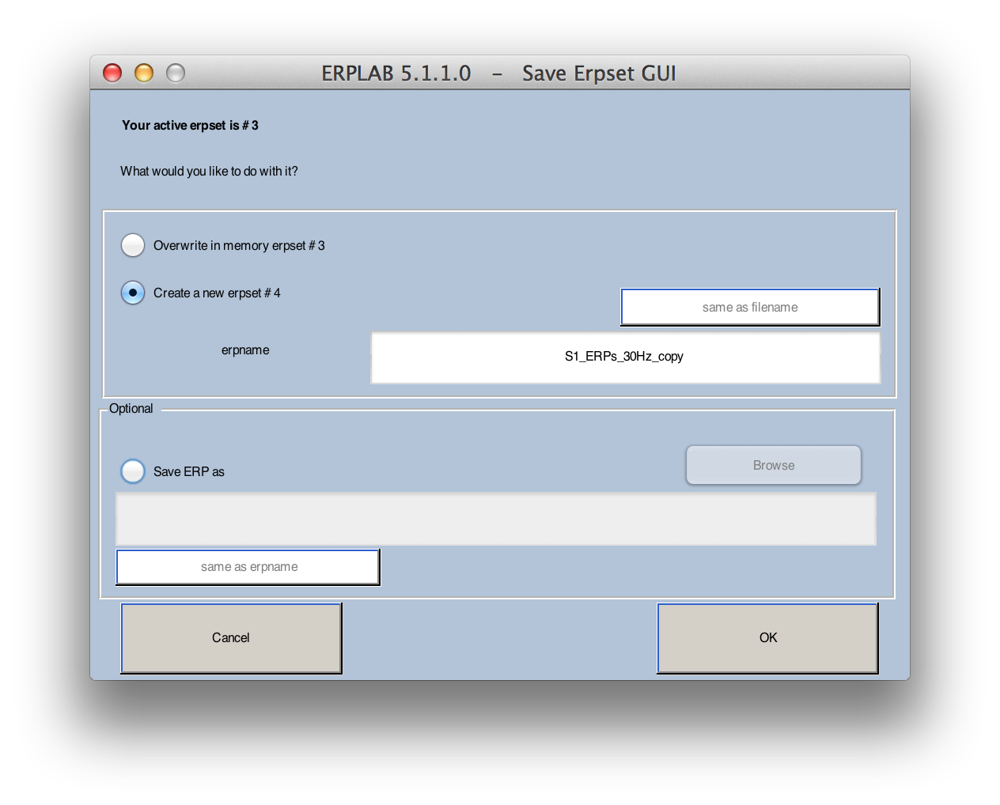
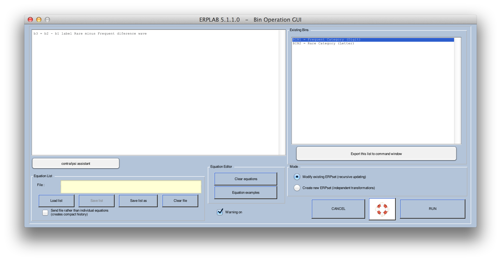
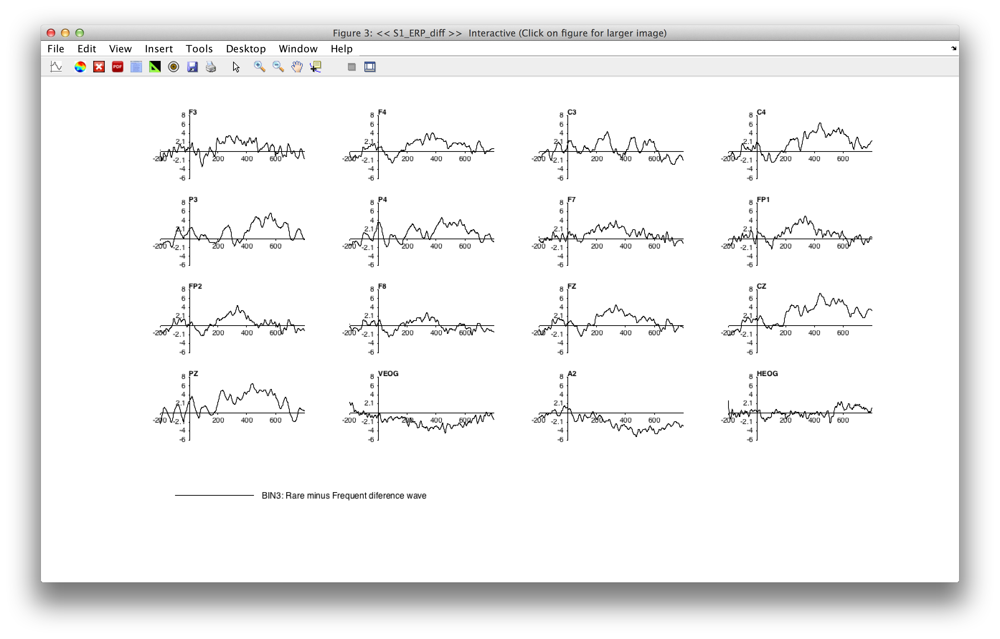
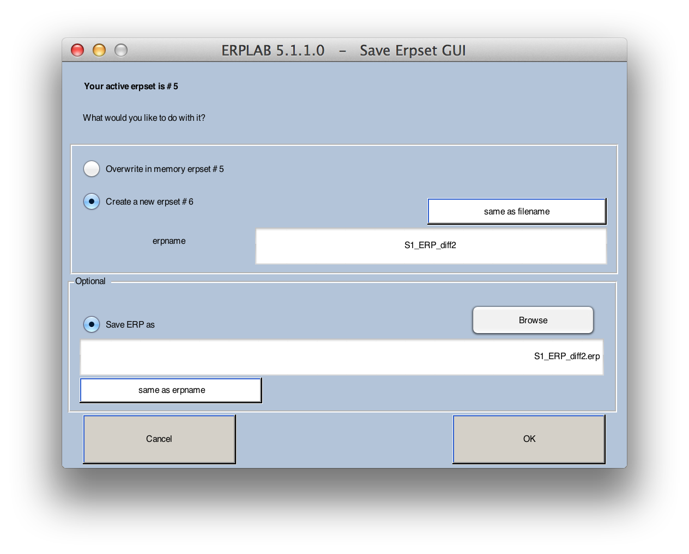

## Combining ERP Waveforms with Bin Operations
The **ERPLAB > ERP Bin Operations** routine allows you to create new bins by combining existing bins from the current ERPset.  This is most often used to create difference waves or to average across bins.

Bin Operations has two modes of operation.  In one mode, you use a set of equations to modify existing bins and add new bins within the current ERPset.  In this mode, you can modify one bin and then use this modified bin to create or modify another bin (this is called _recursive updating_).  In another mode, the current ERPset serves as the input to a set of equations that create a new set of bins in a new ERPset (this is called performing a set of _independent transformations_).  We will begin with modifying an existing ERPset, which is the simplest way to simply add a few bins.

### Modifying an existing ERPset (recursive updating)
As our first example, we will use **ERPLAB > ERP Operations > ERP Bin Operations** to make a difference wave, in which the ERP from the frequent stimuli is subtracted from the ERP from the rare stimuli.  We will operate on the data in the ERPset you created earlier called "S1_ERPs_30Hz", so make sure it is selected in the **ERPset** menu.  It's usually a good idea to operate on a duplicate of an ERPset, so first select **ERPLAB > Duplicate or rename current ERPset** and then make a duplicate of it called "S1_ERPs_30Hz_copy", as shown in the screenshot below.

    Equivalent Script Command:

    % Load ERP S1_ERPs_30Hz
    % Path is /Users/etfoo/Desktop/tutorial_script/
    % Note that you will need to replace the path with the actual location in your file system
    ERP = pop_loaderp( 'filename','S1_ERPs_30Hz.erp',   'pathname','/Users/etfoo/Desktop/tutorial_script/', 'overwrite', 'off');   

    % The following command uses Matlab's Current Folder
    ERP = pop_loaderp({'S1_ERPs_30Hz.erp' });   

    % Duplicate S1_ERPs_30Hz to S1_ERPs_30Hz_copy
    % Path is /Users/etfoo/Desktop/tutorial_script/
    % Note that you will need to replace the path with the actual location in your file system
    ERP = pop_savemyerp(ERP, 'erpname', 'S1_ERPs_30Hz_copy.set', 'filename',...
       'S1_ERPs_30Hz_copy.erp', 'pathname', '/Users/etfoo/Desktop/tutorial_script/');   

    % The following command uses Matlab's Current Folder
    ERP = pop_savemyerp(ERP, 'erpname', 'S1_ERPs_30Hz_copy.set', 'filename',...
       'S1_ERPs_30Hz_copy.set.erp', 'gui','no');  

Now select **ERPLAB > ERP Operations > ERP Bin Operations**.  The window shown below will appear.

The right panel lists the existing bins in your ERPset, and the left panel shows a set of equations that you write to create new bins from the existing bins.  In the example shown here, an equation is written to create a new bin 3 within the current ERPset that is equal to the existing bin 2 minus the existing bin 1 (the rare-minus-frequent difference wave).  A label is also provided for the new bin.  You should type this equation into the window, as shown in the screenshot above.

You can create as many new bins as you'd like in one step, defining one bin on each line of the left panel.  You can save your bin equations in a text file (by clicking **Save list as**) and you can read in a previously saved set (by clicking **Load list**).

_Hint: You can see examples of the types of equations that are valid by clicking the **Equation examples** button.  This will create sample equations.  These will probably not be directly useful (because ERPLAB doesn't know what would make sense for a given experiment), but they will show you the kinds of things that are possible._

Once you have defined the new bin as shown in the screenshot above, make sure that **Modify existing ERPset (recursive updating)** is selected so that you will add the new bin to the existing ERPset.  Then click **RUN** to create the new bin.

Select **ERPLAB > Duplicate or rename current ERPset**.  
Type the following name into **erpname: S1_ERP_diff.erp**  
Check the box **Save ERP as**, and then click on the **same as erpname** button.  
This will save your updated ERPset, (we will need this file later).

Once you've created the new bin, plot it with **ERPLAB > Plot ERP Waveforms**.  
Uncheck the **all bins** box and select **only bin 3**. The result should look like the following:

    Equivalent Script Command:

    % ERP bin operations
    % b3=b2-b1 label Rare minus Frequent difference wave
    ERP = pop_binoperator( ERP, {'b3= b2-b1 label Rare minus Frequent difference wave' });  

    % Plotting ERP Waveforms from bin 3 with default parameters
    pop_ploterps( ERP, 3, 1:16);  

In this example, we've simply added a new bin to the current ERPset.  Note, however, that you can also update the existing bins in this mode.  In addition, any changes you make in one equation can influence the results of the next equation.  For example, after creating the difference wave in bin 3, you could have an equation that uses this difference wave to create a new bin 4.

### Creating a new ERPset (independent transformations)
In this example, we will use **ERPLAB > ERP Bin Operations** to re-order the bins in the output from the previous step.  We will also create an additional bin that shows how to implement a somewhat more complicated transformation.

Select **ERPLAB > ERP Operations > ERP Bin Operations** after performing the previous step  
You will see that the newly created bin (bin 3) is now listed in the right panel as an existing bin (see screenshot below).  
Select **Create new ERPset (independent transformations)** to create a new ERPset in this example.  
A popup window will appear when selecting **Create new ERP set**, warning you that you need to use the "new bin" syntax. ERPLAB will then ask if you want to have it automatically update the syntax for you. Select Yes and continue.  

The equations in the left panel of the window will create a new ERPset, in which the first 3 bins are re-ordered versions of the bins in the current ERPset.  The 4th bin is the vector distance between the first two bins:

**nb1 = b3 label Rare minus Frequent difference wave** — This means that new bin 1 (nb1) in the new ERPset will be equal to the original bin 3 (b3) in the current ERPset)

**nb2 = b1 label Frequent** — This means that new bin 2 (nb1) in the new ERPset will be equal to the original bin 1 (b1) in the current ERPset)

**nb3 = b2 label Rare** — This means that new bin 1 (nb1) in the new ERPset will be equal to the original bin 2 (b2) in the current ERPset)

**nb4 = sqrt((b1*b1) + (b2*b2)) label Vector length** — This means that new bin 4 (nb4) is the Pythagorean distance between the original bins 1 and 2 (rare and frequent)

After you complete your equation list, save it by clicking **Save list as** button  
Save the equation list as "S1_ERP_bo.txt" and click **OK**.

_Note: You can also recombine bins with different subsets of channels (e.g., to make contra-minus-ipsi difference waves to isolate the lateralized readiness potential or the N2pc wave).  See the section on Bin Operations in the ERPLAB User's Manual for details.  This can be done only in the **independent transformations** mode._

Click the **Run** button and then you will see the **Save Erpset** window:  

When you use the **independent transformations** mode, the Bin Operations necessarily creates a new ERPset. This allows you to name the new ERPset and, optionally, save it as a file on your hard drive.

Name the ERP set as **S1_ERP_diff2** and save it to the disk.

_Hint: There is no reason to first make a duplicate of the ERPset in this mode, because it always creates a new ERPset. In the **recursive updating** mode, however, creating a duplicate is useful (although not necessary) so that you can easily step backward and try again if you make a mistake or change your mind._  

    Equivalent Script Command:   % Creating new bins
      ERP = pop_binoperator( ERP, {'nb1=b3 label Rare minus Frequent difference wave' 'nb2=b1 label Frequent' ...
    'nb3=b2 label Rare' 'nb4=sqrt((b1*b1)+(b2*b2)) label Vector length'})

----
<h5 align="center"> <a href="./Filtering-EEG-and-ERPs"> << Filtering EEG and ERPs </a> <a href="./Creating-and-Modifying-Channels-with-Channel-Operations">  Creating and Modifying Channels with Channel Operations >>  </a></h5>
