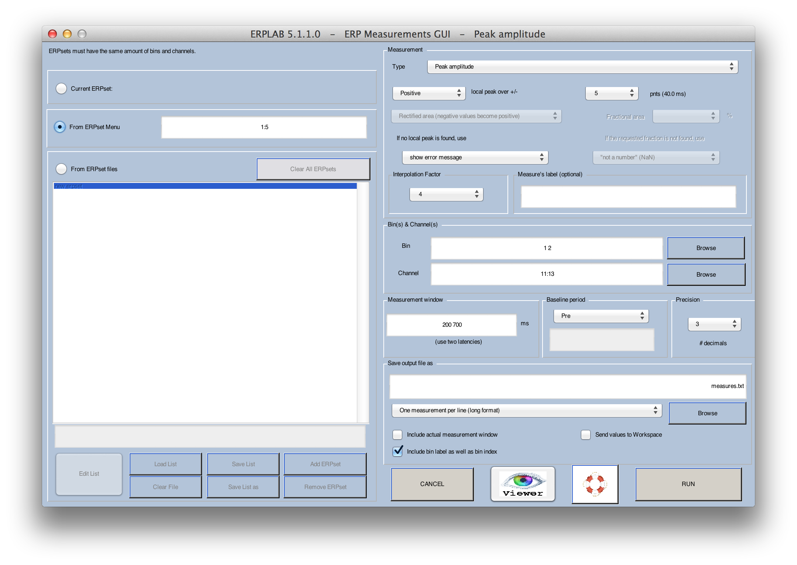
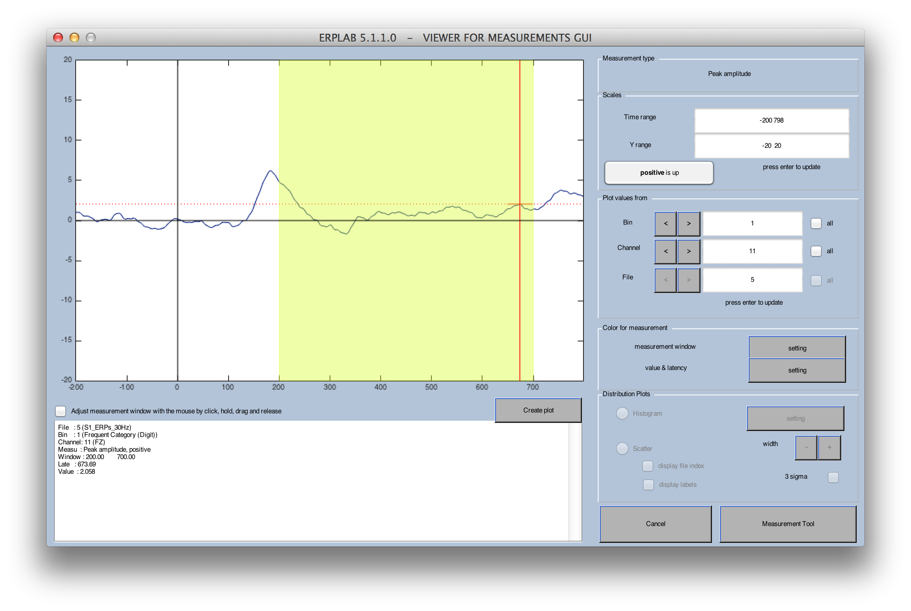
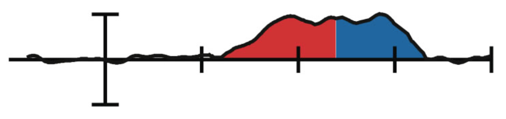
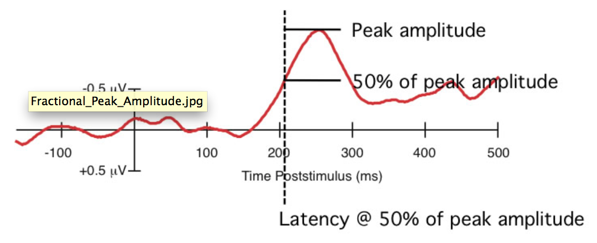

## ERP Measurement Tool
**ERPLAB > ERP Measurement Tool** is used to measure features of the ERP waveforms, such as amplitudes and latencies.

The basic idea behind this tool is that you specify a set of ERPsets, a set of bins, a set of channels, and a specific measurement to be performed (e.g., peak latency between 300 and 600 ms), and then the tool performs all of the measurements and saves them in a text file.  You can either specify ERPsets that have been loaded into ERPLAB (and are therefore visible in the **ERPsets** menu) or ERPsets that have been stored in files on disk.  To make it easy to repeatedly measure the same set of files, you can save a list of the files and then load it again later.  The GUI is shown in the screenshot below.

The measurement tool includes a **Viewer** button near the bottom. This allows you to view each waveform along with measurement information. We strongly encourage you to look at all your measurements to make sure that everything is OK. You may be surprised at the degree of subject-to-subject variability in the waveforms. Here's what it looks like for peak amplitude measurements with the parameters shown in the screenshot above.  The yellow region is the specified measurement window (200-700 ms), and the red vertical line shows the time at which the peak latency was found (because peak amplitude was used for this example).  The text box at the bottom left of the window shows various parameters, including the measured peak amplitude value for the currently displayed subject, bin, and channel.

The usual approach should be to set the measurement parameters (e.g., latency window, files to measure, etc.) and then click the **VIEWER** button to see the measures. You can use the arrow buttons in the viewer to step through each combination of bins, channels, and files. When you have finished viewing the measures, you click the **Measurement Tool** button, which brings you back to the main measurement window.  However, be careful not to bias your results by using the VIEWER to select the windows and electrodes where the effect is biggest (which may simply reflect noise).  Instead, this should be used as a reality check to help you realize if your measurement parameters are giving you inappropriate values.

In the main Measurement Tool GUI, you will select a text file for saving the measured values and then click **RUN** to measure the values and save them to the file.  If the file already exists, you can overwrite it or append to the end.  You can choose between two different file formats (more details can be found below). The two formats are:

- **One ERPset per line (wide format)**. This format is appropriate for many statistical packages, such as SPSS.  In this format, all the measurements for a single file (e.g., N bins x M channels) will be placed on a single line. That is, each line will be a subject (assuming that each file represents one subject's data) and each column will be the measurement for a bin/channel combination. In many experiments, the number of columns is very large, making it not very human-friendly.
- **One measurement per line (long format)**. In this format, a single measurement is provided on each line (e.g., a single combination of file, bin, and channel). Each line also contains informaiton about which file, bin, and channel was measured on that line. This is easily human readable, and it is also well suited for importing into Excel for use with pivot tables.  However, it is not appropriate for most statistical packages.

#### Time Windows and Interpolation
Each type of measurement requires that you specify a time window (or single time point) for measurement.  For example, you might measure the peak or mean amplitude between 100 and 200 ms.  However, depending on your sampling rate, you might not have sample points at exactly these times.  ERPLAB therefore picks the closest sample points (except for the mean/integral/area measures), as described fully on the [Timing Details](./Timing-Details) page.

To increase precision, ERPLAB can resample the data at a higher sampling rate prior to measuring an amplitude or latency value.  This is primarily valuable for the advanced latency measurement routines (e.g., when you are finding the latency at which the voltage has reached 50% of the peak voltage).  You can control this by specifying the Interpolation Factor in the ERP Measurement Tool.  If you use a factor of 1, no interpolation will be applied.  If you use a value of greater than 1, the sampling rate will be increased by this factor (using spline interpolation).  For example, if your original sampling rate was 512 Hz, and you specify an interpolation factor of 2, the data will be resampled at 1024 Hz.  Details can be found on the [Timing Details](./Timing-Details) page.

#### Measurement Types
Here are the different types of values that can be measured:

**Instantaneous amplitude**

This simply measures the amplitude at one latency (a single latency is specified in the latency text box).

**Peak amplitude or latency**

This finds the most positive or most negative amplitude within a specified time range (the starting and ending latencies of the time range are specified in the **latency** text box).  The amplitude and/or latency of this peak is provided in the output file.  If the number of points for the **local peak** option is nonzero, a peak is defined as the most positive or most negative value that is also (a) larger than the voltages in the one sample on either side of the peak, and (b) larger than the average of the **N** sample points on left side of the peak, and (c) larger than the average of the **N** sample points on the right side of the peak (where **N** is the value you specify in the GUI).  If there is no point that meets this definition, then a warning message is printed in the command window and the simple peak (the most positive or negative point) or NaN is printed (depending on what is specified in the pull-down menu for **If no local peak is found in a given waveform**).  Note that this requires that the **N** sample points actually exist.  If, for example, you ask for the local peak amplitude between 300 and 900 ms, with **N** set at 10, then the epoch length must be at least 10 sample points longer than 900 ms.  Note: We strongly recommend that you use the local peak option; if you do, the Method section of your journal articles should indicate that you measured "local peak amplitude" or "local peak latency" (and not just "peak amplitude" and "peak amplitude").

**Mean amplitude**

This computes mean voltage within a specified time range (the starting and ending latencies of the time range are specified in the **latency** text box).

**Integral and area amplitude**

ERPLAB provides several options for computing what is often called "area amplitude," and to understand them you must first understand some terminology.  Technically, the term "area" refers to the geometric shapes created by the boundary of the waveform and the zero line.  Area can never be negative.  When you want to allow the regions below the zero line to be considered negative, such that positive and negative regions will cancel each other, you will be measuring the "integral" of the waveform (over some time range).  The area is equivalent to taking the absolute value of each point (i.e., "rectifying" the waveform) and then computing the integral.

When ERPLAB measures areas and integrals, it does so by treating each sample point as a rectangle that is one sample period wide and computing the area or integral numerically (as opposed to computing the values analytically by fitting a continuous function to the data).  Some details are described on the [Timing Details](./Timing-Details) page.

The integral or area is measured between two fixed time points that you specify. You have 4 options for exactly what will be measured:

- **Rectified area (negative values become positive)-** This is the true area of the geometric regions formed by the combination of the baseline and the waveform. It is equivalent to taking the absolute value at each data point (i.e., _rectifying_ the waveform) and then measuring the area. The resulting value is >= zero.
- **Numeric integration (area for negatives subtracted from area for positives)-** This is the integral of the waveform, which is equal to computing the sum of the voltages at each sample point in the measurement window and then scaling this sum to take the sampling rate into account.  The resulting value can be either positive or negative. Note that the integral is equivalent to the mean amplitude, except that the mean is divided by the length of the measurement interval.
- **Area for positive regions (negatives are zeroed)-** This finds the area of the portions of the waveform that are above the zero line.  This is equivalent to setting all negative values to zero and computing the area. The resulting value is >= zero.
- **Area for negative regions (positives are zeroed)-** This finds the area of the portions of the waveform that are below the zero line.  This is equivalent to setting all positive values to zero, and computing the rectified area. The resulting value is >= zero.
Because area has a height (µV) and a width (seconds), the values from this routine are in units of µVs (microvolt seconds). That is, a 1 µV value over a 1 second period would have an area of 1.0 µVs, and a 1 µV value over a100-ms period would have an area of 0.1 µVs.

**Fractional area latency**

This routine provides a measure of latency by finding the point that dividing the area under the curve into specific fractions.  For example, if you want to find the midpoint of a component, you could do this by finding the point that divides the area under the curve into two equal regions, as in the example below.  This would be the "50% area latency" measure, and it works extremely well on large components like the P3 wave or on components that have been isolated by means of difference waves (see, e.g., Kiesel et al., 2008, Psychophysiology; Luck & Hillyard, 1990, Perception & Psychophysics; Luck, 1998, Psychological Science).

The same approach can be used to assess the onset or offset of a waveform.  To estimate the onset, you could find something like the 15% area latency (the point at which 15% of the area is to the left of the point and 85% of the area is to the right).  To estimate the offset, you could find something like the 85% area latency.  The same four options that are available for using area/integral to measure amplitude are available for measuring fractional area amplitude.

**Fractional peak latency**

This routine provides a measure of onset latency by finding the peak amplitude and working backward in the waveform until the amplitude reaches a specified fraction of the peak amplitude.  For example, the figure below shows how the 50% peak latency is computed by finding the peak amplitude and then working backward until the voltage reaches 50% of this peak voltage.  As in other peak measures, you can have it find a local peak amplitude rather than the absolute peak, and work backward to the point that is the requested fraction of the local peak amplitude. In many cases, this is the optimal method for computing onset latency (see, e.g., Kiesel et al., 2008, Psychophysiology; Luck et al., 2009, Psychophysiology).

#### Saving the measurements
The measured values are stored in a text file, which you can import into the statistical analysis package of your choice.  There are two output formats.  In the first (**One ERPset per line (wide format)**), each line contains the data from every requested bin and channel from a given ERPset.  Ordinarily, each ERPset will contain the data from one subject, so the result contains one line for each subject, as shown here:

    ERPset   Frequent_FZ   Frequent_CZ  Frequent _PZ  Rare_FZ  Rare_CZ   Rare_PZ      

    S1       2.265         4.173       4.352        4.300      10.754    9.814

    S2       1.776         4.027       4.175        3.914      10.029    9.268

    S3       2.265         4.173       4.352        4.300      10.754    9.814

In this example, peak amplitude was measured from two bins ("Frequent" and "Rare") and three channels (Fz, Cz, and Pz).  The data from each subject (S1, S2, and S3) appears on a separate line, and each column represents the measurement from a particular channel in a particular bin.  This format is useful for most statistics programs, such as SPSS.

The second output format (**One measurement per line (long format)**) provides one measurement per line, along with various pieces of information that can be used for sorting.  This format is ideal for using the pivot table feature of Excel.  Here are the same data as in the previous example but shown in this alternative format:

    ERPset   bin       channel          value

    S1       1            1             2.265

    S1       1            2             4.173

    S1       1            3             4.352

    S1       2            1             4.300

    S1       2            2            10.754

    S1       2            3             9.814

    S2       1            1             1.776

    S2       1            2             4.027

    S2       1            3             4.175

    S2       2            1             3.914

    S2       2            2            10.029

    S2       2            3             9.268

    S3       1            1             2.265

    S3       1            2             4.173

    S3       1            3             4.352

    S3       2            1             4.300

    S3       2            2            10.754

    S3       2            3             9.814

The values can also be stored in the Matlab workspace in the variable **ERP_MEASURES**.  You can see them by simply typing **ERP_MEASURES** at the Matlab command line, yielding an output that looks like this:

    >> ERP_MEASURES

    ERP_MEASURES(:,:,1) =

        2.2648    4.1730    4.3524

        4.2995   10.7537    9.8138

    ERP_MEASURES(:,:,2) =

        1.7761    4.0267    4.1753

        3.9139   10.0288    9.2685

    ERP_MEASURES(:,:,3) =

        2.2648    4.1730    4.3524

        4.2995   10.7537    9.8138
