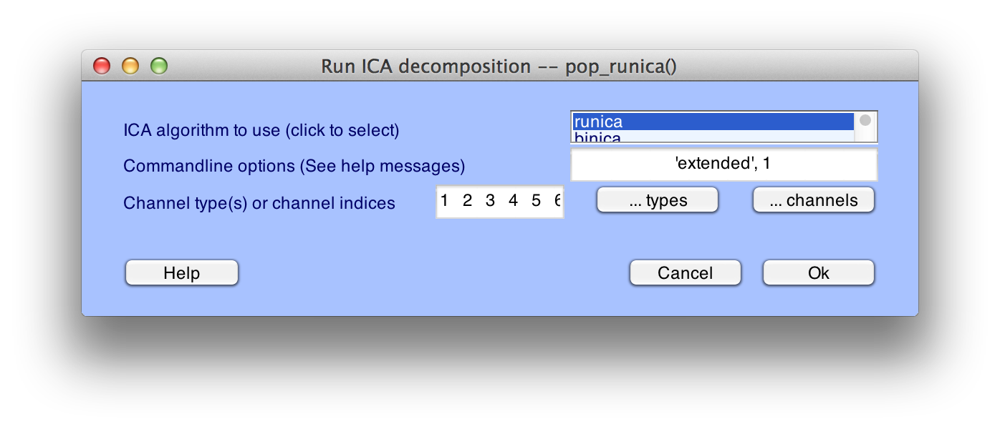
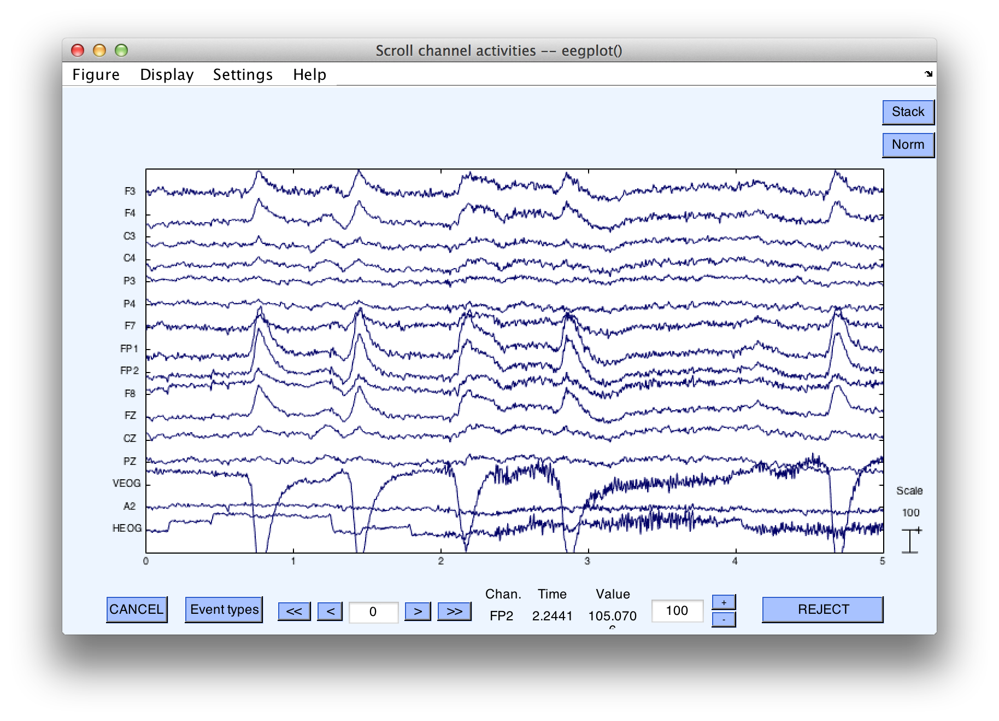
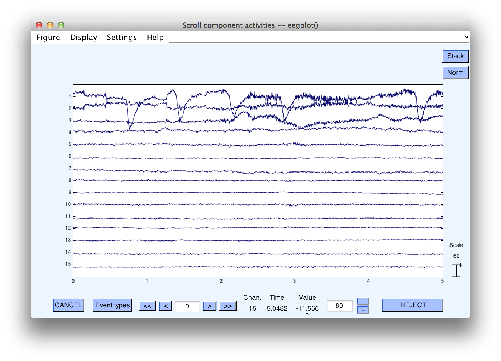
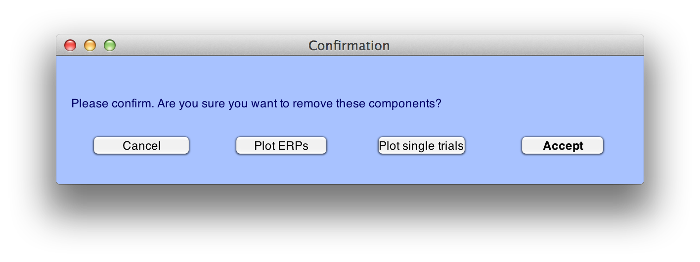
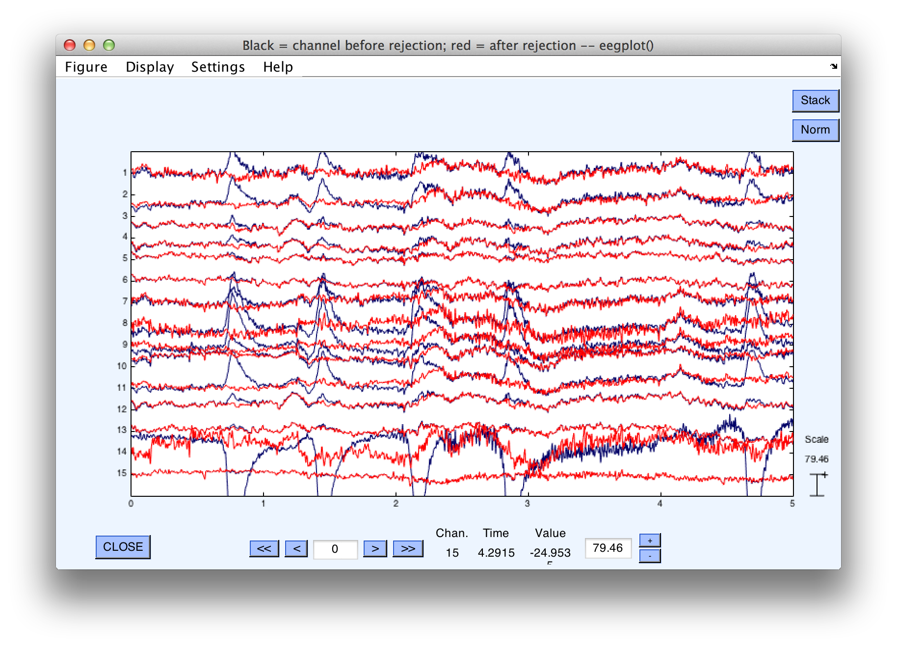

### Exporting and Importing EventLists to Combine Artifact Rejection and Artifact Correction
In this section, we will show how EEGLAB's artifact correction using Independent Component Analysis (ICA) can be combined with ERPLAB's artifact detection and rejection abilities.  This is a somewhat complicated example, but it illustrates two important aspects of the EEGLAB/ERPLAB combination.  First, it shows how (and why) to take an EventList text file that was created in one dataset, export it, and then import it back into another dataset.  Second, it shows how you can use artifact correction to avoid throwing out a lot of data, while still eliminating trials on which the eyes were closed when the stimulus was presented. Note that, before attempting this exercise, you should become familiar with how to perform ICA-based artifact correction in EEGLAB (see the EEGLAB documentation).   Here we will only cover the aspects of artifact correction necessary for illustrating how to combine it with artifact rejection.

If you take a look at [the first example of artifact detection in this tutorial](./Artifact-Detection), you will see that 29.7% of the epochs for subject S1 were detected as containing artifacts using the Moving Window Peak-to-Peak function.  By scrolling through the data, it is obvious that many of these were detected due to blinks occurring during the epoch.  Because the activity generated during a blink is stereotyped, a single component can usually be identified and removed to eliminate the influence of the artifact.  However, the removal of a blink component does not mean that we should necessarily include all corrected trials in our analysis.  For example, if the participant blinks during the presentation of a stimulus, this trial should not be included because a participant can't see a stimulus if his or her eyes are closed due to a blink.  It is important to keep in mind that artifact correction can correct the artifactual voltage associated with an ocular artifact, but it cannot correct the change in sensory input caused by an eye blink or eye movement.

The tricky part of combining artifact rejection and artifact correction is that, once the artifact correction has been performed, it is impossible to detect which trials contained a blink at the time of the stimulus.  Thus, we need to perform artifact detection on uncorrected data and merge this information with the corrected EEG.  This is made even more complicated by the fact that we detect artifacts after epoching the EEG, but artifact correction is usually best performed on the continuous EEG. Accomplishing this typically involves the following set of steps:

1. Import your continuous EEG data into EEGLAB
2. Remove "crazy" sections of data from the continuous EEG, either manually or using [Artifact Rejection from - Continuous Data](./Artifact-Rejection-in-Continuous-Data)
3. Create an EVENTLIST for the continuous EEG
4. Use ICA on the continuous EEG to create an EEG file in which the blinks have been corrected
5. Using the uncorrected, epoched EEG file, find trials with a blink at the time of the stimulus
6. Save the EventList from this file, which marks which events contained the artifacts
7. Import the EventList that marks the artifactual trials into the corrected continuous EEG file
8. Epoch and average this corrected EEG file  

To start, you will need to load the file **S1_Chan.set**, which was created earlier. Because running ICA will take a fair amount of time (more or less so depending on the specifics of your computer), be prepared to let it work while you go to lunch (or to sleep).  To begin the procedure, select **Tools > Run ICA**.  Most of the default settings can be left untouched, but it is important to only include channels that have the same reference electrode.  To do this, click on **…channels**, and select all except HEOG (which is a bipolar channel created between the left and right eye channels).  

    Equivalent Script Command:

    % Load S1_Chan
    EEG = pop_loadset( 'filename', 'S1_Chan.set', 'filepath',  '/Users/etfoo/Desktop/tutorial_script/');
    % The following command uses Matlab's Current Folder
    EEG = pop_loadset( 'filename', 'S1_Chan.set');  

When ICA is complete, 'Done.' will be displayed in the Matlab Command Window.  Make sure to save this dataset by selecting **File > Save current dataset as** and entering the filename **S1_Chan_ica.set**.  You will notice in the main EEGLAB window that there is now a 'Yes' next to 'ICA weights'.  

    Equivalent Script Command:

    % Run ICA
    EEG = pop_runica(EEG, 'icatype','runica', 'dataset',1,'options',{'extended' 1});  

Next, you should plot the continuous EEG data and the ICA component time courses.   This can be done by selecting **Plot > Channel Data (scroll) and Plot > Component Activations (scroll)**.  Align the two windows to make for easy visual comparison.  You may wish to change the scaling of these plots in order to better view the data.  You will see something very similar to the figure below (although likely not identical since ICA does not always return precisely the same solution).  It is clear that the activations of component #1 line up in time with the occurrence of blinks in the data.

Next, we want to remove this component from the data.  To do this, select **Tools > Remove Components** and enter '**1**' in the uppermost box (assuming it was component 1 that resembled blinks in your ICA results as well).  After selecting **OK**, a window will appear asking you to confirm this decision.

If you click on the button **Plot single trials**, you can view the original EEG superimposed with the corrected EEG that results from removing the component(s) that you have selected.  It will look something like this screenshot:

You can see that the large blinks in some channels of the original EEG (blue traces) are eliminated in the corrected EEG (red traces).  If you are satisfied with the components you have selected, click on **Accept** and save this new file as **S1_EEG_Chan_icapruned.set**.  We now have the corrected dataset that we will use for the final analysis.  

    Equivalent Script Command:

    % Setname is S1_EEG_Chan_icapruned.set
    % Filename is S1_EEG_Chan_icapruned.set
    % Path is /Users/etfoo/Desktop/tutorial_script/
    % Note that you will need to replace the path with the actual location in your file system  
    EEG.setname='S1_EEG_icapruned';
    EEG=pop_saveset(EEG, 'filename', 'S1_EEG_icapruned.set', 'filepath','/Users/etfoo/Desktop/tutorial_script/');

    % The following command uses Matlab's Current Folder
    EEG.setname='S1_EEG_icapruned';
    EEG=pop_saveset(EEG, 'filename', 'S1_EEG_icapruned.set');  

Now that the artifactual voltages produced by the blinks have been eliminated, we need to mark the trials in which blinks occur during stimulus presentation so that these trials can be rejected.  Blinks will no longer be apparent in the corrected (i.e., pruned) file, so we will use a previous version of the EEG file to determine which trials contained blinks at the time of the stimulus and export an EventList that marks those trials.  To do this, select **File > Load existing dataset** and open the file **S1_EEG_elist_be** (which you created earlier in the epoching example).  Recall that in this version of the data, EventList information is already stored in the EEG.event structure, the bins have been defined, and the dataset has been epoched (we need the epoched version of the dataset because ERPLAB's artifact detection routines require epoched data).  

    Equivalent Script Command:

    % Load S1_EEG_elist_be.set
    % Filename is S1_EEG_elist_be.set
    % Path is /Users/etfoo/Desktop/tutorial_script/
    % Note that you will need to replace the path with the actual location in your file system
    EEG = pop_loadset( 'filename', 'S1_EEG_elist_be.set', 'filepath',...
        '/Users/etfoo/Desktop/tutorial_script');

    %The following command uses Matlab's Current Folder
    EEG = pop_loadset( 'filename', 'S1_EEG_elist_be.set');  

We will locate epochs with blinks occurring near the stimulus by selecting **ERPLAB > Artifact Detection > Blink rejection (alpha version)**.   You should enter the parameters shown in the screenshot below.  Because we are only concerned with marking those trials in which a blink occurred during the stimulus presentation, we will limit the test period to the time range immediately surrounding the stimulus event code, -200 to 200 ms (optimal parameters will depend on the duration of the blink; you can try varying this window to see whether it reliably detects blinks at the time of the stimulus and not blinks at other times).  We will use only the VEOG (channel 14) to detect blinks.  Finally, be sure to select a flag, so that we can uniquely label epochs in which blinks occurred.  Here we have chosen Flag 8.

null

After clicking on **Accept**, you can see in the command window output that 1.6% of trials are detected as having blinks in this time period.  Scroll through the EEG data viewer window that has appeared and see which epochs have been marked, as we did in the earlier examples of artifact detection.  Note that most of the blinks have not been detected, because they did not occur at the time of the stimulus.  However, blinks at the time of the stimulus were rejected.  In particular, note epoch numbers 68, 121, 166, 221, 262.  Epoch 68 is shown below, and it is clear that this blink occurred at the time of stimulus presentation, as indicated by the fact that it surrounds the stimulus event code.  (Note that the bin marker has replaced the stimulus event code).  

    Equivalent Script Command:

    % Artifact Detection Blink rejection
    % Test period [-200 200], Blink width 400,
    % Normalized cross covariance threshold 0.7, channel 14
    % Mark flag 1 and 8
    EEG = pop_artblink( EEG, [-200  200], 400, 0.7,  14, [ 1 8]);  

eeg13

Now that we've detected the trials that we want to exclude in the uncorrected EEG data, we need to save the current EventList to a text file so that we can import it back into our ICA-corrected dataset.  To do this, select **ERPLAB > EventList > Export EEG EventList to text file**.  Enter **EventList_blinkdetection.txt** as the filename and click **Save**.   If you open this text file in Matlab's text editor, you can scroll down to the event numbered 135 (this was event #135 prior to epoching, but it was event #68 after epoching because the response events were not assigned to bins and did not generate epochs).  As you can see, this was one of the events we detected.  Both the 1st and 8th flags are present (Remember the 1st is always flagged when an artifact is detected for that bin.  We chose also to label the artifacts detected by this step with the 8th flag).  

    #item  bepoch  code   label           onset      diff      dura     b_flags     a_flags      enable    bin
    #                                                (sec)     (sec)    (sec)       (binary)     (binary)
    132    0       9      Corr_Resp       100.204    594       0        00000000    00000000     1	  [     ]

    133    67      22     Frequent_Digit  100.916    712       0        00000000    00000000     1        [    1]

    134    0       9      Corr_Resp       101.704    788       0        00000000    00000000     1        [     ]

    135    68      22     Frequent_Digit  102.342    638       0        00000000    10000001     1        [    1]

    136    0       9      Corr_Resp       103.296    953.99    0        00000000    00000000     1        [     ]  

    Equivalent Script Command:

    % Export eventList
    % Save as EventList_blinkdetection.txt
    % Path is /Users/etfoo/Desktop/tutorial_script/
    % Note that you will need to replace the path with the actual location in your file system
    EEG = pop_exporteegeventlist(EEG,...
       '/Users/etfoo/Desktop/tutorial_script/EventList_blinkdetection.txt');

    % The following command uses Matlab's Current Folder
    EEG = pop_exporteegeventlist(EEG,'EventList_blinkdetection.txt');  

The final step is to import this EventList into the ICA-corrected dataset so that we can be sure to exclude the trials in which blinks occurred during the stimulus when we create ERPs from this dataset.  To do this, select **File > Load existing dataset** and open the file **S1_EEG_icapruned** (or simply select It from the Datasets menu if it is still there).   Next, select **ERPLAB > EventList > Import EEG EventList from text file**.   Choose the EventList that we just exported, **EventList_blinkdetection.txt**.   A warning window will appear, asking you to confirm that you would like to replace the EEG.EVENTLIST field with this file.  Select  **Yes**.  Finally, we will need to select **ERPLAB > Extract Bin-based Epochs** as we did previously (epoch from -200 to  800 ms, with a pre-trial baseline).  

    Equivalent Script Command:

    %Load S1_EEG_icapruned
    %Path is /Users/etfoo/Desktop/tutorial_script
    %Note that you will need to replace the path with the actual location in your file system
    EEG = pop_loadset('filename','S1_EEG_icapruned.set',...
      'filepath','/Users/etfoo/Desktop/tutorial_script/');
    %The following command uses Matlab's Current Folder
    EEG = pop_loadset('filename','S1_EEG_icapruned.set');

    Equivalent Script Command:  

    % Import EventList_blinkdetection.txt
    % Path is /Users/etfoo/Desktop/tutorial_script/EventList_blinkdetection.txt.
    % Note that you will need to replace the path with the actual location in your file system
    EEG = pop_importeegeventlist( EEG,...
       '/Users/etfoo/Desktop/tutorial_script/EventList_blinkdetection.txt',1);

    %The following command uses Matlab's Current Folder
    EEG = pop_importeegeventlist( EEG,'EventList_blinkdetection.txt',1);

    Equivalent Script Command:
    %Extracts bin based epoch [-200 800] prebaseline correction
    EEG = pop_epochbin(EEG , [-200.0  800.0],  'pre');  

You could then average the data using **ERPLAB > Compute Averaged ERPs**.  However, some other artifacts may remain in the data (e.g., movement artifacts).  Thus, before averaging we will rerun the same artifact detection procedures done in the [section on artifact detection](./Artifact-Detection-in-Epoched-Data).  Please look back to remind your self of these parameters and run both the Moving Window Peak-to-Peak Threshold and Step-like artifact detection procedures.  When the Moving Window procedure was applied to the unrejected data in the original example of artifact detection, it detected artifacts in 29.7% of epochs.  Now only 10% are marked, because the blinks have been eliminated by the artifact correction process.  Those epochs in which a blink occurred near to the target stimulus will also be marked as artifacts, thanks to the fact that we imported the EventList already containing these as flagged.

From here, one can proceed as before and compute average ERPs for those trials without artifacts.  

    Equivalent Script Command:

    % Compute Averaged ERP
    ERP = pop_averager(EEG, 1, 1, 1 );

----
<h5 align="center"> <a href="./Measuring-amplitudes-and-latencies-with-the-ERP-Measurement-Tool"> << Measuring amplitudes and latencies with the ERP Measurement Tool </a> <a href="./Tutorial">  Tutorial >>  </a></h5>