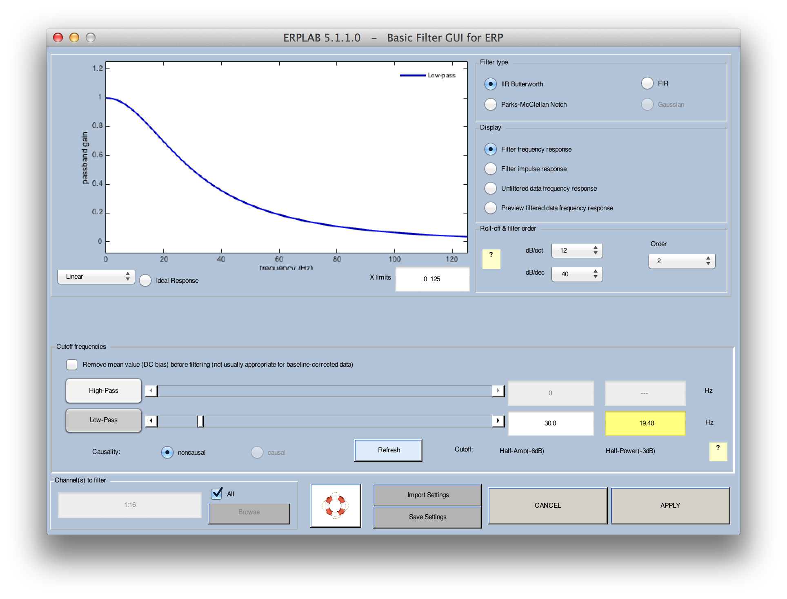
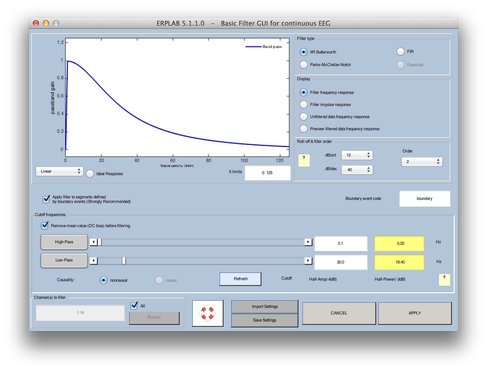
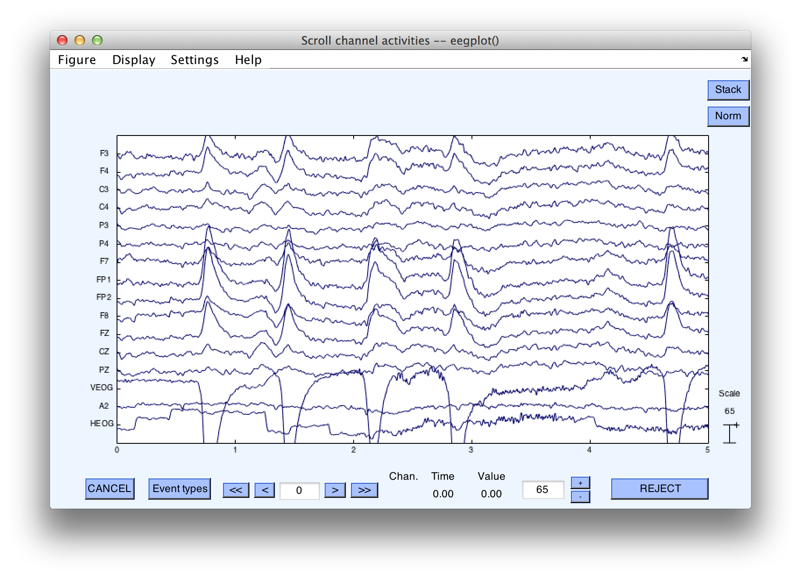

## Filtering EEG and ERPs
ERPLAB contains a set of filters that can be applied to continuous EEG, to segmented EEG, and to averaged ERPs.  Separate routines are used for filtering EEG (**ERPLAB > Filter & Frequency Tools >  Filters for EEG data**) and for filtering ERPs (**ERPLAB > Filter & Frequency Tools > Filters for ERP data**).  The routines are nearly identical, except for a few options.  We will start by discussing the filtering of averaged ERPs.  Make sure that "S1_ERPs" is selected in the **ERPsets** menu, and then select **ERPLAB > Filter & Frequency Tools > Filters for ERP data**. You will see a window similar to the screenshot below.  This window allows you to set various properties of the filter.  First, you can determine whether to apply a low-pass filter (filtering out high frequencies) and/or a high-pass filter (filtering out low frequencies).  For each of these, you can select the 50% amplitude cutoff point by typing a number in the corresponding text field or by adjusting the sliders.  You can also adjust the slope of the filter's roll-off in the **Roll-off & filter order** panel in units of decibels per octave (**dB/oct**) or in units decibels per decade (**dB/dec**) or in terms of the filter's order (if you change one, the others will automatically change).

You can see the frequency response function of the resulting filter (the extent to which each frequency is passed by the filter) in the graph at the top of the window (assuming that the **Plot** panel is set to **Frequency response**).  Try playing around with the various filter parameters to see how it changes the frequency response function.

Three general classes of filters have been implemented.  First, **IIR Butterworth** is a digital implementation of the classic Butterworth filter.  The output of this filter feeds back into its input, making it an _infinite impulse response_ filter.  It filters the data in both directions, avoiding any phase shift.  Second, **FIR** is a _finite impulse response_ filter that uses a sinc impulse response function.  This kind of filter can be very efficient but can produce artificial oscillations in the filtered data under some conditions.  We will eventually implement Gaussian impulse response functions but have not done so yet.  However, the sinc filter approximates a Gaussian when a relatively low filter order is used.  The third option is **Parks McClellan Notch**, which provides a notch filter (which attenuates one narrow range of frequencies and passes everything else).

Filters can dramatically distort your data, creating artificial peaks and oscillations (see Chapter 5 in _An Introduction to the Event-Related Potential Technique_).  To avoid these distortions, we recommend that you choose a high-pass cutoff of 0.1 Hz or lower and a low-pass cutoff of 20 Hz or higher unless you really know what you're doing.  We also recommend a roll-off slope of 12 dB/octave.  For an example of how severe filtering can lead to incorrect conclusions, see Yeung et al., 2007, _Psychophysiology_, 44, 39-49.

As an example, select **ERPLAB > Filter & Frequency Tools > Filters for ERP data** and set up the filter as shown in the screenshot above, with no high-pass filter, a low-pass half-amplitude cutoff at 30 Hz, a roll-of of 12 dB/octave, a Butterworth filter type, and all 16 channels being filtered.  Click **APPLY**.  After the filtered data have been created, the standard window for saving new ERPsets will appear, and you should name the new ERPset "S1_ERPs_30Hz" (it's a good idea to save the ERPset to disk, because we will need this file for another example later).  This will now be the active ERPset.  If you plot it with **ERPLAB > Plot ERP Waveforms**, the result will look like the following screenshots (you should also plot the unfiltered data for comparison).

    Equivalent Script Command: %Basic Filtering for ERP
    %Channels [1:16], High pass 0, Low pass 30, Order 2, IIR Butterworth
    ERP = pop_filterp( ERP,1:16 , 'Cutoff',30, 'Design', 'butter', 'Filter', 'lowpass', 'Order',2 );
    %Setname is S1_ERPs_30Hz.set
    %Filename is S1_ERPs_30Hz.erp
    %Path is /Users/etfoo/Desktop/tutorial_script/S1_ERPs_30Hz.erp
    ERP = pop_savemyerp(ERP,
    'erpname',
    'S1_ERPs_30Hz.set',
    'filename',
     'S1_ERPs_30Hz.erp',
     'pathname',
     '/Users/etfoo/Desktop/tutorial_script/',
     'warning',
     'on');
    %The following command uses Matlab's Current Folder pop_savemyerp(ERP, 'erpname', 'S1_ERPs_30Hz.set', 'filename', ' S1_ERPs_30Hz.erp')  

Now let's try filtering continuous EEG data.  Make "S1_Chan" the active Dataset (loading it with **File > Load existing dataset** if necessary).  Select **ERPLAB > Filter & Frequency Tools > Filters for EEG data**.  Set the parameters as shown in the screenshot below, selecting a high-pass filter with a cutoff at 0.1 Hz and a low-pass filter with a cutoff at 30 Hz.  You should check the boxes for applying the filter to segments defined by boundary events (which you should always check unless you really know what you're doing) and for removing the mean value (which you should always do with DC recordings and which won't hurt for non-DC recordings).  The ERPLAB User's Manual provides more details.

Once you've set the parameters, click **APPLY**.  The filtering will take a little while. Once it prints **Done** in the Matlab command window, use **Plot > Channel data (scroll)** to see the filtered data, which should look like the screenshot below.

_Hint: In most cases, high-pass filters should be applied to the continuous EEG, not the epoched EEG or averaged ERPs.  The reason is that, with typical cutoff values, a long period of continuous data is needed for these filters to work properly.  Low-pass filters can be applied at any time, because they do not need a very long time period with typical settings.  In most cases, however, it is best to apply low-pass filtering after averaging.  Otherwise, you will need to back up to the EEG and repeat several steps if you later decide to change the filter settings.  However, low-pass filtering can sometimes improve artifact detection, in which case you can apply the low-pass filter to either the continuous or epoched EEG prior to artifact detection._  

    Equivalent Script Command: %Load S1_Chan from the current folder
    EEG = pop_loadset( 'filename', 'S1_Chan.set');
    %Basic Filtering for EEG with High pass
    %Channels 1:16, High-Pass 0.1, Low-Pass 30, Order 2,
    %IIR Butterworth, Apply filter to segments defined by boundary events
    %Boundary event code 'boundary'
    EEG  = pop_basicfilter( EEG,  1:16 , 'Boundary', 'boundary', 'Cutoff', [ 0.1 30], ...
    'Design', 'butter', 'Filter', 'bandpass', 'Order',  2, 'RemoveDC', 'on' );

----
<h5 align="center"> <a href="./Plotting-Averaged-ERP-Waveforms"> << Plotting Averaged ERP Waveforms </a> <a href="./Combining-ERP-Waveforms-with-Bin-Operations">  Combining ERP Waveforms with Bin Operations >>  </a></h5>