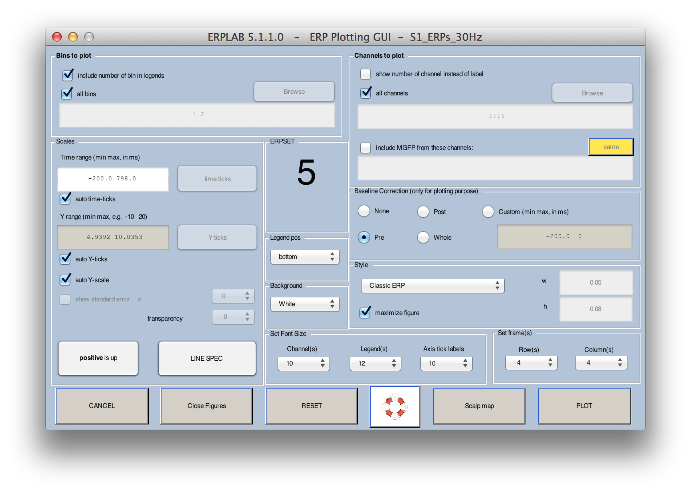
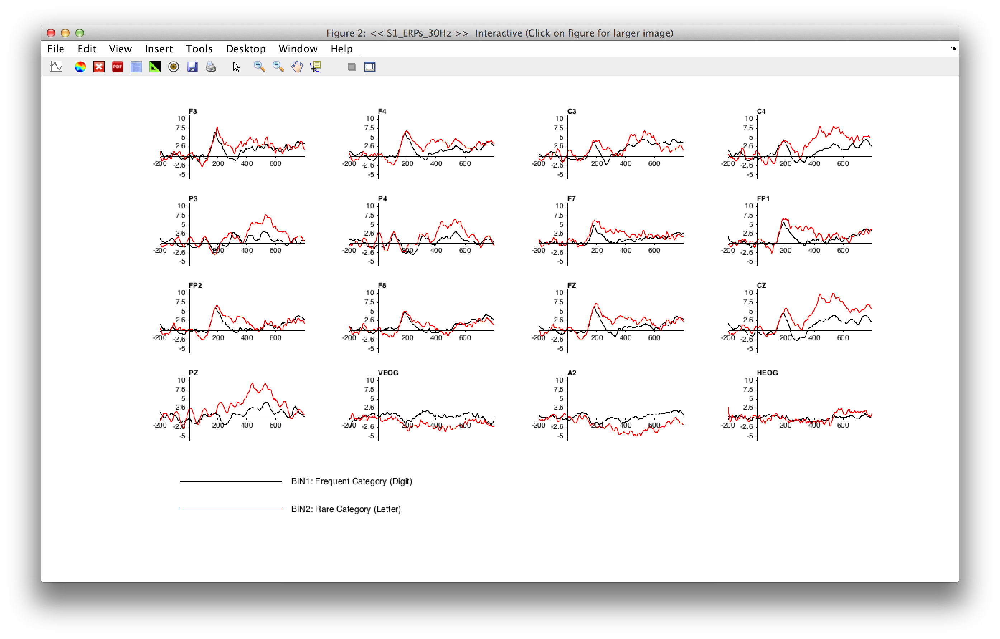

## Plotting ERP Waveform
Once you have an **ERP** structure active in an ERPset (via averaging or by loading a saved ERPset from disk), you can plot the data with the **ERPLAB > Plot ERP > Plot ERP Waveforms** function.  It is designed to be a relative simple plotting routine that can be used for one of two purposes: 1) Providing a quick-and-dirty view of your averaged data; and 2) Exporting this view as a vector file that can be read into a commercial graphics program such as Adobe Illustrator.  The **Plot ERP Waveforms** routine is not intended to provide the flexibility necessary to directly produce publication-quality images; this should be done by exporting the waveforms into a commercial graphics program.  

The **Plot ERP Waveforms** GUI is shown in the screenshot below, along with an example of a plot created with the shown parameters.

 You will typically begin by selecting which bins and channels to plot, along with the time range to show, the period to be used for baseline correction, and the Y (voltage) scale.  You can click on the **positive is up** button to change the plotting to negative-up.  You then click the **PLOT** button to create a window showing the waveforms.

Fortunately, the plotting GUI will remember the settings from the last time you used it, so you will not lose your settings when you close the GUI to select a new ERPset.  But this sometimes leads to other problems.  For example, if the new ERPset was created with a different epoch period, the time range that you used the last time you used the plotting GUI may no longer be valid.  If you click the **RESET VALUES** button, the GUI will reset to default parameters that reflect the currently active ERPset.

The window containing the plotted waveforms contains several useful icons at the top. The icon that looks like a waveform brings back the GUI for plotting waveforms so that you can easily plot some new waveforms.  The icon that looks like a scalp map brings up the GUI for plotting scalp maps.  The icon that looks like an X will close all the currently open plot windows.  The PDF icon allows you to save the current plot as a PDF file.  The icon that looks like the main EEGLAB GUI window will bring this window to the front (e.g., so that you can select a different ERPset).  The triangular icon brings up the ERP Measurement Tool.  The icon that looks like brown circle brings up the Viewer from the ERP Measurement Tool.

_Note: In the current version, it is not possible to plot waveforms from different ERPsets in the same plot.  If you want to do this, you can append one ERPset onto the end of another ERPset with **ERPLAB > Utilities > Append ERPsets**.  This will create a new ERPset that has twice as many bins (all the bins from the first ERPset followed by all the bins from the second ERPset).  You can then overlay the bins corresponding to the original first and second ERPsets.  We will create an easier method for this in a future version._

Here are the details of the options:

**Bins to Plot**

This is simply a list of the bins that should be included in the plot, in the standard Matlab format (e.g., "2 3 4 5" or "2:5").  Currently, ERPLAB creates a separate panel for each channel and overlays the selected bins within each panel.  Note that a popup menu next to the text box will allow you to see the bin labels along with the bin numbers so that you do not need to remember the bin numbers.

**Channels to Plot**

This is simply a list of the channels that should be included in the plot, again in the standard Matlab format (e.g., "2 3 4 5" or "2:5").  A popup menu next to the text box will allow you to see the channel labels along with the channel numbers so that you do not need to remember the channel numbers.  An option is provided for plotting the channel numbers rather than the channel labels.

**Time Range**

The **Time Range** field allows you to specify the time range that will be shown in the plots.  The default is the entire epoch.

**Time Ticks**

If the **auto time ticks** option is checked, ERPLAB will automatically choose a set of reasonable time ticks.  If it is not set, you can use the **Time Ticks** button to manually control the placement of time ticks.  You can simply list the time points at which ticks should appear (e.g., "-100 0 +100 +200 +300 +400 +500").  Alternatively, you can use the standard Matlab format of start:step:end (e.g., "-100:50:500" to start at -100 ms and put ticks every 100 ms through 500 ms).

**Y Scale**

This panel determines the amplitude scaling.  If **Auto Y Scale** is selected, the plotting function determines a scale based on the minimum and maximum points across all waveforms that will be plotted.  If you de-select **Auto**, you can enter the minimum and maximum voltages that will be shown in each panel of the plot.  

**Time Ticks**

If the **auto time ticks** option is checked, ERPLAB will automatically choose a set of reasonable time ticks.  If it is not set, you can use the **Time Ticks** button to manually control the placement of time ticks.  You can simply list the time points at which ticks should appear (e.g., "-100 0 +100 +200 +300 +400 +500").  Alternatively, you can use the standard Matlab format of start:step:end (e.g., "-100:50:500" to start at -100 ms and put ticks every 100 ms through 500 ms).

**Y Ticks**

If the **auto Y ticks** option is checked, ERPLAB will automatically choose a set of reasonable Y axis ticks.  If it is not set, you can use the **Y Ticks** button to manually control the placement of Y axis ticks.  You can simply list the amplitude values at which ticks should appear (e.g., "-2 -1 0 +1 +2 +3 +4").  Alternatively, you can use the standard Matlab format of start:step:end (e.g., "-1:1:4" to start at -1 µV and put ticks every 1 µV through +4 µV).

**Baseline Correction**

The **Baseline Correction** panel allows you to specify the time range that will be used to baseline the plots. In most cases, you will have already baselined your data during epoching, and it is not necessary to re-baseline the data before plotting.  However, it doesn't hurt, and it is good to be reminded that the baseline period plays an important role in determining the amplitude at each time point in the waveform.  The default baseline period is the prestimulus interval (**Pre**).  You can also select **None** (no baselining), **Post** (post-stimulus interval), **Whole** (the entire epoch), and **Custom** (in which case you must enter the time period in milliseconds).  When the data are plotted, the average voltage across the selected interval is subtracted from each point in the waveform.

**Mean Global Field Power**

If the **Include MGFP** option is selected, ERPLAB will compute the mean global field power across the specified channels and plot this along with the individual channels.  MGFP is the standard deviation across the selected electrode sites at each moment in time, and it can provide a good measure of overall activity at each time point (especially when a large number of electrode sites, spanning most of the head, are included in the calculation).

**Style**

There are four styles: Matlab 1, Matlab 2, Classic ERP, and Topographic.  We recommend Classic ERP as the starting point for figures that will be used in journal articles, conference presentations, etc.

If you select **Topographic Arrangement**, the electrode location information will be used to plot the channels in their appropriate positions.  You may need to adjust the width (**w**) and height (**h**) parameters to produce appropriately sized waveforms.  These parameters control how wide and tall each waveform is as a proportion of the window width (e.g., a **w** value of 0.10 means that each waveform will be 10% of the window width)
