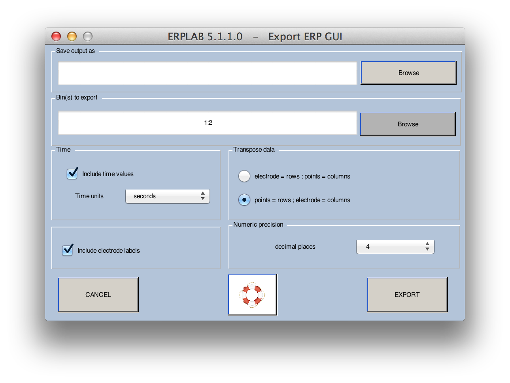

## Saving and Loading ERPsets
Each process that creates a new ERPset gives you the opportunity to save the ERPset in a file.  You can also save an ERPset in a file at any time by making sure it is the active ERPset in the **ERPsets** menu and then selecting **ERPLAB > Save Current ERPset**.  We recommend that you use a suffix of **.erp** for your saved ERPsets (but they are actually in .mat format).

You can use **ERPLAB > Duplicate or Rename Current ERPset** to change the name of an ERPset (e.g., the name that appears in the **ERPsets** menu) or make a duplicate of an ERPset.  You can also save the new ERPset as a file.  Imagine, for example, that you have 3 ERPsets loaded in the **ERPsets** menu, and ERPset #1 is the active ERPset (which means that it has a check mark next to it in the **ERPsets** menu).  If the name of this ERPset is "S1_ERPs_30Hz", the window for **ERPLAB > Duplicate or Rename ERPset** would look like the following screenshot.  If you wanted to change the name of this ERPset without creating a new ERPset, you would change the text in the **erpname** box, selected **Overwrite in memory erpset #1**, and click **OK**.  If you want to save this ERPset to disk, you would also select **Save ERP as** and fill in the name of the file in the text box prior to clicking **OK**.  If you want to make a duplicate of ERPset #1, you would select **Create a new erpset # 4**, enter a new name for the new ERPset (if desired), and click **OK**.  If you wanted to save the duplicate ERPset to disk, you would click **Save ERP as** and fill in the filename prior to clicking **OK**.

You can use the **ERPLAB > Clear ERPset(s)** routine to remove one or more ERPsets from the list shown in the **ERPsets** menu.  This routine will pop up a window in which you can list the ERPsets to be cleared.  For example, to clear ERPsets 2, 4, and 7-9, you would type **2 4 7:9** or **2 4 7 8 9** in this window.  This does not delete the files (if any) associated with the ERPsets; it simply clears them from memory.

To export an ERPset as a text file, you can select either **ERPLAB >Export and Import ERP >Export ERP to Text (Universal)**.  The ERPSS version creates a text file in an ERPSS-compatible format in which all bins are stored in a single file.  The Universal version creates a separate file for each bin using the GUI shown below.  You can select which bin or bins to export.  If you select multiple bins, the name of each bin is inserted into the filename for that bin.  You can choose whether the rows are the time points and the columns are the channels or vice versa.  You can also choose whether to include a label for each electrode site and/or a label for each time point.

