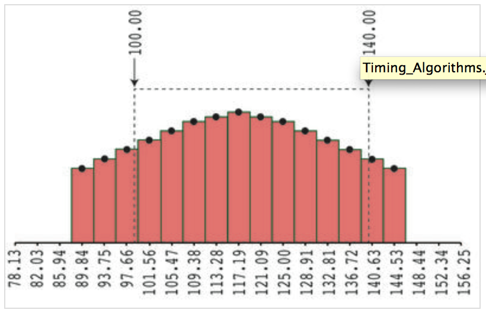

## Timing Details
EEG/ERP data are stored as samples at discrete moments in time, and this can lead to some ambiguities when you specify timing information. For example, if you specify a baseline period of -100 to +50 ms, what happens if there is not a sample point at exactly -100 ms or at exactly +50 ms? The purpose of this page is to explain exactly how ERPLAB deals with these issues. This is relevant for any routines that involve time windows, including baseline periods, artifact detection windows, and measurement windows. In addition, the ERP Measurement Tool obtains additional precision by interpolating between the discrete samples, and this is also explained here.

The image below illustrates how ERPLAB deals with timing. In this example, the EEG was sampled at 256 Hz, which means that a sample was taken every 3.90625 ms. The time-locking point is always assumed to be at exactly 0 ms, so the subsequent samples were at 3.90625 ms, 7.8125 ms, 11.71875 ms, etc. The image below shows the samples from approximately 78-156 ms. We assume that each sample represents the voltage during a period that is centered on the sample time.

For most processes that specify a time window (e.g., a baseline period or an artifact rejection window), ERPLAB finds the closest sample points to the specified window. In the example below, for example, the user specifies a window of 100-140 ms. The actual window would start at 97.66 ms (because this is the closest sample to 100 ms) and would end at 140.63 ms (because this is the closest sample to 140 ms). If the specified start or end time of a window is exactly halfway between two sample points, the earlier of the two points is chosen.

In the ERP Measurement Tool, time windows are chosen in the same way, except in measures that involve an area or integral (e.g., the fractional area latency measure). When an area is measured, each sample point is replaced by a rectangle, as shown in the figure below, and the area within the exact measurement window is computed. This will involve summing the areas of each rectangle that is completely inside the specified measurement window, and then adding the appropriate fraction of the rectangles at the beginning and end that are partly within the measurement window. In the figure below, this would be the total area inside the dashed lines. Mean amplitude, in contrast, uses a window defined by rounding to the nearest sample points.

The ERP Measurement Tool allows the user to specify an interpolation factor, which is used to resample the data. For example, if the data were originally sampled at 250 Hz (4 ms per sample), and the interpolation factor is 4, the data will be resampled prior to measurement at 1000 Hz (1 ms per sample). The interpolation is achieved via a spline function. The same principles described above for determining time windows are then applied to the resampled data.

Note that no rounding is done for time windows in BINLISTER. For example, if the bin descriptor is .{1}{t<200-1000>2}, and event will be matched only if the event code 1 is followed by an event code 2 with a time difference of >= 200 ms and <= 1000 ms.
